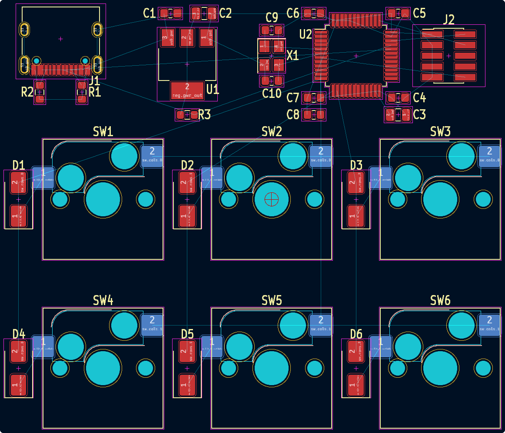
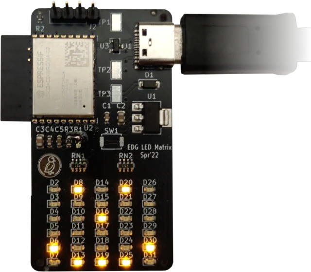
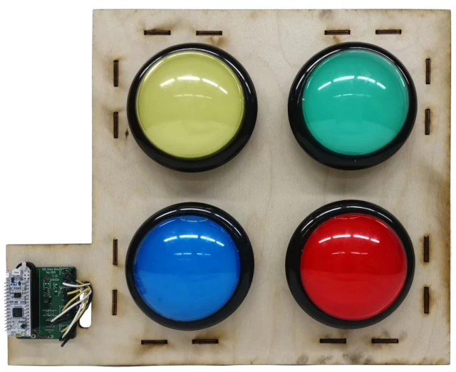
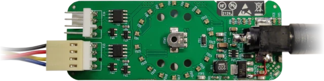
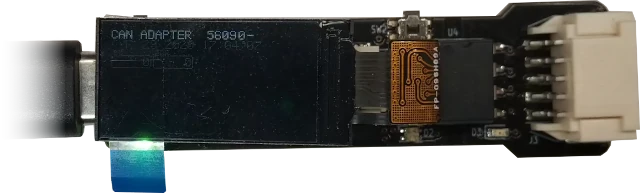
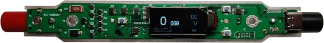
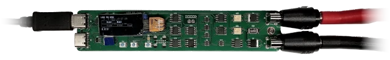

# Polymorphic Blocks

Polymorphic Blocks is an open-source, Python-based [hardware description language (HDL)](https://en.wikipedia.org/wiki/Hardware_description_language) for [printed circuit boards (PCBs)](https://en.wikipedia.org/wiki/Printed_circuit_board).
By making use of programming concepts and capabilities, this project aims to **make circuit design faster and easier through high-level subcircuit library blocks** much like what makes software development so productive and approachable.
Underlying language features enable these libraries to be general across many applications and provide a high degree of design automation.

We've been using this system to create a variety of boards of varying complexity, [examples](#examples) range from a charlieplexed LED matrix to a USB source-measure unit.

### A Keyboard Example

An example of all this in action is this design for a USB keyboard with a 3x2 switch matrix:

<table>
<tr>
<td><b>User input</b></td>
<td><b>What this tool does</b></td>
</tr>

<tr style="vertical-align:top">
<td>

The board is defined using high-level library subcircuits blocks, including parameterized ones like the switch matrix.
Choices for internal components can also be specified as refinements, for example generic switches (used in the switch matrix) are refined to Kailh mechanical keyswitch sockets.

```python
class Keyboard(SimpleBoardTop):
  def contents(self) -> None:
    super().contents()

    self.usb = self.Block(UsbCReceptacle())
    self.reg = self.Block(Ldl1117(3.3*Volt(tol=0.05)))
    self.connect(self.usb.gnd, self.reg.gnd)
    self.connect(self.usb.pwr, self.reg.pwr_in)

    with self.implicit_connect(
            ImplicitConnect(self.reg.pwr_out, [Power]),
            ImplicitConnect(self.reg.gnd, [Common]),
    ) as imp:
      self.mcu = imp.Block(Stm32f103_48())
      self.connect(self.usb.usb, self.mcu.usb.request())

      self.sw = self.Block(SwitchMatrix(nrows=3, ncols=2))
      self.connect(self.sw.cols, self.mcu.gpio.request_vector())
      self.connect(self.sw.rows, self.mcu.gpio.request_vector())

  def refinements(self) -> Refinements:
    return super().refinements() + Refinements(
      class_refinements=[
        (Switch, KailhSocket),
      ],
    )
```

These library blocks contain logic to adjust the subcircuit based on how it is used or its parameters.
For example, the USB-C port generates the required CC pulldown resistors if a power delivery controller is not attached, and the STM32 generates the required crystal oscillator if USB is used.
This helps eliminate gotchas for the system designer and makes the overall board more correct-by-construction.

</td>
<td>

Compiling the design produces a netlist that can be imported into KiCad for board layout and ultimately Gerber generation for manufacturing:

_Placement and routing are out of scope of this project, components were manually placed._

Additionally, the compiler...
- generates stable netlists, allowing incremental updates to in-progress board layouts
- checks electrical properties like voltage and current limits
- automatically selects generic parts like resistors and diodes against a parts table
- generates a BoM for factory assembly 

</td>
</tr>
</table>

### Under the Hood

While degrees of library-based design are possible in graphical schematic tools, either informally with copy-paste or with hierarchical sheets, the main limitation is that these subcircuits are static and tuned for one particular application.
Baked-in choices like component values, footprint, and part number selection may not meet requirements for a different application that might, for example, call for through-hole components instead of surface-mount, or has different voltage rails.

The HDL provides two mechanisms to enable general subcircuit libraries: _generators_ and _abstract parts_.
Defining the subcircuit as code enables the library to contain logic to _generate_ the implementation to support many applications.
For instance, instead of a keyboard switch matrix with a fixed number of rows and columns, the library can take in user-specified `nrows` and `ncols` parameters and generate the matrix for that configuration.
A more complex example would be a buck converter generator, which automatically sizes its inductor and capacitors based on the current draw of connected components.

While generators enable the subcircuit to adapt to its environment, _abstract parts_ formalize and automate the concept of generic parts within subcircuits.
Instead of requiring baked in part numbers and footprints in subcircuits, library builders can instead place an abstract part like generic resistors, generic diodes, and even generic microcontrollers.
These only define the parts' interface but have no implementation; instead other library blocks can implement (subtype) the interface.
For example, the abstract interface can be implemented by a SMT resistor generator, a through-hole resistor generator, or a resistor that picks from a vendor part table.
_Refinements_ allow the system designer to choose how parts are replaced with subtypes.

An _electronics model_ performs basic checks on the design, including voltage limits, current limits, and signal level compatibility.
Advanced features like cross-hierarchy packing allows the use of multipack devices, like dual-pack op-amps and quad-pack resistors to optimize for space and cost.


## Getting Started
See the [setup documentation](setup.md), then work through building a blinky board in the [getting started tutorial](getting-started.md).

**Setup tl;dr**: install the Python package from pip: `pip install edg`, and optionally run the [IDE plugin with block diagram visualizer](setup.md#ide-setup).


## Additional Notes 

### Examples
Example boards, including layouts, are available in the [examples/](examples/) directory, structured as unit tests and including board layouts:

<table>
<tr>
<td>


**[LED Matrix](examples/test_ledmatrix.py)**: a 6x5 LED matrix using a [charlieplexed](https://en.wikipedia.org/wiki/Charlieplexing) circuit generator that drives 30 LEDs off of just 7 IO pins.

</td>
<td>


[Simon](examples/test_simon.py): a [Simon memory game](https://en.wikipedia.org/wiki/Simon_(game)) implementation with a speaker and [12v illuminated dome buttons](https://www.sparkfun.com/products/9181).

</td>
</tr>

<tr>
<td>


**[IoT Fan Driver](examples/test_iot_fan.py)**: an [ESPHome](https://esphome.io/index.html)-based internet-of-things fan controller, controlling and monitoring up to two computer fans from a web page or [home automation dashboard](https://www.home-assistant.io/).

</td>
<td>


**[CAN Adapter](examples/test_can_adapter.py)**: an isolated [CANbus](https://en.wikipedia.org/wiki/CAN_bus) to USB-C adapter.

</td>
</tr>

<tr>
<td>


**[BLE Multimeter](examples/test_multimeter.py)**: a BLE (Bluetooth Low Energy) compact (stick form factor) multimeter, supporting volts / ohms / diode / continuity test mode, for low voltage applications.

</td>
<td>


**[USB Source-Measure Unit](examples/test_usb_source_measure.py)**: a USB PD (type-C power delivery) source-measure unit -- which can both act as a DC power supply with configurable voltage and current, and as a DC load. More precisely, it's a digitally-controlled 2-quadrant (positive voltage, positive or negative current) power source.

</td>
</tr>

</table>

### Developing
**If you're interested in collaborating or contributing, please reach out to us**, and we do take pull requests.
Ultimately, we'd like to see an open-source PCB HDL that increases design automation, reduces tedious work, and makes electronics more accessible to everyone.

See [developing.md](developing.md) for developer documentation.

### Papers
This started as an academic project, though with the goal of broader adoption.
Check out our papers (all open-access), which have more details:
- [System overview, UIST'20](http://dx.doi.org/10.1145/3379337.3415860)
- [Mixed block-diagram / textual code IDE, UIST'21](https://dl.acm.org/doi/10.1145/3472749.3474804)
- [Array ports and multi-packed devices, SCF'22](https://doi.org/10.1145/3559400.3561997)

### Project Status and Scope
**This is functional and produces boards, but is still a continuing work-in-progress.**
APIs and libraries may continue to change, though the core has largely stabilized.

If you're looking for a mature PCB design tool that just works, this currently isn't it (yet).
For a mature and open-source graphical schematic capture and board layout tool, check out [KiCad](https://kicad-pcb.org/), though existing design tools generally have nowhere near the design automation capabilities our system provides.
**However, if you are interested in trying something new, we're happy to help you and answer questions.**

Current development focuses on supporting intermediate-level PCB projects, like those an advanced hobbyist would make.
Typical systems would involve power conditioning circuits, a microcontroller, and supporting peripherals (possibly including analog blocks).
There is no hard-coded architecture (a microcontroller is not needed), and pure analog boards are possible.
The system should also be able to handle projects that are much more or much less complex, especially if supporting libraries exist.

### Misc
- **_What is EDG?_**:
  [Embedded Device Generation](https://dl.acm.org/doi/10.1145/3083157.3083159) (or more generally Electronic Device Generation) was a prior version of this project that focused on algorithms and models for embedded device synthesis, though it lacked a user-facing component.
  This project is a continuation of that work focusing on an end-to-end system, and for most of its development cycle has been called `edg`.
  But, for the purposes of writing research papers, naming collisions are confusing and bad, and we chose to keep the repo and paper name consistent.
