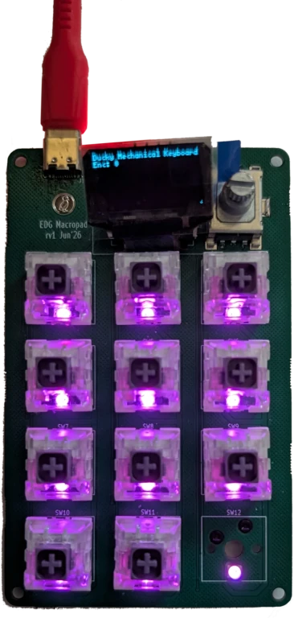

# Polymorphic Blocks


_subcircuit generator library based hardware description language for circuit board design_

Polymorphic Blocks is an open-source, Python-based [hardware description language (HDL)](https://en.wikipedia.org/wiki/Hardware_description_language) for schematic-equivalent design of printed circuit boards (PCBs).
Its library of components provide a high-level abstraction for circuit design while subcircuit generators automate the calculation of fine details.
Abstract component interfaces enable these libraries to be general across applications and component vendors.

Generates stable KiCad netlists to be routed in the KiCad PCB Editor.


### Built Boards

Many boards have been built with this system, from a mechanical keyboard macropad, to battery-powered IoT devices, to a USB source-measure unit.
Check out the [examples page](examples.md)!


### Example: from HDL to Keyboard

**Overall flow**: write HDL -> generate netlist -> import into KiCad PCB editor -> place and route (optionally iterating with HDL) -> export BoM and Gerbers -> optionally generate JLC PCBA data

A simplified version of the [getting started tutorial](getting-started.md) is this snippet for a 3x4 mechanical keyboard:

```python
from edg import *

class Keyboard(SimpleBoardTop):
    def contents(self) -> None:
        super().contents()

        self.usb = self.Block(UsbCReceptacle())
        self.reg = self.Block(LinearRegulator(3.3 * Volt(tol=0.05)))
        self.connect(self.usb.gnd, self.reg.gnd)
        self.connect(self.usb.pwr, self.reg.pwr_in)

        with self.implicit_connect(
            ImplicitConnect(self.reg.pwr_out, [Power]),
            ImplicitConnect(self.reg.gnd, [Common]),
        ) as imp:
            self.mcu = imp.Block(IoController())
            self.connect(self.usb.usb, self.mcu.usb.request())

            self.sw = self.Block(SwitchMatrix(ncols=3, nrows=4))
            self.connect(self.sw.cols, self.mcu.gpio.request_vector("sw_col"))
            self.connect(self.sw.rows, self.mcu.gpio.request_vector("sw_row"))

            self.enc = imp.Block(DigitalRotaryEncoder())
            self.connect(self.enc.a, self.mcu.gpio.request("enc_a"))
            self.connect(self.enc.b, self.mcu.gpio.request("enc_b"))
            self.connect(self.enc.with_mixin(DigitalRotaryEncoderSwitch()).sw, self.mcu.gpio.request("enc_sw"))

    def refinements(self) -> Refinements:
        return super().refinements() + Refinements(
            class_refinements=[
                (IoController, Ch32v203),
                (Switch, KailhSocket),
            ])

compile_board_inplace(Keyboard)
```

The system:
- provides a library of subcircuit generators, like switch matrices and USB-C ports, that automatically include supporting components like decoupling capacitors and pullup resistors
- automatically selects generic parts like resistors and diodes against builtin parts tables
- performs basic electrical checks on the design, including voltage and current limits, automating some common datasheet parameter checking

This generates:
- a netlist that can be imported into the KiCad PCB editor
  - ... including hierarchical data, allowing subcircuit replication / channelization
  - ... and have stable tstamps, allowing incremental updates to in-progress board layouts
- a JLCPCB-compatible BoM
  - including a [postprocessing script](edg/tools/jlc_pcba/__main__.py) to shift part rotations from KiCad-generated component placements for JLC PCBA
- a [JSON representation of the full design](edg/core/CompiledDesignExport.py), including connectivity and solved circuit values, to integrate with custom / third-party tooling



Advanced capabilities include:
- multi-board support including connector-pair management
- cross-hierarchy packing of multi-pack devices like dual op-amps and quad resistors
- standard abstract component interfaces, allowing for custom implementations of parts like resistors (including from a parts table), and microcontrollers
- full support for user component definition; very little is hard-coded into the infrastructure


## Getting Started
See the [setup documentation](setup.md), then work through building a mechanical keyboard (including subcircuit layout replication) in the [getting started tutorial](getting-started.md).

**Setup tl;dr**: install from pip, published as `edg`: `pip install edg`.
You will need a Java 11+ JRE / JDK, for the core compiler / solver.

Also check out the [reference documentation](reference.md) for a concise list of capabilities.

Some documentation is available for library parts construction.
Be warned, this is more complex and less polished. 
See the [library block definition tutorial using KiCad schematic import](getting_started_schimport.md) and the [library construction reference](reference_library.md).


## Additional Notes 

### Project Status
**This is functional has been used to [produce a wide variety of boards](examples.md) over the years.**
While the core is reasonably stable, as a pre-v1.0-release there are no formal guarantees of API stability.
In practice, deprecation shims are / will be maintained for common features if APIs change.

This started as an academic research project and continues to be developed as a personal project post-graduation, including for designing circuit boards for fun.

Though many functional boards have been built with this system, there may still be bugs and edge cases.
You are recommended to sanity check generated designs during layout.

### Scope
The current libraries best support intermediate-level (and simpler) PCB designs.
This includes circuits with discrete microcontrollers, microcontroller modules (like ESP32s), and socketed dev boards.
Libraries include common subcircuits like switch matrices, digitally attached peripherals like I2C sensors, voltage converters, and some analog signal conditioning circuits.
Check out the [subcircuits library folder](edg/circuits/) and [parts library folder](edg/parts/).

There is no prescribed architecture and microcontrollers are not required.

ESPHome boards are a great fit.

Designs that do not decompose neatly(ish) into subcircuits blocks are a poor fit.

There is no support for high-speed digital design (like DDR memories).
There are some experimental RF subcircuits.

The electrical checks are not a design assurance tool and only automate some of the most common datasheet checks.
More advanced parameters, especially performance characteristics not related to maximum ratings, are currently out of scope of the electronics model.

### Compared to Hierarchical Schematics

The main goal of this HDL is to enable the creation of _general_ subcircuit libraries that can be reused across many applications.

While graphical schematic tools support hierarchical sheets, direct re-use is limited because the sheets encode a lot of per-design information, like a specific resistor values or footprints.
Different users may have different requirements (e.g., different resistor values for a LED based on its input voltage, or preference for through-hole vs. surface-mount components).

This HDL addresses those limitations with two mechanisms:
- **Generators** allow the implementation of the subcircuit to depend on high-level parameters.
  A LED circuit could automatically size its resistor based on the input voltage.
- **Abstract parts** allow the subcircuit to use generic parts with generic interfaces, which many parts can implement.
  An abstract resistor interface could be implemented by through-hole and surface-mount resistors, enabling a generic LED circuit and deferring the choice.
  The top-level designer can then specify _refinements_ to make the specific choice of parts.

Both of these combined also present a higher level of abstraction for the board designer, more at the system architecture level-of-design than schematics.
We suspect this will also make it easier for novices to design boards, reducing the knowledge barrier to entry. 

### Parameter Engine

This system has a concept of parameters (variables, think voltages and currents) that can be attached to blocks and propagate through ports.
This is strictly limited to directed assignments.

Solving may happen within a single block with arbitrary Python code (for example, find the best set of E12 resistor values to implement a divider), but not across multiple blocks.
Search involving multiple blocks must be handled by the block exposing tuning knobs and the user turning those knobs with recompilation.

Compilation is intended to be fully deterministic.

### Parts Data

Most passive parts / discretes are selected from a 2022 JLCPCB parts table (included in this repository).
JLC no longer makes parts tables publicly available.

This parts table still mostly works and boards have been built using this table as recently as 2026.
Some basic parts have drifted and some parts may be no longer stocked.

### Contributing
We take pull requests and would love to see contributions and collaborations!

See [CONTRIBUTING.md](CONTRIBUTING.md) for details.

### Papers
This started as an academic project, though with the goal of broader adoption.
Check out our papers (all open-access), which have more details:
- [System overview, UIST'20](http://dx.doi.org/10.1145/3379337.3415860) (some details may be out of date)
- [Mixed block-diagram / textual code IDE, UIST'21](https://dl.acm.org/doi/10.1145/3472749.3474804)
- [Array ports and multi-packed devices, SCF'22](https://doi.org/10.1145/3559400.3561997)

### Misc
- **_What is EDG?_**:
  [Embedded Device Generation](https://dl.acm.org/doi/10.1145/3083157.3083159) (or more generally Electronic Device Generation) was a prior version of this project that focused on algorithms and models for embedded device synthesis, though it lacked a user-facing component.
  This project is a continuation of that work focusing on an end-to-end system, and for most of its development cycle has been called `edg`.
  But, for the purposes of writing research papers, naming collisions are confusing and bad, and we chose to keep the repo and paper name consistent.
