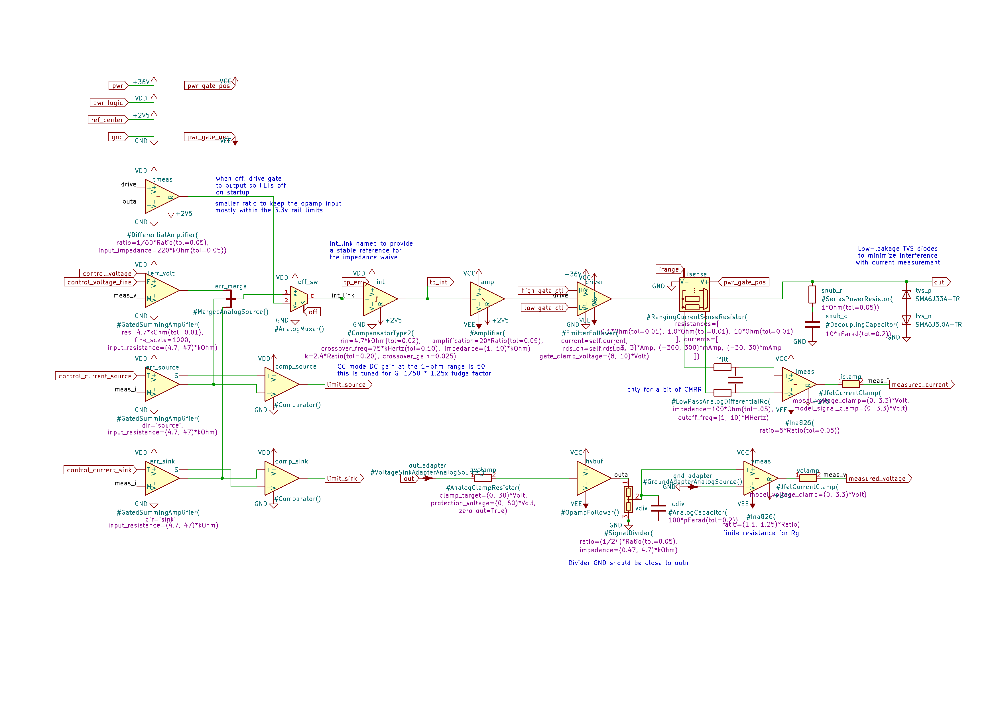
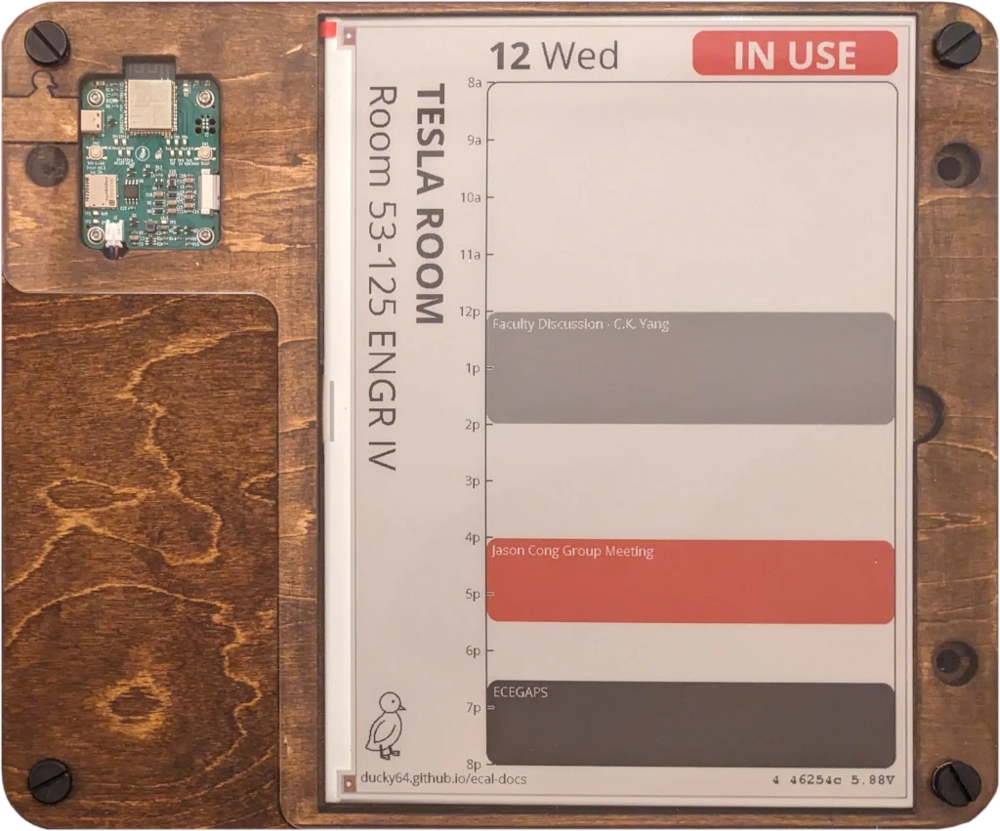
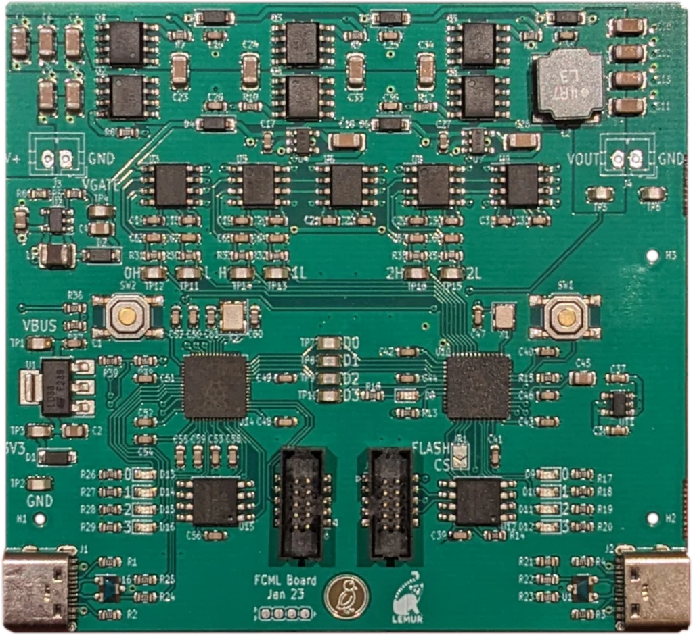

# Example boards

This is a small, curated list of example boards built with this HDL framework. 

## Mechanical Macropad
[test_keyboard.py](examples/test_keyboard.py), [Keyboard.kicad_pcb](examples/Keyboard/Keyboard.kicad_pcb)

[Minimal Rust firmware](https://github.com/ducky64/edg-pcbs/tree/main/KeyboardExample) (note, RMK crashes on this device, possibly an issue with mutex implementation on the CH32V203 HAL).

A 3x4 mechanical macropad with per-key RGB lighting, using a discrete CH32V203 microcontroller and USB-C.
Also includes a rotary encoder and a small OLED display.
Example of a full device built with minimal HDL, demonstrating the power of subcircuit generator libraries.

A variation of the design in the [getting started tutorial](getting-started.md).

## BLE Joystick

_This is a new board, bring-up is a work in progress._

[test_ble_joystick.py](examples/test_ble_joystick.py), [BleJoystick.kicad_pcb](examples/BleJoystick/BleJoystick.kicad_pcb) (main board), [BleJoystick_btns.kicad_pcb](examples/BleJoystick/BleJoystick_btns.kicad_pcb) (buttons sub-board), [BleJoystick_stick.kicad_pcb](examples/BleJoystick/BleJoystick_stick.kicad_pcb) (joystick FPC)

[Rust firmware](https://github.com/ducky64/blejoystick-rs)

An nRF52840 based air-mouse with an XBox joystick and d-pad.

Example of a three board assembly with connector-pairs managed by the system: the buttons daughterboard connects to the main board via a FFC, and the joystick itself is on a FPC "board".

## USB Source-Measure

[test_usb_source_measure.py](examples/test_usb_source_measure.py), [UsbSourceMeasure.kicad_pcb](examples/UsbSourceMeasure/UsbSourceMeasure.kicad_pcb)

[ESPHome firmware](https://github.com/ducky64/usb-source-measure/)

A portable 2-quadrant (positive voltage only, sourcing or sinking current) DC power supply, powered from USB-PD.
Design target of 0 - 30V output, -3 - +3A current (electrical limits, thermal limits lower), three current ranges (30mA, 300mA, 3A).
Buck-boost (four-switch) pre-regulator and linear analog feedback stage.

Example of a fairly complex device with significant analog circuitry.
The analog feedback circuitry is a high-level KiCad-schematic-defined-block:

This device functions fine as a basic DC lab supply but frequency response and measurement noise needs more tuning and iteration.   

## E-ink Display

[test_iot_display.py](examples/test_iot_display.py), [IotDisplay.kicad_pcb](examples/IotDisplay/IotDisplay.kicad_pcb)

[Arduino firmware](https://github.com/ducky64/edg-pcbs/tree/main/IoTDisplay)

A battery-powered WiFi e-ink display controller with low sleep current and expected 1 year life on 4xAA batteries.
Designed for simple deployment: no power wires to run, piggybacks off existing WiFi network infrastructure.

A few of these are deployed outside the UCLA ECE departmental meeting rooms as room calendars.

## SWD and ESP Programmers

[test_swd_debugger.py](examples/test_swd_debugger.py), [SwdDebugger.kicad_pcb](examples/SwdDebugger.kicad_pcb), [PicoProbe.kicad_pcb](examples/PicoProbe/PicoProbe.kicad_pcb),

[test_esp_programmer.py](examples/test_esp_programmer.py), [EspProgrammer.kicad_pcb](examples/EspProgrammer/EspProgrammer.kicad_pcb)

Tiny SWD and ESP programmers with USB-C and a 6-pin Tag-Connect interface to the target.

The STM32 SWD programmer run a variation of [DAPLink](https://github.com/armmbed/daplink), the RP2040 SWD programmer runs the Picoprobe firmware.

The ESP programmer is a CP2102 USB-UART bridge with no microcontroller.

## LoRa and NFC Demonstrator

[test_lora.py](examples/test_lora.py), [EspLora.kicad_pcb](examples/EspLora/EspLora.kicad_pcb)

[ESPHome firmware for NFC](https://github.com/ducky64/edg-pcbs/blob/main/IoTDevices/nfctest.yml); also runs Meshtastic

A demonstrator / test board for RF subcircuit generators, generating the analog frontend for the SX1262 LoRa transceiver and PN7160 NFC controller.
Both of these subcircuits work, though RF performance hasn't been characterized in any detail.

## Multilevel Converter Demonstrator

[test_fcml.py](examples/test_fcml.py), [Fcml.kicad_pcb](examples/Fcml/Fcml.kicad_pcb)

[Minimal Chisel RTL / gateware](https://github.com/calisco/fcml-rtl)

A design using an iCE40 FPGA that drives a 4-level flying capacitor multilevel buck converter, a converter topology that trades inductor size for more switches. 
A few basic tests have been run with this device, and it appears to be able to process power efficiently.
