# Getting Started

## Core concepts
The core abstraction is the hierarchical block diagram, which we will explain using an example design of a microcontroller driving an LED.

In conventional schematic tools, such a design could be a flat schematic, consisting of the microcontroller module, LED, and resistor:  
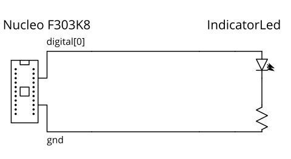

Many modern tools have the concept of hierarchy blocks, where a block could be a subcircuit:  
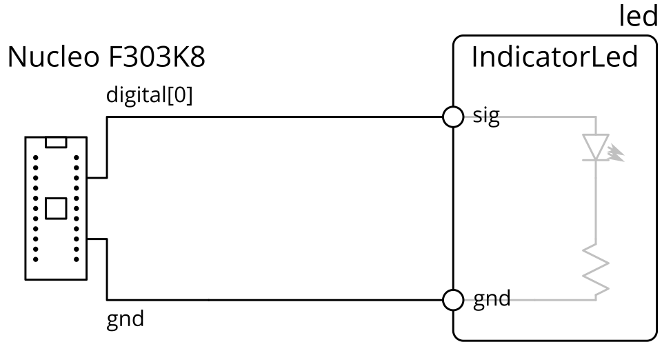

In the example above, the LED-resistor subcircuit is contained within a block, which can be manipulated as a unit, and exposes ports (circles on the diagram) while encapsulating internal pins.
(note: in mainstream schematic tools with this feature, the subcircuit is usually presented in its own sheet, instead of having its contents displayed in the block)

Generalizing this model, components are blocks too, and component pins are also block ports:  
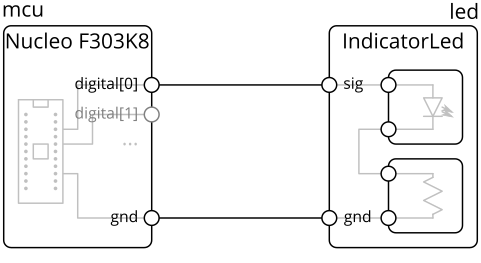

The main concepts our model extends on top of the simple hierarchy blocks above are **parameters**, **links**, and **generators**.

**Parameters** are variables that can be attached to blocks and ports.
For example, a digital IO, like `digital[0]` in the example above, would have parameters like input voltage tolerance, output voltage range, and logic thresholds.
This allows for a more powerful design correctness check (think ERC++), and provides a foundation for generators.

**Generators** allow a block's internal contents to be constructed by code, possibly based on parameters on it and its ports.
For example, the `IndicatorLed` block automatically sizes the resistor based on the input voltage on the `sig` pin, and the DC-DC converter block automatically sizes inductors and capacitors based on the target output voltage and current.

Finally, in the internal model (mainly relevant for compiler writers and library builders), the connections between ports expand into **links** which defines how parameters propagate between those ports and any constraints on them.
Continuing the digital IO example, the link would check the output thresholds against the input thresholds, and provide the worst-case voltage levels given all connected drivers.
These could be viewed as a block-like object (diamonds on the diagram) instead of direct wire connections:  
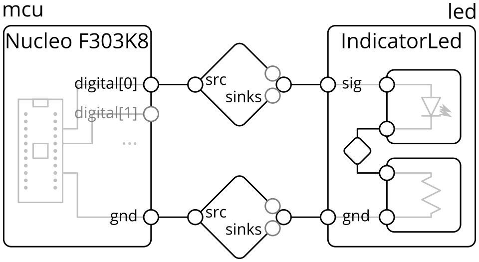

> In the user-facing HDL design model, links are inferred based on the types of connected ports and not explicit.
> Being aware of links can be useful for debugging, but this is mainly relevant for compiler writers and library builders.

We'll put these concepts into practice in the rest of this tutorial by building a variation of the blinky example above, then defining a custom part.

### Reference Document
While this getting started guide is meant to be self-contained, you may also find the [reference document](reference.md) helpful, especially as you build designs outside this tutorial.
The reference document includes a short overview of all the core primitives and common library elements.


### Hardware Description Language (HDL)
To support user-defined computation of parameters and generator blocks, the design system is implemented as a _hardware description language_ (HDL).
That is, blocks are "placed" or instantiated, and their ports are connected, through lines in code instead of GUI actions in a graphical schematic.

There are a couple of basic operations, which you'll get to try in the tutorial:
- **Block Definition**: blocks are defined as Python classes which extend (subclass, including indirectly) `Block`.
- **Block Instantiation**: creates a sub-block in the current block
  - For example, `self.led = self.Block(IndicatorLed())` instantiates an `IndicatorLed` block and names it `led` in the current block
- **Port Instantiation**: creates an exterior port in the current block, used for building library blocks.
  - For example, `self.vdd = self.Port(VoltageSink(voltage_limits=(2.3, 5.5)*Volt, current_draw=(0, 15)*uAmp))` instantiates a port of type `VoltageSink` (voltage input) with defined voltage limits and current draw ranges, and names it `vdd`.
  - Ports are not allowed on top-level blocks.
- **Connect**: connects two (or more) ports.
  - For example, `self.connect(self.mcu.gnd, self.led.gnd)` connects the ground pins on `mcu` and `led`


### Graphical Editor and Integrated Development Environment (IDE)
While an HDL is needed to support parameter computation and programmatic construction, some operations (like building a top-level design with an LED connected to a microcontroller) may not require the full power provided by an HDL and may be more intuitive or familiar within a graphical environment.
However, because this design makes use of generator blocks (the LED), and because blocks may also take parameters (such as the target output voltage of a DC-DC converter), the HDL is still the primary design input.

To help with these more basic operations and to support those more familiar with a graphical schematic capture flow, we're developing an IDE to help bridge the graphical schematic-like and HDL code representations. Specifically, it:
- provides a block diagram visualization of the design
- allows inspection of solved / computed parameters in the design
- generates and inserts HDL code from schematic editor-like actions

The IDE is organized like:  
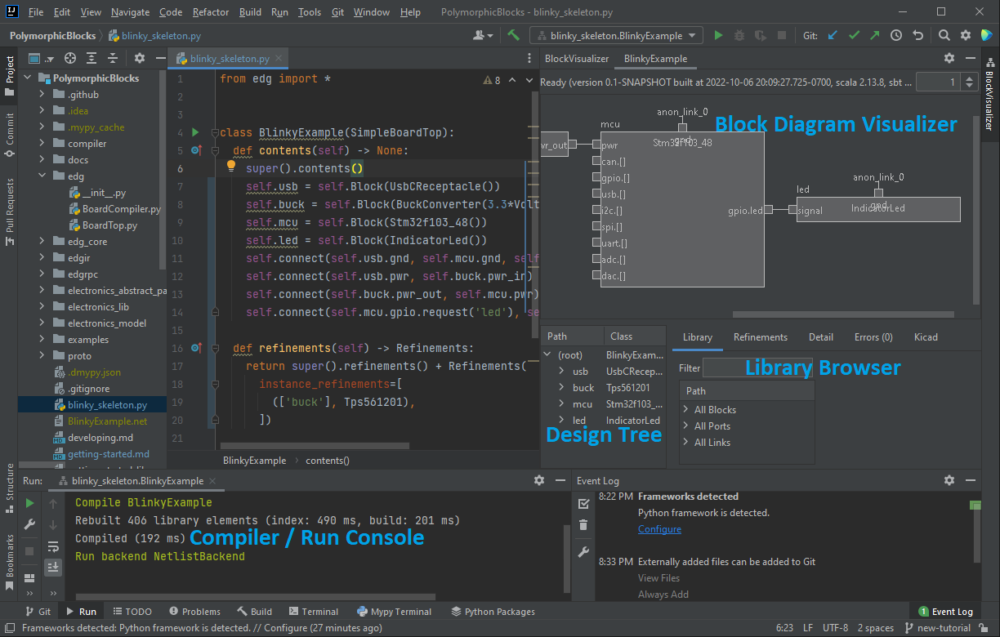

- **Block Diagram Visualization**: shows the compiled design visualized as a block diagram here.
  - **Design Tree**: shows the compiled design as a tree structure of the block hierarchy.
- **Library Browser**: shows all the library blocks, ports, and links.
  The text box at the top allows filtering by keyword.
  - The preview box on the right shows more information on the selected library block, including docstring (if available), parameters, and block diagram preview.
- **Compiler / Run Console**: shows the compilation log, including any errors and prints from Python as HDL runs.

The rest of this tutorial will focus on the HDL, but will also describe how the equivalent code could be generated by GUI actions.
**As you go through the tutorial, you can write the code shown in the code blocks or follow the graphical actions described immediately afterward.**
However, you can't do both (since they would duplicate the same results), but you can try the graphical actions if you remove the code.


## Setup
_Setting up and using the IDE is recommended, but HDL-only setup is also documented below._
_Runs natively on Windows, Linux, and Mac._

1. Download [sbt](https://www.scala-sbt.org/download.html), the Scala build tool.
2. If you do not have a Java JDK installed, download and install one.
   An open-source one is [Eclipse Temurin](https://adoptium.net/temurin/releases/?version=17).
   Java 11 (or later) is required.
   <details> <summary>Determining Java version</summary>
   
     _This is probably not necessary unless you suspect you're running an outdated Java version, most will probably have Java 11+ installed._
   
     On the command line, run `java --version`.
     If Java is installed, you'll get something like:

     ```
     openjdk 17.0.4.1 2022-08-12
     OpenJDK Runtime Environment Temurin-17.0.4.1+1 (build 17.0.4.1+1)
     OpenJDK 64-Bit Server VM Temurin-17.0.4.1+1 (build 17.0.4.1+1, mixed mode, sharing)
     ```
   
     The above is an example of a JDK at Java 17.
     Version reporting formats are not standardized, for example Oracle's Java 8 may report as `Oracle Corporation Java 1.8.0_351`.
   </details>
   <!--Reference: JDK compatibility from https://docs.scala-lang.org/overviews/jdk-compatibility/overview.html-->
3. Download or clone the IDE plugin sources from https://github.com/BerkeleyHCI/edg-ide.
   - If using command line git: make sure to initialize submodules: `git submodule update --init --recursive`.
   - If using GitHub Desktop: it should automatically clone submodules for you.
4. In the `edg-ide` directory, run `sbt runIDE`.
   sbt will automatically fetch dependencies, compile the plugin, and start the IDE with the plugin enabled.
   - The first run may take a while. 
   <details> <summary>Resolving common errors</summary>
   
   - If you get an error along the lines of  
      `sbt.librarymanagement.ResolveException: Error downloading edgcompiler:edgcompiler_2.13:0.1.0-SNAPSHOT`  
      or `not found: [...]/edgcompiler/edgcompiler_2.13/0.1.0-SNAPSHOT/edgcompiler_2.13-0.1.0-SNAPSHOT.pom`,  
      this is because the PolymorphicBlocks submodule hasn't been cloned.
      See the section above for instructions.
      The IDE plugin includes the HDL compiler as part of its build and requires the PolymorphicBlocks codebase.
   - If you get an error along the lines of `[error] ...: value strip is not a member of String`,
      this is because your Java version is pre-11.
      See the section above for instructions to install a more recent JDK.
   </details>
5. In the IDE, **open the `PolymorphicBlocks` folder as a project**.
   - You do not need to clone `PolymorphicBlocks` separately, you can use the submodule in `edg-ide`.
6. Once the project loads, open `blinky_skeleton.py`.
7. Set up the Python interpreter once the prompt shows up, "Configure Python interpreter".
   - Recommended: set up a Virtualenv environment based on a Python 3.7 (or later) interpreter. 
   - Install Python requirements (packages) if prompted, this banner should show up in the `blinky_skeleton.py` editor:  
     
   - When requirements finish installing, this popup will show up on the bottom right:  
     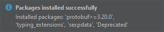
   <details> <summary>Using other interpreters</summary>
   
     - If using Pipenv (may need to be installed separately), IntelliJ should also prompt you to install dependencies similarly to the Virtualenv case above.
     - If using System Interpreter or Conda: you will need to install dependencies manually, `pip install -r requirements.txt`.
       - On Ubuntu, you may need to select a particular version of Python for pip, using `python3.8 -m pip` instead of `pip` directly.
   </details>
9. Open the Block Visualizer tab on the right.
   It will be empty right now.


<details> <summary>Alternatively, HDL-only setup...</summary>

  _This isn't necessary if you're using the IDE._
  _Runs natively on Windows, Linux, and Mac._

  1. Make sure you are using Python 3.7 (or later).
  2. Make sure you have Java 11 or later.
  3. Install the needed dependencies.
     If using pip: `pip install -r requirements.txt`
     - If on Linux and you get an error along the lines of `python: command not found`, you may need to `apt install python-is-python3`.
</details>


## A top-level design: Blinky
_In this example, we will create a circuit consisting of a LED and switch connected to a microcontroller._

For now, you will be working directly in the `PoylmorphicBlocks` repository folder directly.
In the future, we will improve the flow to allow adding `PolymorphicBlocks` as a package dependency.

Start by opening `blinky_skeleton.py`, which is pre-populated with this skeleton code:

```python
from edg import *


class BlinkyExample(SimpleBoardTop):
  def contents(self) -> None:
    super().contents()
    # your implementation here


if __name__ == "__main__":
  compile_board_inplace(BlinkyExample)
```

- `from edg import *` brings in the base classes for circuit construction, like `SimpleBoardTop`.
- `class BlinkyExample` contains the (top-level) circuit you're going to build, and it extends the top-level hierarchical block base class `SimpleBoardTop`.
  It's empty for now, but we'll fill it in the next section.
  - `SimpleBoardTop` has definitions which make this tutorial easier but which may not be desirable in a production environment, in which case you should use `BoardTop`.
    Currently, this is just ignoring the frequency specification for inductor, since that data isn't available in the parts table.
- `compile_board_inplace(...)` invokes the circuit generator given the top-level design (`BlinkyExample`).
  This is the starting point that allows the file to run as a Python script, and you can treat it as magic.

Try building the example now:
- **If using the IDE**: look for the run icon  in the gutter (with the line numbers) next to `class BlinkyExample`.
  1. Click it.
     _Make sure that you're using the run icon associated with `class BlinkyExample`, not the file, and not `if __name__ == "__main__"`._
  2. Then from the menu, click the Run option.  
     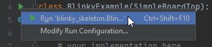
     > Next time, you can rebuild the design by re-running the last selected run configuration with hotkey **Shift+F10** (Windows) or **Ctrl+R** (MacOS).
  3. The design should build, and you should get a run log that looks something like:
     ```
     Starting compilation of blinky_skeleton.BlinkyExample
     Using interpreter from configured SDK [...]
     [... lots of compilation output here ...]
     Run backend NetlistBackend
     Wrote netlist to [...]
     ```
  4. Unlike the command-line option, this generates a netlist in the same directory as `blinky_skeleton.py`.
     In the IDE, you can configure where this goes via the run options at the top right:  
     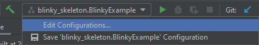
- <details> <summary>If not using the IDE</summary>
  
  Run `python blinkly_skeleton.py` from the command line.
  If all worked, this should create a folder `PolymorphicNlocks/blinky_skeleton` with a netlist `BlinkyExample.net` inside.
  </details>
- <details> <summary>Resolving common errors</summary>
  
  - If you get an error along the lines of `ModuleNotFoundError: No module named 'deprecated'` or `ModuleNotFoundError: No module named 'google'`, this is because the Python dependencies haven't been installed.
  See the [setup](#setup) section above for instructions on installing dependencies.
  </details>


### Creating the microcontroller and LED
For this simple example, we connect an LED to a STM32F103 microcontroller, and have everything powered by a USB type-C receptacle.

**In `blinky_skeleton.py`, `# your implementation here`, add this code** to instantiate the microcontroller and LED as follows:
```python
self.usb = self.Block(UsbCReceptacle())
self.mcu = self.Block(Stm32f103_48())
self.led = self.Block(IndicatorLed())
```
> `self.Block(...)` creates a sub-block in `self` (the current hierarchy block being defined).
> It must be assigned to an instance variable (in this case, `mcu`), which is used as the name sub-block.

> You can also insert blocks through graphical operations in the IDE.
> 1. Start by selecting the insert location in code, by setting the caret to the end of `super().contents()`.
>    - The _caret_ refers to the text editor's current position, commonly shown as a blinking vertical line.
>    - **Precise caret positioning is important**, since it is where code will be inserted.
>      In particular, it must not be in `super().contents()` since code cannot be inserted in the middle of a function call, nor can it be be outside the class block.
> 2. Search for the relevant block in the Library Browser by using the Filter textbox:  
>    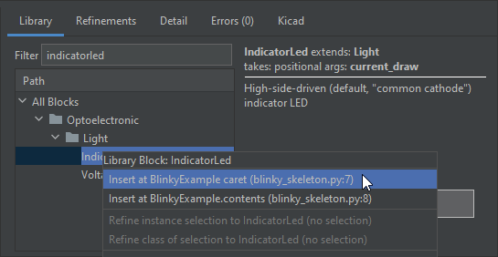
> 3. Double-click the library entry.
>    - Alternatively, you can also right-click to show other available actions. 
> 4. In the text prompt, give the new block a name.
> 5. The block should appear in the block diagram visualizer, and the corresponding line of code should be inserted.
>    - The hatched pattern (diagonal lines) in the block diagram visualizer indicates that the block may be out-of-sync with the code until the next re-compile. 
>
> The library icons have these meanings:
> -  (category): this "block" is actually a category organizer and should not be instantiated.
> -  (abstract type): this block is an abstract type.
>   Abstract blocks will be discussed more later. 
> - Most will not have an icon, which means that they're none of the above. These blocks can be instantiated.

If you're using the IDE, once you recompile the block diagram should look like:  
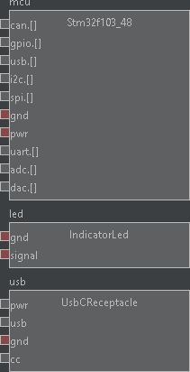  
With something on your screen now, you can zoom in and out of the visualization using the mousewheel, or pan by clicking and dragging.

As the design is incomplete, **it is expected that there will be errors**.
The red ports indicate ports that need to be connected, but aren't.
We'll fix that next.

### Connecting blocks
Blocks alone aren't very interesting, and they must be connected to be useful.
First, we need to connect the power and ground between the devices, by **adding connect statements after your block instantiations**:

```python
self.connect(self.usb.pwr, self.mcu.pwr)
self.connect(self.usb.gnd, self.mcu.gnd, self.led.gnd)
```

> `self.connect(...)` connects all the argument ports together. 
> Connections are strongly typed based on the port types: the system will try to infer a _link_ based on the argument port types and count.

> You can also connect ports through graphical operations in the IDE.
> 1. Again, start by selecting the insert location in code, by setting the caret to the end of `super().contents()`.
> 2. Double click any of the ports you want to connect.
>    This starts a connection operation, which dims out the ports that cannot be connected.
> 3. Select (single click) on all the other ports you want to connect.
>    - The order in which you select additional ports determines the order of the ports in the generated code.
> 4. Double-click anywhere (within a block) to make the connections.
>    - You can also cancel the connect operation by double-clicking anywhere (within a block) without additional ports selected, or through the right-click menu.
> 5. Optionally, in the text prompt. give the connection a name.
> 6. The connection should appear in the block diagram visualizer, and the corresponding line of code should be inserted.

If you're using the IDE, once you recompile the block diagram should look like:  
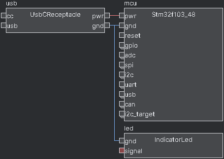

Then, we need to connect the LED to a GPIO on the microcontroller, by **adding this connect statement:**.

```python
self.connect(self.mcu.gpio.request('led'), self.led.signal)
```

> Microcontroller GPIOs (and other IOs like SPI and UART) are _port arrays_, which are dynamically sized.
> Here, we `request(...)` a new GPIO from the GPIO port array, then connect it to the LED.
> `request(...)` takes an optional name parameter, the meaning of which depends on the block.
> For microcontrollers, this name can be used later to manually assign pins to simplify layout.
> 
> Port arrays behave differently when viewed externally (as we're doing here) and internally (for library builders).
> Internal usage of port arrays will be covered later in the library building section.

> Port arrays are a recent feature and are not supported yet with graphical operations in the IDE.
> This can only be done by writing textual HDL... for now.

Recompiling in the IDE yields this block diagram:  
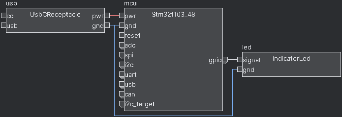

> <details>
>   <summary>At this point, your HDL might look like...</summary>
>
>   ```python
>   class BlinkyExample(SimpleBoardTop):
>     def contents(self) -> None:
>       super().contents()
>       self.usb = self.Block(UsbCReceptacle())
>       self.mcu = self.Block(Stm32f103_48())
>       self.led = self.Block(IndicatorLed())
>       self.connect(self.usb.gnd, self.mcu.gnd, self.led.gnd)
>       self.connect(self.usb.pwr, self.mcu.pwr)
>       self.connect(self.mcu.gpio.request('led'), self.led.signal)
>   ```
> </details>


## Fixing Blinky
_In this section, we will explore and fix the remaining compiler errors to get to a clean design._

While the design is now structurally complete, we still have errors in the form of failed assertions.
Assertions are checks on the electronics model, in this case it's detecting a voltage incompatibility between the USB's 5v out and the STM32's 3.3v tolerant power inputs.

If you're in the IDE, errors will show up in the compilation log and in the errors tab:  
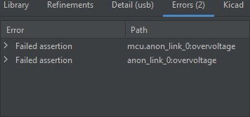  
You can also inspect the details of the power connection by mousing over it:   
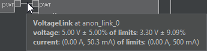

### Adding a Buck Converter
To run the STM32 within its rated voltage limits, we'll need something to lower the 5v from USB to the common 3.3v power expected by modern devices.
Here, we'll choose to use a buck converter, a high-efficiency DC-DC switching converter.
**Repeat the add block flow** with a `BuckConverter` block, **then update the power (between the USB and the microcontroller) and ground connections**.
**Make sure to delete the previous power and ground connections, otherwise it will error out from over-connection.** 
```python
self.buck = self.Block(BuckConverter(3.3*Volt(tol=0.05)))

self.connect(self.usb.pwr, self.buck.pwr_in)
self.connect(self.buck.pwr_out, self.mcu.pwr)
self.connect(self.usb.gnd, self.buck.gnd, self.mcu.gnd, self.led.gnd)
```

> The `BuckConverter` block is parameterized - configured by additional data specified as constructor arguments.
> Here, we've specified a target output voltage of 3.3v.
> 
> Many blocks in the library are parameterized, allowing them to be used in a wide range of situations.
> See each block's definition or documentation for what those parameters mean.

> If using the IDE, make sure to select a local location for insertion.
> This block logically goes between the USB input and the microcontroller, but it just needs to be declared before any connect statements involving it.
> The IDE will create a block with empty parameters for you to fill.
> 
> You can append the buck converter's ground pin to the existing ground connect statement:
> 1. Select the existing connect statement in the code.
> 2. Start a connect operation at any port that is part of the existing connection.
>    - It is not currently supported to add to an existing connection without starting the connect operation at that connection.
> 3. Add the new port to the selection and finish the connect operation as typical.
> 
> The IDE does not support disconnect operations, so you'll have to edit the HDL for code that.
> However, the IDE can help you find where the code is:
> 1. Right click on any port in the connection, then select "Goto Connect".

If you try recompiling it, it will give you a bunch of errors, all stemming from the BuckConverter block being _abstract_, or not having an implementation (and hence no output voltage, which confuses everything downstream).
Abstract blocks are useful for two reasons:
1. It allows your design to be more general and allows you to defer implementation choices until later.
   This is more relevant for library builders, where you may want to give the system designer the choice of, for example, whether to use a surface-mount or through-hole resistor.
2. It can help preserve design intent more precisely and keep HDL readable.
   For example, saying that we want a buck converter by instantiating a buck converter is more intuitive than directly instantiating, for example, a TPS561201 block.

Unlike in software, we can instantiate abstract blocks here, but they won't actually place down a useful circuit.
We can _refine_ those abstract blocks to give them a _concrete_ subclass by **adding a refinements block in the top-level design class**.
```python
class BlinkyExample(SimpleBoardTop):
  def contents(self) -> None:
    ...

  def refinements(self) -> Refinements:
    return super().refinements() + Refinements(
    instance_refinements=[
      (['buck'], Tps561201),
    ])
```

> `BoardTop` defines default refinements for some common types, such has choosing surface-mount components for `Resistor` and `Capacitor`.
> You can override these with a refinement in your HDL, for example choosing `AxialResistor`.

> If using the IDE, refinements can be done through the library browser.
> 1. Select (single click) on the block you want to refine.
> 2. In the Library Browser, search for the class you want to refine into.
>    If you don't know, you can filter by the abstract type and see what options are under it.
> 3. Right-click the subclass in the Library Browser, and click "Refine instance...".
>    - Refine instance only affects the single selected block.
>    - Refine class affects all classes of the selected block.
>      This may be useful, for example, if you wanted to do a design-wide replacement of all generic resistors with a specific type.
> 4. The corresponding refinement block should be inserted, or if it already exists, a new refinement entry will be added.

Recompiling in the IDE yields this block diagram and no errors:  
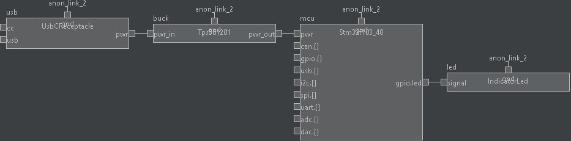

> <details>
>   <summary>At this point, your HDL might look like...</summary>
>
>   ```python
>   class BlinkyExample(SimpleBoardTop):
>     def contents(self) -> None:
>       super().contents()
>       self.usb = self.Block(UsbCReceptacle())
>       self.buck = self.Block(BuckConverter(3.3*Volt(tol=0.05)))
>       self.mcu = self.Block(Stm32f103_48())
>       self.led = self.Block(IndicatorLed())
>       self.connect(self.usb.gnd, self.buck.gnd, self.mcu.gnd, self.led.gnd)
>       self.connect(self.usb.pwr, self.buck.pwr_in)
>       self.connect(self.buck.pwr_out, self.mcu.pwr)
>       self.connect(self.mcu.gpio.request('led'), self.led.signal)
>
>     def refinements(self) -> Refinements:
>       return super().refinements() + Refinements(
>       instance_refinements=[
>         (['buck'], Tps561201),
>       ])
>   ```
> </details>

### Deeper Inspection
One major benefit of this HDL-based design flow is the design automation that is encapsulated in the libraries.
Here, we were able to place down a buck converter - a non-trivial subcircuit - with just one line of code.
The library writer has done the hard work of figuring out how to size the capacitors and inductors, and wrapped it into this neat `BuckConverter` block.

You may want to inspect the results.
In the IDE, you can hover over the output line and see that it is at 3.3v ±4.47%.
Why?
You can dig into the Tps561201 by double-clicking on it:  
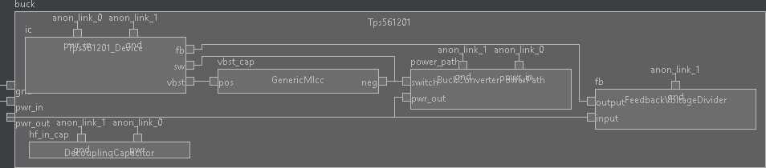

The implementation uses a feedback voltage divider, and if you mouseover this it will show the generated ratio of 0.23.
The converter's output voltage reflects the actual expected output voltage, accounting for resistor tolerance and the chip's feedback reference tolerance.  
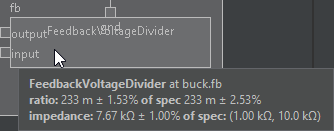

Similarly, mousing over the other components like the resistors and capacitors shows their details.

To zoom out, double-click on the topmost block.

## KiCad Import
If you have KiCad installed, you can import this full design into the layout editor. _KiCad 6.0+ is required, the netlist format is not compatible with 5.x or lower!_

In the KiCad PCB Editor (layout tool), go to File > Import > Netlist..., and open the netlist file generated.
KiCad will produce an initial placement that roughly clusters components according to their hierarchical grouping:
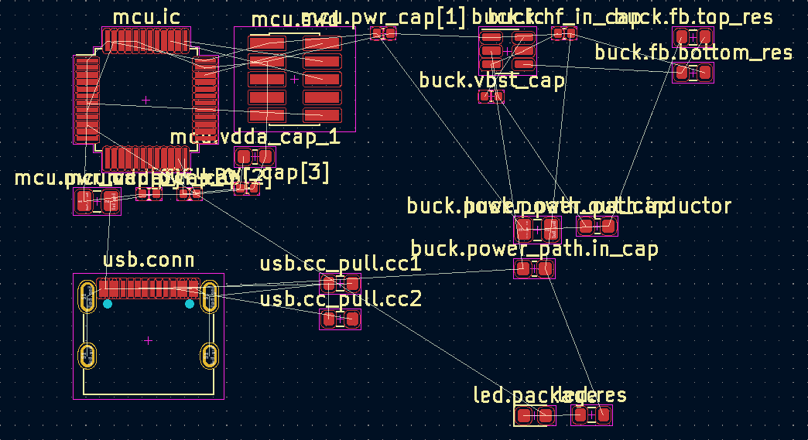

The block hierarchy will appear to KiCad as a sheet hierarchy.
You can, for example, right click one of the footprints > Select > Items in Same Hierarchical Sheet, and it will select all footprints in that sub-block.
Some external hierarchical plugins like [Replicate Layout](https://github.com/MitjaNemec/ReplicateLayout) also work.

As you continue to write HDL, both generated refdes and tstamp are stable, allowing you to update a partial layout with a new netlist.
**Both are tied to the hierarchical path, so if those change, then both refdes and tstamp will change.**
When you're near ready for production, you can toggle traditional refdes generation (R1, R2, instead of current hierarchical path).


## Expanding Blinky
_In this section, we will add a tactile switch and three more LEDs._

### Adding a Switch
A tactile switch with a digital output can be instantiated as `DigitalSwitch()` which has an `out` port.
Using what you've learned above, instantiate a switch and connect it to the microcontroller.

### Arraying LEDs
While you certainly can copy-paste the above LED instantiation 4 times, that's no fun given that we're in a programming language with `for` loops.

**Replace your single LED instantiation and connections with**:
```python
self.led = ElementDict[IndicatorLed]()
for i in range(4):
  self.led[i] = self.Block(IndicatorLed())
  self.connect(self.mcu.gpio.request(f'led{i}'), self.led[i].signal)
  self.connect(self.usb.gnd, self.led[i].gnd)
```

> ElementDict creates a naming space that is an extension of the parent and is needed to give a unique, arrayed name for the LED being created.
> The square brackets provide the type parameter for the value type, which is necessary when using static analysis tools like mypy.

> The IDE cannot produce code that programmatically generates hardware.
> In general, code offers you a lot more power than can be achieved through the GUI
> 
> However, the visualizer will run fine.

Recompiling in the IDE yields this block diagram:  
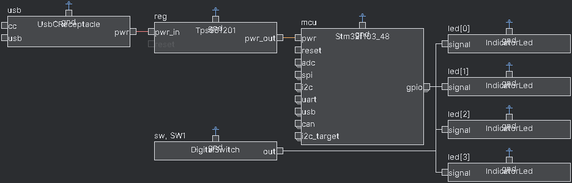

> <details>
>   <summary>At this point, your HDL might look like...</summary>
>
>   ```python
>   class BlinkyExample(SimpleBoardTop):
>     def contents(self) -> None:
>       super().contents()
>       self.usb = self.Block(UsbCReceptacle())
>       self.buck = self.Block(BuckConverter(3.3*Volt(tol=0.05)))
>       self.mcu = self.Block(Stm32f103_48())
>       self.connect(self.usb.gnd, self.buck.gnd, self.mcu.gnd)
>       self.connect(self.usb.pwr, self.buck.pwr_in)
>       self.connect(self.buck.pwr_out, self.mcu.pwr)
> 
>       self.sw = self.Block(DigitalSwitch())
>       self.connect(self.mcu.gpio.request('sw'), self.sw.out)
>       self.connect(self.usb.gnd, self.sw.gnd)
>
>       self.led = ElementDict[IndicatorLed]()
>       for i in range(4):
>         self.led[i] = self.Block(IndicatorLed())
>         self.connect(self.mcu.gpio.request(f'led{i}'), self.led[i].signal)
>         self.connect(self.usb.gnd, self.led[i].gnd)
>
>     def refinements(self) -> Refinements:
>       return super().refinements() + Refinements(
>       instance_refinements=[
>         (['buck'], Tps561201),
>       ])
>   ```
> </details>


## Syntactic sugar
_Syntactic sugar refers to syntax within programming languages that makes things more usable._
_In this section, we clean up the prior example by consolidating some repetitive connections through implicit scopes._

> Similar to arraying LEDs, the IDE does not have any special support for generating these operations.
> However, the visualizer will continue to run fine.

### Implicit Connections
Because some connections (like power and ground) are very common, the HDL provides the idea of an implicit connection scope to automatically make them when a block is instantiated.
In our example, we can get rid of the explicit power and ground connections.
Start by **adding an implicit scope** to tie Power-tagged ports to `self.buck.pwr_out` and Common- (ground) tagged ports to `self.buck.gnd`:
```python
with self.implicit_connect(
    ImplicitConnect(self.buck.pwr_out, [Power]),
    ImplicitConnect(self.buck.gnd, [Common]),
) as imp:
  ...
```

> When blocks define ports, they can associate tags with them to specify implicit connectivity.
> To prevent errors, all ports with tags are required to be connected, either implicitly (as in this section) or explicitly (through `connect` statements).
> `Power` (for a general positive voltage rail) and `Common` (for ground) are the most common tags.

Inside an implicit connection block, only blocks instantiated with `imp.Block(...)` have implicit connections made.
**Move the microcontroller, switch, and LED instantiation into the scope, and delete their power and ground connections**:

```python
self.buck = self.Block(BuckConverter())
with self.implicit_connect(
    ImplicitConnect(self.buck.pwr_out, [Power]),
    ImplicitConnect(self.buck.gnd, [Common]),
) as imp:
  self.mcu = imp.Block(Stm32f103_48())

  self.sw = imp.Block(DigitalSwitch())
  self.connect(self.mcu.gpio.request('sw'), self.sw.out)

  self.led = ElementDict[IndicatorLed]()
  for i in range(4):
    self.led[i] = imp.Block(IndicatorLed())
    self.connect(self.mcu.gpio.request(f'led{i}'), self.led[i].signal)
```

Remember that the buck converter is outside the implicit scope because it takes 5v and must be connected separately.

> <details>
>   <summary>At this point, your HDL might look like...</summary>
>
>   ```python
>   class BlinkyExample(SimpleBoardTop):
>     def contents(self) -> None:
>       super().contents()
>       self.usb = self.Block(UsbCReceptacle())
>       self.buck = self.Block(BuckConverter(3.3*Volt(tol=0.05)))
>       self.connect(self.usb.gnd, self.buck.gnd)
>       self.connect(self.usb.pwr, self.buck.pwr_in)
>
>       with self.implicit_connect(
>           ImplicitConnect(self.buck.pwr_out, [Power]),
>           ImplicitConnect(self.buck.gnd, [Common]),
>       ) as imp:
>         self.mcu = imp.Block(Stm32f103_48())
>
>         self.sw = imp.Block(DigitalSwitch())
>         self.connect(self.mcu.gpio.request('sw'), self.sw.out)
>
>         self.led = ElementDict[IndicatorLed]()
>         for i in range(4):
>           self.led[i] = imp.Block(IndicatorLed())
>           self.connect(self.mcu.gpio.request(f'led{i}'), self.led[i].signal)
>
>     def refinements(self) -> Refinements:
>       return super().refinements() + Refinements(
>       instance_refinements=[
>         (['buck'], Tps561201),
>       ])
>   ```
> </details>

### Chain Connects
Another shorthand is for chained connections of blocks with inline declarations of blocks.
We could, **inside the implicit scope, replace the LED and switch instantiations and connections, with**:  
```python
(self.sw, ), _ = self.chain(imp.Block(DigitalSwitch()), self.mcu.gpio.request('sw'))
...
(self.led[i], ), _ = self.chain(self.mcu.gpio.request(f'led{i}'), imp.Block(IndicatorLed()))
```

`chain` takes blocks and ports as arguments, from left to right as inputs to outputs, and does `connects` to chain them together.
The first argument is treated as the initial input, and the last element is treated as the final output.
Blocks in the middle (if any) have the previous link connected to their `Input`-tagged ports and present their `Output`-tagged ports for the next element, or attach their `InOut`-tagged port to the previous link which is also presented to the next element.
Only one pin per block may be tagged with `Input`, `Output`, and `InOut`.

`chain` returns a chain object, which can be unpacked into a tuple of blocks that are part of the chain and the chain object itself.
The tuple of blocks can be used to name inline blocks declared in the chain (which is done in the blinky example to name the LED and switch), and the chain object can be used to name the links.

> As a more complicated example, running `self.chain(Port1, Block1, Block2, Block3, Block4)` (with the block definitions written as are shown below) would produce this block diagram:  
>   
> The chain starts at Port1.
> Block1 and Block2 have both an Input and Output port, so the chain goes "through" those blocks.
> Block3 has an InOut port, so it is attached to the previous connection, but the chain goes not go "through" it.
> Because Block4 is the last in the chain, it only needs an Input port.

> <details>
>   <summary>At this point, your HDL might look like...</summary>
>
>   ```python
>   class BlinkyExample(SimpleBoardTop):
>     def contents(self) -> None:
>       super().contents()
>       self.usb = self.Block(UsbCReceptacle())
>       self.buck = self.Block(BuckConverter(3.3*Volt(tol=0.05)))
>       self.connect(self.usb.gnd, self.buck.gnd)
>       self.connect(self.usb.pwr, self.buck.pwr_in)
>
>       with self.implicit_connect(
>           ImplicitConnect(self.buck.pwr_out, [Power]),
>           ImplicitConnect(self.buck.gnd, [Common]),
>       ) as imp:
>         self.mcu = imp.Block(Stm32f103_48())
>
>         (self.sw, ), _ = self.chain(imp.Block(DigitalSwitch()), self.mcu.gpio.request('sw'))
>
>         self.led = ElementDict[IndicatorLed]()
>         for i in range(4):
>           (self.led[i], ), _ = self.chain(self.mcu.gpio.request(f'led{i}'), imp.Block(IndicatorLed()))
>
>     def refinements(self) -> Refinements:
>       return super().refinements() + Refinements(
>       instance_refinements=[
>         (['buck'], Tps561201),
>       ])
>   ```
> </details>


## Changing the Microcontroller
_Finally, let's put the finishing touches on this design by changing the microcontroller and specifying a pin assignment._

### Using the IoController Abstract Class
Like the `BuckConverter`, there is actually an abstract class for microcontrollers, `IoController`.
`Stm32f103_48` extends this class and adheres to its interface, so we can **change the type of `mcu` to `IoController`**, then **add a refinement to `Stm32f103_48`**.

```python
class BlinkyExample(SimpleBoardTop):
  def contents(self) -> None:
    ...

  def refinements(self) -> Refinements:
    return super().refinements() + Refinements(
    instance_refinements=[
      ...
      (['mcu'], Stm32f103_48),
    ])
```

> `IoController` defines an interface of a power and ground pin, then an array of common IOs including GPIO, SPI, I2C, UART, USB, CAN, ADC, and DAC.
> Not all devices that implement it have all those capabilities (or the number of IOs requested), in which case they will fail with a compilation error.
> This interface generalizes beyond microcontrollers to anything that can control IOs, such as FPGAs.

With the abstract block in place, we can now easily change it to something else.
Perhaps we want a microcontroller with built-in wifi, so
**change the refinement to an `Esp32_Wroom_32`**.

> If using the IDE, refinements can be changed the same way they are defined.
> The IDE will update the existing refinement instead of inserting a new entry.

### Explicit Pin Assignments
While `IoController` can assign peripherals like SPI pins according to the capabilities of each chip, it does not have access to layout data to do physically-based pin assignment.
However, it does define a `pin_assigns` parameter (as an array-of-strings) which allows specifying a pin number (on the footprint) or pin name (eg, `PC_13` - format specific to each microcontroller) for each requested pin.

We can also force parameter values through the refinements system, using `instance_values`.
Let's arbitrarily choose pins 26-29 for the LEDs.
**Add a pin assignment for the ESP32 in the refinements section**:
```python
class BlinkyExample(SimpleBoardTop):
  def contents(self) -> None:
    ...

  def refinements(self) -> Refinements:
    return super().refinements() + Refinements(
    instance_refinements=[
      ...
    ],
    instance_values=[
      (['mcu', 'pin_assigns'], [
        'led0=26',
        'led1=27',
        'led2=28',
        'led3=29',
      ])
    ])
```

> <details>
>   <summary>At this point, your HDL might look like...</summary>
>
>   ```python
>   class BlinkyExample(SimpleBoardTop):
>     def contents(self) -> None:
>       super().contents()
>       self.usb = self.Block(UsbCReceptacle())
>       self.buck = self.Block(BuckConverter(3.3*Volt(tol=0.05)))
>       self.connect(self.usb.gnd, self.buck.gnd)
>       self.connect(self.usb.pwr, self.buck.pwr_in)
>
>       with self.implicit_connect(
>           ImplicitConnect(self.buck.pwr_out, [Power]),
>           ImplicitConnect(self.buck.gnd, [Common]),
>       ) as imp:
>         self.mcu = imp.Block(IoController())
>
>         (self.sw, ), _ = self.chain(imp.Block(DigitalSwitch()), self.mcu.gpio.request('sw'))
>
>         self.led = ElementDict[IndicatorLed]()
>         for i in range(4):
>           (self.led[i], ), _ = self.chain(self.mcu.gpio.request(f'led{i}'), imp.Block(IndicatorLed()))
>
>     def refinements(self) -> Refinements:
>       return super().refinements() + Refinements(
>       instance_refinements=[
>         (['buck'], Tps561201),
>         (['mcu'], Esp32_Wroom_32),
>       ],
>       instance_values=[
>         (['mcu', 'pin_assigns'], [
>           'led0=26',
>           'led1=27',
>           'led2=28',
>           'led3=29',
>          ])
>       ])
>   ```
> </details>

And that's it for board-level design!
You can import the netlist into KiCad if you'd like.
Good luck with building PCBs!


## Defining Library Parts
Continue to [part 2 of the tutorial](getting_started_library.md) on defining a library part.

### Additional Resources
If you want to some more complex examples of boards designed in this HDL, check out:
- [LED Matrix](examples/test_ledmatrix.py): a charlieplexed LED matrix.
  Ignore the implementation of the charlieplexing LED matrix library block for now, just look at the top-leve design.
- [Simon Game](examples/test_simon.py): an implementation of the Simon electronic game, that uses 12v dome buttons and includes the needed power conversion circuitry.
- [CANdapter](examples/test_can_adapter.py): an USB to isolated CAN adapter, with a bunch of onboard LEDs and an LCD display.
