# Getting Started Tutorial

Introductory tutorial and example starter project, building towards a basic mechanical keyboard macropad.


## Core concepts
The core abstraction is the hierarchical block diagram, which we will explain using an example design of a microcontroller driving an LED.

In conventional schematic tools, such a design could be a flat schematic, consisting of the microcontroller module, LED, and resistor:  
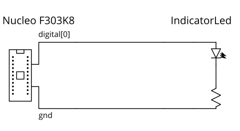

Modern tools have the concept of hierarchy blocks, where a block could be a subcircuit:
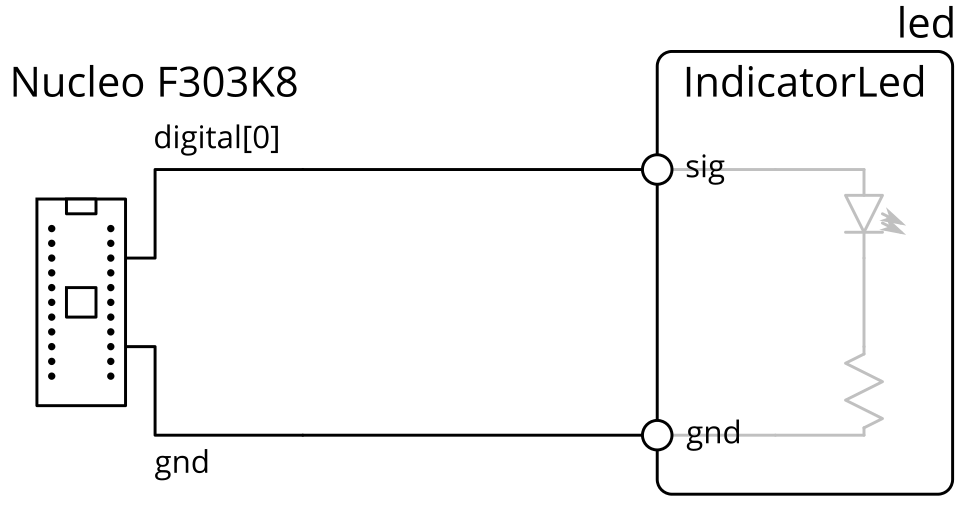

In the example above, the LED-resistor subcircuit is contained within a block, which can be manipulated as a unit, and exposes ports (circles on the diagram) while encapsulating internal pins.

Generalizing this model, components are blocks too, and component pins are also block ports:  
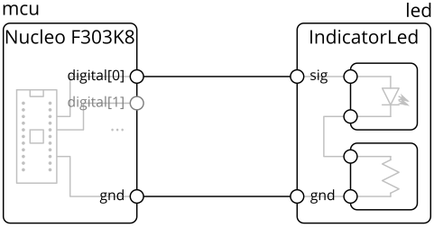

The main concepts our model extends on top of the simple hierarchy blocks above are **parameters** and **generators**.

**Parameters** are variables that can be attached to blocks and ports.
For example, a digital IO, like the `mcu`'s `digital[0]` in the example above, would have parameters like voltage limits, output voltage range, and logic thresholds.
This allows for automated design correctness check of basic datasheet parameters (think ERC++) and provides a foundation for generators.

**Generators** allow a block's internal contents to be constructed by code, possibly based on parameters on it and its ports.
For example, the `IndicatorLed` block automatically sizes the resistor based on the input voltage on the `sig` pin, and the DC-DC converter block automatically sizes inductors and capacitors based on the target output voltage and current.

<details> <summary>Under the hood: from connections to links</summary>

While the user-facing HDL design model is connections between ports, the internal model expands these connections into **links**.
Links are a block-like construct (diamonds in the diagram) that define how parameters propagate between ports and constraints on them.
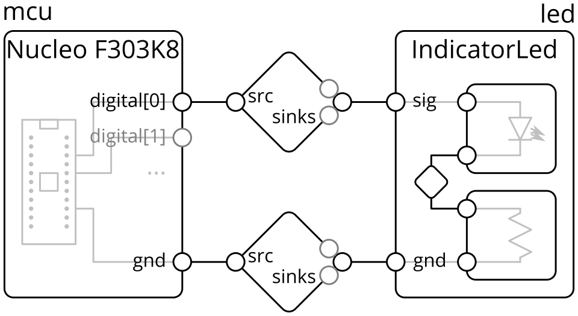

Continuing the digital IO example, the link checks the output thresholds against the input thresholds and calculates the full range of voltage levels given all connected drivers.
These could be viewed as a block-like object (diamonds on the diagram) instead of direct wire connections:  

All links are fully defined in the same HDL code, and you can inspect the link definitions of included port types to see how they work and what they check.
You can also write custom links and ports, though this will be unnecessary for most users.

</details>


### Setup
Instructions for setting up the IDE and compiler are in the [setup document](setup.md).

The rest of this tutorial requires that you have this `edg` package (available on `pip`) installed.


### Reference Document
While this getting started guide is meant to be self-contained, you may also find the [reference document](reference.md) helpful, especially as you build designs outside this tutorial.


### Hardware Description Language (HDL)
To support user-defined computation of parameters and generator blocks, the design system is implemented as a _hardware description language_ (HDL).
That is, blocks are "placed" or instantiated, and their ports are connected, through lines in code instead of GUI actions in a graphical schematic.


### Optional Integrated Development Environment (IDE) with Graphical Editor
We have also built a basic IDE (as a PyCharm plugin) that provides some basic graphical integrations for working with HDL. 
Specifically, it:
- generates a block diagram visualization of the design
- allows inspection of solved / computed parameters in the design
- provides schematic-like graphical edit actions to insert HDL

The graphical edit actions have significant limitations (and probably bugs / unhandled edge cases) compared to the full HDL and are best suited for simple designs or as a learning tool.
**Consider it more of a tech demonstrator and proof-of-concept** but do give it a try.

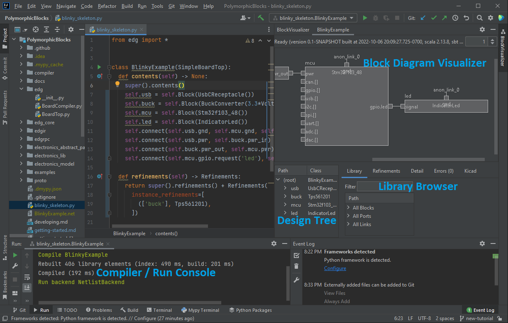

The IDE has these major components:
- **Block Diagram Visualization**: shows the compiled design visualized as a block diagram.
  - **Design Tree**: shows the compiled design as a tree structure of the block hierarchy.
- **Library Browser**: shows all the library blocks, ports, and links.
  The text box at the top allows filtering by keyword.
  - The preview box on the right shows more information on the selected library block, including docstring (if available), instantiation parameters, and block diagram preview.
- **Compiler / Run Console**: shows the compilation log, including any errors and prints from Python as HDL runs.

The rest of this tutorial focuses on the HDL, but equivalent graphical edit actions (where possible) are described in expandable boxes.
**As you go through the tutorial, you can write the code shown in the code blocks or follow the graphical actions.**


## A top-level design: Blinky
_In this example, we will create a basic LED controlled by a microcontroller._

Start by creating a `blinky.py`, and filling it with this skeleton code:

```python
from edg import *


class BlinkyExample(SimpleBoardTop):
  def contents(self) -> None:
    super().contents()
    # your implementation here


if __name__ == "__main__":
  compile_board_inplace(BlinkyExample)
```

- `from edg import *` brings in the base classes for circuit construction, like `SimpleBoardTop`.
- `class BlinkyExample` contains the (top-level) circuit you're going to build, and it extends the top-level block base class `SimpleBoardTop`.
  It's empty for now, but we'll fill it in the next section.
  - `SimpleBoardTop` provides some default component mappings and relaxes some strict constraints that do not matter for maker-type boards.
- `compile_board_inplace(...)` invokes the circuit generator given the top-level design (`BlinkyExample`).
  This is the starting point that allows the file to run as a Python script, and you can treat it as magic.

Try building the example now.

**If using the command line**: 
1. Run `python blinky.py`.
   If all worked, this should create a folder `BlinkyExample` with a netlist `BlinkyExample.net` inside.

**If using the IDE**: 
1. Click the run icon  in the gutter (with the line numbers) next to `class BlinkyExample`:

   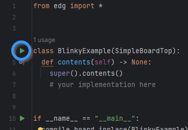
   
   _Make sure that you're using the run icon associated with `class BlinkyExample`, not the file, and not `if __name__ == "__main__"`._
2. Then from the menu, click the Run option.  
   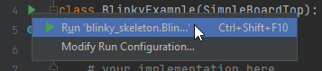
   > **Tip**: Next time, you can rebuild the design by re-running the last selected run configuration with hotkey **Shift+F10** (Windows) or **Ctrl+R** (MacOS).

   > **Recompilation caching behavior**: the IDE only re-compiles block classes when it detects changes in its source (including some dependencies), but this misses edge cases including:
   >
   > - Any changes outside the class, even if the code is called by the class.
   > - Changes to supporting files (such as part tables and imported schematics), even if they are referenced in the class.
   > - Changes to default values of `__init__` arguments.
   >
   > You can clear all compiled blocks through main menu > Tools > Empty Block Cache.
3. The design should build, and you should get a run log that looks something like:
   ```
   Starting compilation of blinky.BlinkyExample
   Using interpreter from configured SDK [...]
   [... lots of compilation output here ...]
   Completed: generate netlist: wrote [...]
   ```
4. Some options (like where the netlist is generated into) can be modified via the run options at the top right:  
   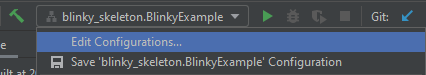


### Creating the microcontroller and LED
For this simple example, we connect an LED to a self-powered Xiao Rp2040 microcontroller dev board.

**Make these changes** to the `contents` method:
```diff
  def contents(self) -> None:
    super().contents()
-   # your implementation here
+   self.mcu = self.Block(Xiao_Rp2040())
+   self.led = self.Block(IndicatorLed())
```

<details> <summary>Alternatively, with IDE graphical edit actions</summary>

Let's start by instantiating the USB type-C receptacle through graphical operations in the IDE.
1. In the Library Browser, search for the block (here, `Xiao_Rp2040`) using the Filter textbox:  
   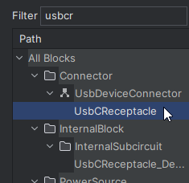

   > The library icons have these meanings:
   > -  (category): this "block" is actually a category organizer and cannot be instantiated.
   > -  (abstract type): this block is an abstract type.
   >   Abstract blocks can be instantiated and will be discussed more later.

2. Double-click the library entry.
   This will insert the code to instantiate the block as a _live template_, code with template fields you can fill in:  
   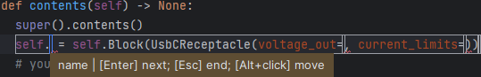  
   **Editing outside the currently active template field (boxed in blue) will break off and cancel the template.**
   **Moving the cursor outside the currently active template field, either using the mouse or keyboard arrows, is discouraged.**
3. Name the block `usb`, by typing it into the first template field.  
   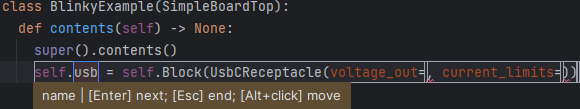
4. Then press [Tab] through the end of the template (leaving the other fields empty, they're optional).
5. Once you commit the live template, the block will appear in the block diagram visualizer.
    - The hatched pattern (diagonal lines) in the block diagram visualizer indicates that the block may be out-of-sync with the code until the next re-compile.

> While the template is active, you can:
> - Press [Enter] or [Tab] to move to the next template field.
>   Validation may prevent moving to the next field, for example if the name field is invalid.
> - Tabbing past the last field will commit the template.
> - Press [Shift+Tab] to move back to the previous template field.
> - Use [Alt+Click] to move the template to another place in the code.
>   If the selected place isn't valid, the template will snap to a valid location.
> - Press [Esc] to cancel the template, ending the editing but leaving the code in place.
>   Canceling a blank template deletes the inserted code.

**Repeat for the LED** (`IndicatorLed`, named `led`).

</details>

`self.Block(...)` creates a sub-block in `self` (the current hierarchy block being defined).
It must be assigned to an instance variable (in this case, `mcu`), which is used as the name sub-block.

If using the IDE: the compiled block diagram should look like:  
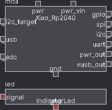  
With something on your screen now, you can zoom in and out of the visualization using the mousewheel, or pan by clicking and dragging.

As the design is incomplete, **it is expected that there will be errors**.
The red ports indicate ports that need to be connected, but aren't.
We'll fix that next.

### Connecting blocks
Blocks alone aren't very interesting, and they must be connected to be useful.
First, we need to connect the power and ground between the devices.

**Make these changes** to the `contents` method:
```diff
  def contents() -> None:
    super().contents()
    self.mcu = self.Block(Xiao_Rp2040())
    self.led = self.Block(IndicatorLed())
+   self.connect(self.mcu.gnd, self.led.gnd)
```

<details> <summary>Alternatively, with IDE graphical edit actions</summary>

1. Double click any of the ground ports (say, `mcu.gnd`).
   This starts a connection operation, which dims out the ports that cannot be connected:  
   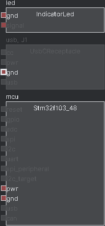
2. Select (single click) on all the other ground ports to be connected (here, just `led.gnd`):  
   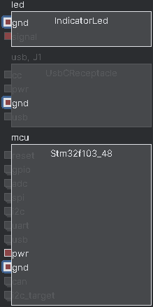
3. Double-click anywhere (within a block) to complete and insert the connections as a live template.
   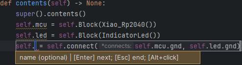
   > - Double-click on a port to simultaneously select that port and complete and insert the connection.
   > - Alternatively, cancel a connect operation by pressing [Esc] while the block diagram visualizer is selected.
4. The name template field is optional, leave it blank and [Tab] past it.
   > - Like the block instantiation, you can move the live template with [Alt+Click].
5. Once you commit the live template, the connection will appear in the block diagram visualizer.

</details>

`self.connect(...)` connects all the argument ports together.
Connections are strongly typed based on the port types: the system will try to infer a _link_ based on the argument port types and count.

If using the IDE: the compiled block diagram should look like:  
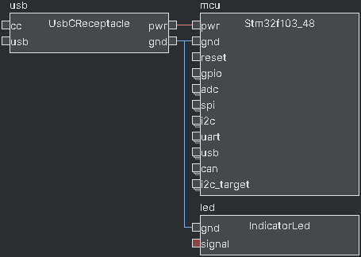

Then, we need to connect the LED to a GPIO on the microcontroller.
Make these changes to the `contents` method:

```diff
  def contents() -> None:
    super().contents()
    self.mcu = self.Block(Xiao_Rp2040())
    self.led = self.Block(IndicatorLed())
    self.connect(self.mcu.gnd, self.led.gnd)
+   self.connect(self.mcu.gpio.request('led'), self.led.signal)
```

<details> <summary>Alternatively, with IDE graphical edit actions</summary>

1. **Repeat the previous connect process**, but with `mcu.gpio` to `led.signal`.
   The microcontroller GPIO port  looks different as it is a dynamically sized port array.
   Connections into it  `request(...)` a new element from the array.
2. Give the GPIO pin an (optional) name `led` by modifying the generated code:
   ```diff
   - self.connect(self.mcu.gpio.request(), self.led.signal)
   + self.connect(self.mcu.gpio.request('led'), self.led.signal)
   ```
   
   Port array element naming has no graphical operation. 

</details>

Microcontroller GPIOs (and other IOs like SPI and UART) are _port arrays_, which are dynamically sized.
Here, we `request(...)` a new GPIO from the GPIO port array, then connect it to the LED.
`request(...)` takes an optional name parameter, the meaning of which depends on the block.

By default, these connections are arbitrarily assigned to microcontroller pins.
However pin assignments can also be manually specified (using this name parameter) to simplify board layout - this will be covered at the end of this tutorial.
 
Port arrays can be connected as a unit, which also propagates the length, though this isn't yet supported with graphical operations.
 
Port arrays behave differently when viewed externally (as we're doing here) and internally (for library builders).
Internal usage of port arrays will be covered later in the library building section.

This should now compile without errors.

If using the IDE: the compiled block diagram should look like:
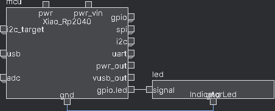


## To KiCad Layout

If you have KiCad installed, you can import the design into the layout editor. _KiCad 6.0+ is required, the netlist format is not compatible with 5.x or lower!_

In the KiCad standalone PCB Editor (layout tool), go to File > Import > Netlist..., and open the netlist file generated.
KiCad will produce an initial placement that roughly clusters components according to their hierarchical grouping:
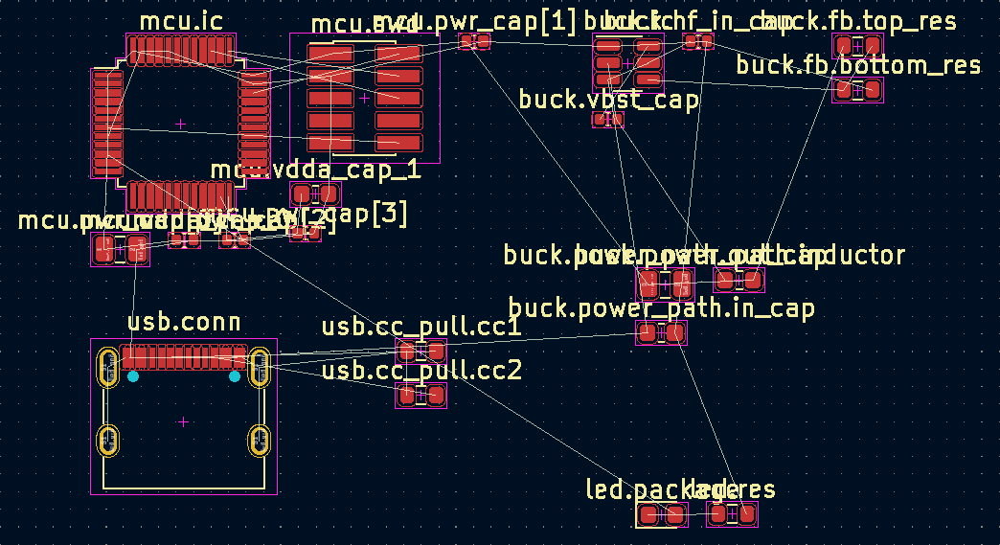

The generated netlist preserves the design hierarchy.
This works with KiCad 10+'s native design blocks feature (which is somewhat heavyweight) as well as the [Sublayout plugin](https://github.com/ducky64/sublayout) (more lightweight and limited).
Once you complete this keyboard example, check out the [hierarchical layout tutorial](getting_started_hierarchy_layout.md) for hierarchical layout replication.
Some plugins (like Replicate Layout) require a schematic for equivalence validation and cannot be used with this flow.

By default, each footprint's value field is set to the block's full path name, on the F.Fab layer.
This can be useful during placement to understand the function of each component.

As you continue to modify HDL, the unique component identifiers (tstamps) are stable and allows you to update a partial layout with a new netlist.
**Unique component identifiers are generated from Block names, so if HDL names change those footprints will not update.**


## Adding a Switch Matrix Generator
__Now, we'll add a 3x2 switch matrix with just a few lines of code, this is where generators really shine!__

**Make these changes** to the `contents` method:
```diff
  def contents() -> None:
    super().contents()
    self.mcu = self.Block(Xiao_Rp2040())
    self.led = self.Block(IndicatorLed())
    self.connect(self.mcu.gnd, self.led.gnd)
    self.connect(self.mcu.gpio.request('led'), self.led.signal)

+   self.sw = self.Block(SwitchMatrix(ncols=2, nrows=3))
+   self.connect(self.sw.cols, self.mcu.gpio.request_vector('cols'))
+   self.connect(self.sw.rows, self.mcu.gpio.request_vector('rows'))
```

<details> <summary>Alternatively, with IDE graphical edit actions</summary>

TODO Write Me 

</details>

`SwitchMatrix` is a generator block that takes the number of columns (width) and rows (height) as parameters and generates the switch matrix (including diodes for multi-key detection).
For keyboard enthusiasts, this generates COL2ROW circuits.

`SwitchMatrix` has two ports, `cols` and `rows`, both of which are port arrays.
Unlike microcontrollers, where the array is defined by its incoming connections (are elements sinks), `SwitchMatrix` port arrays are internally defined (are elements sources) based on the parameters.

Port arrays can be connected to other arrays, forming a parallel connection.
Here, we connect `cols` (and `rows`) to the microcontroller, using `request_vector(...)` to request a new GPIOs the size of the incoming connection.

If we load the netlist into KiCad, we get this:


## Abstract Parts and Refinements
_Tactile switches are probably not what we want for a mechanical keyboard, so we'll fix that here._

Internally, SwitchMatrix uses the abstract `Switch` block, and `SimpleBoardTop` defines a global default mapping `Switch` to a 5.1mm tactile switch.

**Make these changes** to the `contents` method:
```diff
  class BlinkyExample(SimpleBoardTop):
    def contents(self) -> None:
      ...
  
+   @override
+   def refinements(self) -> Refinements:
+       return super().refinements() + Refinements(
+           class_refinements=[
+               (Switch, KailhSocket),
+           ],
+       )
```

<details> <summary>Alternatively, with IDE graphical edit actions</summary>

1. **Navigate into the switch in the switch matrix hierarchy and select it**.
   It is currently refined to a JlcSwitch, the tactile 5.1mm switch that is part of the JLC basic parts library.
   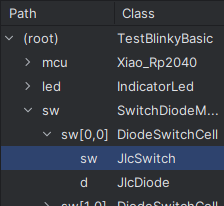
2. **In the library, search for KailhSocket**, then right-click it and select "Refine class Switch to KailhSocket"
   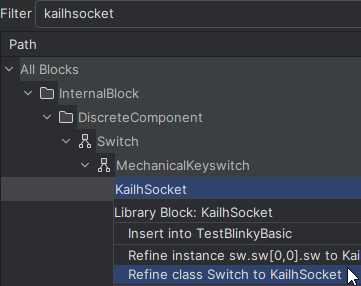 

</details>

Refinements allow specifying, at the top level, modifications across the design hierarchy.
Here, we override the default Switch refinement to use a mechanical keyswitch socket.

If we load the netlist into KiCad, we get more reasonable components:


After finishing this tutorial, see the [hierarchical layout tutorial](getting_started_hierarchy_layout.md) for speeding up layout using hierarchical layout replication.

You could place and route this board now, get it fabbed, and it will (probably) work.
This design requires footprints from the Keyswitch KiCad Library, available in the KiCad Plugin and Content Manager.


## Towards a Discrete Microcontroller 
_So far, we have used a microcontroller development board, which while convenient, may not be the best choice from a cost and size perspective. Here, we'll replace it with a discrete chip and supporting component._

Because blocks encapsulate their subcircuits, using a discrete microcontroller is as easy as a development board from an HDL perspective.

**Make these changes** to the design:
```diff
  class BlinkyExample(SimpleBoardTop):
    def contents() -> None:
      super().contents()
-     self.mcu = self.Block(Xiao_Rp2040())
+     self.mcu = self.Block(IoController())
      self.led = self.Block(IndicatorLed())
      self.connect(self.mcu.gnd, self.led.gnd)
      self.connect(self.mcu.gpio.request('led'), self.led.signal)
  
      self.sw = self.Block(SwitchMatrix(ncols=2, nrows=3))
      self.connect(self.sw.cols, self.mcu.gpio.request_vector('cols'))
      self.connect(self.sw.rows, self.mcu.gpio.request_vector('rows'))
  
    @override
    def refinements(self) -> Refinements:
        return super().refinements() + Refinements(
            class_refinements=[
+               (IoController, Stm32f103_48),
                (Switch, KailhSocket),
            ],
        )
```

Refactoring and delete operations are not supported with graphical edit actions.
However, you can delete lines of code, then recompile, then insert new blocks and connections using the graphical edits flow.

Instead of directly replacing the microcontroller, we replace it with the `IoController` abstract block, which all microcontrollers implement.
Then, we refine that to a specific microcontroller, here the STM32F103.

If we recompile this now, it will give errors since the microcontroller has no power source.

### Adding Supporting Components

We'll add in the USB type-C port that was previously part of the Xiao, and connect its power and data lines.
**Make these changes** to the `contents` method:
```diff
  class BlinkyExample(SimpleBoardTop):
    def contents() -> None:
      super().contents()
      
+     self.usb = self.Block(UsbCReceptacle())
      
      self.mcu = self.Block(IoController())
+     self.connect(self.usb.gnd, self.mcu.gnd)
+     self.connect(self.usb.pwr, self.mcu.pwr)
+     self.connect(self.usb.usb, self.mcu.usb.request('usb'))

      self.led = self.Block(IndicatorLed())
      self.connect(self.mcu.gnd, self.led.gnd)
      self.connect(self.mcu.gpio.request('led'), self.led.signal)
  
      self.sw = self.Block(SwitchMatrix(ncols=2, nrows=3))
      self.connect(self.sw.cols, self.mcu.gpio.request_vector('cols'))
      self.connect(self.sw.rows, self.mcu.gpio.request_vector('rows'))
```

We will still get errors if we recompile, since USB provides 5v, while the STM32F103 is a 3.3v part.
We'll insert a simple linear regulator, a step-down voltage converter.
**Make these changes** to the `contents` method:
```diff
  class BlinkyExample(SimpleBoardTop):
    def contents() -> None:
      super().contents()
      
      self.usb = self.Block(UsbCReceptacle())
      
+     self.reg = self.Block(LinearRegulator(3.3*Volt(tol=0.05)))
+     self.connect(self.usb.gnd, self.reg.gnd)
+     self.connect(self.usb.pwr, self.reg.pwr_in)
      
      self.mcu = self.Block(IoController())
      self.connect(self.usb.gnd, self.mcu.gnd)
-     self.connect(self.usb.pwr, self.mcu.pwr)
+     self.connect(self.reg.pwr_out, self.mcu.pwr)
      self.connect(self.usb.usb, self.mcu.usb.request('usb'))

      self.led = self.Block(IndicatorLed())
      self.connect(self.mcu.gnd, self.led.gnd)
      self.connect(self.mcu.gpio.request('led'), self.led.signal)
  
      self.sw = self.Block(SwitchMatrix(ncols=2, nrows=3))
      self.connect(self.sw.cols, self.mcu.gpio.request_vector('cols'))
      self.connect(self.sw.rows, self.mcu.gpio.request_vector('rows'))
```

Once we recompile, it should complete with no errors.

If we load the netlist into KiCad, we get the discrete microcontroller and its bundles of capacitors.
Because we used USB, the microcontroller subcircuit also automatically generated a crystal to meet USB timing requirements.


After finishing this tutorial, see the [hierarchical layout tutorial](getting_started_hierarchy_layout.md) for speeding up layout by loading an existing microcontroller block layout.


## Adding addressable RGBs with Mixins
Electronics sometimes have variations-on-a-theme with a common base, for example adding addressable RGBs to the switch matrix without redefining it completely.
This is supported through **mixins**.

**Make these changes** to the `contents` method:
```diff
  class BlinkyExample(SimpleBoardTop):
    def contents() -> None:
      super().contents()
      
      self.usb = self.Block(UsbCReceptacle())
      
      self.reg = self.Block(LinearRegulator(3.3*Volt(tol=0.05)))
      self.connect(self.usb.gnd, self.reg.gnd)
      self.connect(self.usb.pwr, self.reg.pwr_in)
      
      self.mcu = self.Block(IoController())
      self.connect(self.usb.gnd, self.mcu.gnd)
      self.connect(self.reg.pwr_out, self.mcu.pwr)
      self.connect(self.usb.usb, self.mcu.usb.request('usb'))

      self.led = self.Block(IndicatorLed())
      self.connect(self.mcu.gnd, self.led.gnd)
      self.connect(self.mcu.gpio.request('led'), self.led.signal)
  
      self.sw = self.Block(SwitchMatrix(ncols=2, nrows=3))
      self.connect(self.sw.cols, self.mcu.gpio.request_vector('cols'))
      self.connect(self.sw.rows, self.mcu.gpio.request_vector('rows'))
      
+     sw_npx = self.sw.with_mixin(SwitchMatrixNeopixels(npx_order="row_snake"))
+     self.connect(self.usb.gnd, sw_npx.npx_gnd)
+     self.connect(self.usb.pwr, sw_npx.npx_pwr)

+     self.npx_shift = self.Block(L74Ahct1g125())
+     self.connect(self.usb.gnd, self.npx_shift.gnd)
+     self.connect(self.usb.pwr, self.npx_shift.pwr)
+     self.connect(self.mcu.gpio.request('npx'), self.npx_shift.input)
+     self.connect(self.npx_shift.output, sw_npx.npx_din)
```

Mixins are not supported with graphical edit actions.

Mixins are a way to require additional functionality (including ports and parameters) on a base abstract block.

Mixins are also used elsewhere, such as adding optional IO types to IoController (like CAN or the requirement for onboard WiFi) or adding requiring a switch port on a rotary encoder.

We have also added a buffer (`L74Ahct1g125`) to shift the 3.3v logic level of the microcontroller to the higher data voltage required by the addressable RGBs.
The RGBs datasheet defines their input thresholds as incompatible with 3.3v and this will generate ERC errors without the buffer.
Go ahead and try it!


## Implicit Connections
_The code is starting to get a bit long and tedious. We'll refactor that using implicit scopes, a syntactic sugar construct, to make it shorter and more readable._

**Replace** the `contents` method:
```python
class BlinkyExample(SimpleBoardTop):
    def contents() -> None:
        super().contents()
        
        self.usb = self.Block(UsbCReceptacle())
        
        self.reg = self.Block(LinearRegulator(3.3*Volt(tol=0.05)))
        self.connect(self.usb.gnd, self.reg.gnd)
        self.connect(self.usb.pwr, self.reg.pwr_in)
        
        with self.implicit_connect(
            ImplicitConnect(self.reg.pwr_out, [Power]),
            ImplicitConnect(self.reg.gnd, [Common]),
        ) as imp:
            self.mcu = imp.Block(IoController())
            self.connect(self.usb.usb, self.mcu.usb.request('usb'))
      
            self.led = imp.Block(IndicatorLed())
            self.connect(self.mcu.gpio.request('led'), self.led.signal)
      
            self.sw = self.Block(SwitchMatrix(ncols=2, nrows=3))
            self.connect(self.sw.cols, self.mcu.gpio.request_vector('cols'))
            self.connect(self.sw.rows, self.mcu.gpio.request_vector('rows'))
        
        with self.implicit_connect(
            ImplicitConnect(self.usb.pwr, [Power]),
            ImplicitConnect(self.usb.gnd, [Common]),
        ) as imp:
            sw_npx = self.sw.with_mixin(SwitchMatrixNeopixels(npx_order="row_snake"))
            self.connect(self.usb.gnd, sw_npx.npx_gnd)
            self.connect(self.usb.pwr, sw_npx.npx_pwr)
      
            self.npx_shift = imp.Block(L74Ahct1g125())
            self.connect(self.mcu.gpio.request('npx'), self.npx_shift.input)
            self.connect(self.npx_shift.output, sw_npx.npx_din)
```

Refactoring operations are not supported with graphical edit actions.
The IDE is not implicit-scope-aware for graphical edit actions.

The implicit scope defines the connections to make and the conditions for which ports to connect (through tags):

```python
with self.implicit_connect(
    ImplicitConnect(self.reg.pwr_out, [Power]),
    ImplicitConnect(self.reg.gnd, [Common]),
) as imp:
    # any blocks here instantiated with imp.Block(...) instead of self.Block(...)
    # will have Power-tagged ports connected to self.reg.pwr_out
    # and Common-tagged ports connected to self.reg.gnd
```

> When blocks define ports, they can associate tags with them to specify implicit connectivity.
> To prevent errors, all ports with tags are required to be connected, either implicitly (as in this section) or explicitly (through `connect` statements).
>
> The most common tags are `Power` (for a general positive voltage rail) and `Common` (for ground).

Inside an implicit connection block, only blocks instantiated with `imp.Block(...)` have implicit connections made.

There is also a more complex `self.chain(...)` construct allowing for very compact HDL, detailed in the [reference document](reference.md).


### Explicit Pin Assignments
While `IoController` automatically assigns IO pinnings according to the capabilities of each chip, it does not have access to layout data to do physically-based pin assignment.
However, it does define a `pin_assigns` parameter (as an array-of-strings) which allows specifying a pin number (on the footprint) or pin name (eg, `GPIO3` - format specific to each microcontroller) for each requested pin.

We can also force parameter values through the refinements system, using `instance_values`.
Let's arbitrarily choose pins 26-29 for the LEDs.
**Add a pin assignment for the STM32 in the refinements section**:
```diff
  class BlinkyExample(SimpleBoardTop):
    def contents() -> None:
      ...
      
    def refinements(self) -> Refinements:
      return super().refinements() + Refinements(
        ...
+       instance_values=[
+         (['mcu', 'pin_assigns'], [
+           'led=10',
+           'sw_col_0=16',
+           'sw_col_1=17',
+           'sw_col_2=18',
+           'sw_row0=19',
+           'sw_row1=20',
+         ])
        ])
```


## Next: Hierarchical Layout
Continue to the [hierarchical layout tutorial](getting_started_hierarchy_layout.md) for using the hierarchical netlist to help with reuse in board layout.


### Additional Resources
For some more complex examples of boards designed in this HDL, check out:
- [Keyboard](examples/test_keyboard.py): the fabbed-out version of this example, with a few more features and different choices of parts.
- [LED Matrix](examples/test_ledmatrix.py): a charlieplexed LED matrix, using a parameterized charlieplexing LED array generator.
- [Seven Segment Clock](examples/test_seven_segment.py): an IoT (ESP32S3) seven-segment LED clock, using individually-addressable RGBs for each segment.
- [Simon Game](examples/test_simon.py): an implementation of the Simon electronic game, that uses 12v dome buttons and includes the needed power conversion circuitry.
