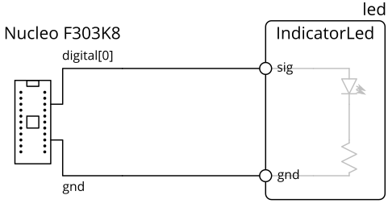
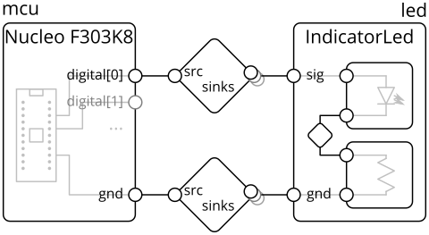
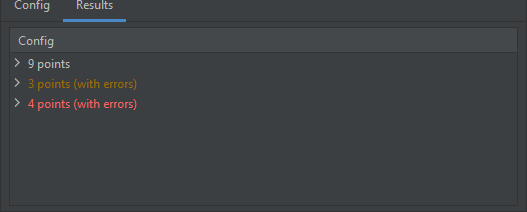
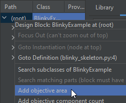
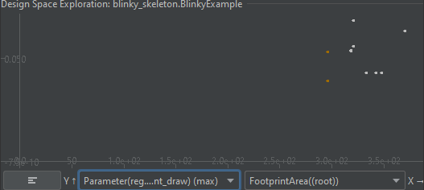
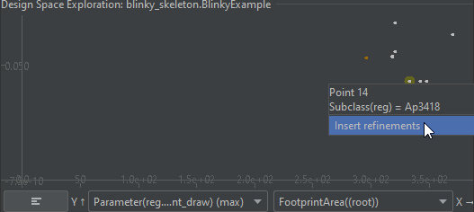
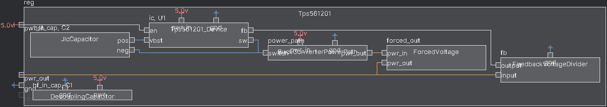
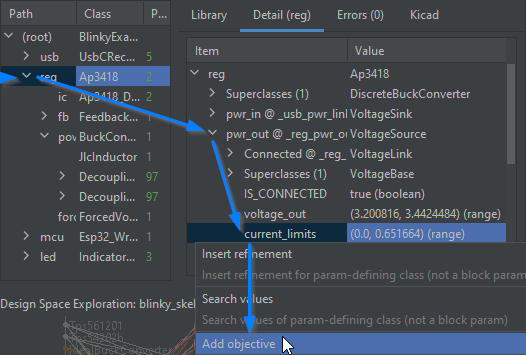
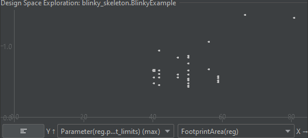

# Getting Started

## Core concepts
The core abstraction is the hierarchical block diagram, which we will explain using an example design of a microcontroller driving an LED.

In conventional schematic tools, such a design could be a flat schematic, consisting of the microcontroller module, LED, and resistor:  


Many modern tools have the concept of hierarchy blocks, where a block could be a subcircuit:  


In the example above, the LED-resistor subcircuit is contained within a block, which can be manipulated as a unit, and exposes ports (circles on the diagram) while encapsulating internal pins.
(note: in mainstream schematic tools with this feature, the subcircuit is usually presented in its own sheet, instead of having its contents displayed in the block)

Generalizing this model, components are blocks too, and component pins are also block ports:  


The main concepts our model extends on top of the simple hierarchy blocks above are **parameters**, **links**, and **generators**.

**Parameters** are variables that can be attached to blocks and ports.
For example, a digital IO, like `digital[0]` in the example above, would have parameters like input voltage tolerance, output voltage range, and logic thresholds.
This allows for a more powerful design correctness check (think ERC++), and provides a foundation for generators.

**Generators** allow a block's internal contents to be constructed by code, possibly based on parameters on it and its ports.
For example, the `IndicatorLed` block automatically sizes the resistor based on the input voltage on the `sig` pin, and the DC-DC converter block automatically sizes inductors and capacitors based on the target output voltage and current.

Finally, in the internal model (mainly relevant for compiler writers and library builders), the connections between ports expand into **links** which defines how parameters propagate between those ports and any constraints on them.
Continuing the digital IO example, the link would check the output thresholds against the input thresholds, and provide the worst-case voltage levels given all connected drivers.
These could be viewed as a block-like object (diamonds on the diagram) instead of direct wire connections:  


> In the user-facing HDL design model, links are inferred based on the types of connected ports and not explicit.
> Being aware of links can be useful for debugging, but this is mainly relevant for compiler writers and library builders.

We'll put these concepts into practice in the rest of this tutorial by building a variation of the blinky example above, then defining a custom part.


### Hardware Description Language (HDL)
To support user-defined computation of parameters and generator blocks, the design system is implemented as a _hardware description language_ (HDL).
That is, blocks are "placed" or instantiated, and their ports are connected, through lines in code instead of GUI actions in a graphical schematic.

There are a couple of basic operations, which you'll get to try in the tutorial:
- **Block Definition**: blocks are defined as Python classes which extend (subclass, including indirectly) `Block`.
- **Block Instantiation**: creates a sub-block in the current block
  - For example, `self.led = self.Block(IndicatorLed())` instantiates an `IndicatorLed` block and names it `led` in the current block
- **Port Instantiation**: creates an exterior port in the current block, used for building library blocks.
  - For example, `self.vdd = self.Port(VoltageSink(voltage_limits=(2.3, 5.5)*Volt, current_draw=(0, 15)*uAmp))` instantiates a port of type `VoltageSink` (voltage input) with defined voltage limits and current draw ranges, and names it `vdd`.
  - Ports are not allowed on top-level blocks.
- **Connect**: connects two (or more) ports.
  - For example, `self.connect(self.mcu.gnd, self.led.gnd)` connects the ground pins on `mcu` and `led`


### Graphical Editor and Integrated Development Environment (IDE)
While an HDL is needed to support parameter computation and programmatic construction, some operations (like building a top-level design with an LED connected to a microcontroller) may not require the full power provided by an HDL and may be more intuitive or familiar within a graphical environment.
However, because this design makes use of generator blocks (the LED), and because blocks may also take parameters (such as the target output voltage of a DC-DC converter), the HDL is still the primary design input.

To help with these more basic operations and to support those more familiar with a graphical schematic capture flow, an IDE helps bridge the graphical schematic-like and HDL code representations. Specifically, it:
- provides a block diagram visualization of the design
- allows inspection of solved / computed parameters in the design
- generates and inserts HDL code from schematic editor-like actions


The IDE has these major components:
- **Block Diagram Visualization**: shows the compiled design visualized as a block diagram here.
  - **Design Tree**: shows the compiled design as a tree structure of the block hierarchy.
- **Library Browser**: shows all the library blocks, ports, and links.
  The text box at the top allows filtering by keyword.
  - The preview box on the right shows more information on the selected library block, including docstring (if available), parameters, and block diagram preview.
- **Compiler / Run Console**: shows the compilation log, including any errors and prints from Python as HDL runs.

The rest of this tutorial will focus on the HDL, but will also describe how the equivalent code could be generated by GUI actions.
**As you go through the tutorial, you can write the code shown in the code blocks or follow the graphical actions described immediately afterward.**
However, you can't do both (since they would duplicate the same results), but you can try the graphical actions if you remove the code.

> **Tip**: This tutorial focuses on `blinky_skeleton.py`, so you can minimize the project explorer (left-side panel) if you need more screen space.


## A top-level design: Blinky
_In this example, we will create a circuit consisting of a LED and switch connected to a microcontroller._

For now, you will be working directly in the `PoylmorphicBlocks` repository folder directly.
In the future, we will improve the flow to allow adding `PolymorphicBlocks` as a package dependency.

Start by opening `blinky_skeleton.py`, which is pre-populated with this skeleton code:

```python
from edg import *


class BlinkyExample(SimpleBoardTop):
  def contents(self) -> None:
    super().contents()
    # your implementation here


if __name__ == "__main__":
  compile_board_inplace(BlinkyExample)
```

- `from edg import *` brings in the base classes for circuit construction, like `SimpleBoardTop`.
- `class BlinkyExample` contains the (top-level) circuit you're going to build, and it extends the top-level hierarchical block base class `SimpleBoardTop`.
  It's empty for now, but we'll fill it in the next section.
  - `SimpleBoardTop` has definitions which make this tutorial easier but which may not be desirable in a production environment, in which case you should use `BoardTop`.
    Currently, this is just ignoring the frequency specification for inductor, since that data isn't available in the parts table.
- `compile_board_inplace(...)` invokes the circuit generator given the top-level design (`BlinkyExample`).
  This is the starting point that allows the file to run as a Python script, and you can treat it as magic.

Try building the example now:
- **If using the IDE**: look for the run icon  in the gutter (with the line numbers) next to `class BlinkyExample`.
  1. Click it.
     _Make sure that you're using the run icon associated with `class BlinkyExample`, not the file, and not `if __name__ == "__main__"`._
  2. Then from the menu, click the Run option.  
     
     > Next time, you can rebuild the design by re-running the last selected run configuration with hotkey **Shift+F10** (Windows) or **Ctrl+R** (MacOS).

     > **Note on re-compiling behavior**: The IDE only re-compiles block classes when its source (or the source of superclasses) has changed, but this does not catch all functional changes.
     > If changes aren't recompiling, you can clear all compiled blocks through main menu > Tools > Empty Block Cache.
     > 
     > In particular, these changes may not trigger a recompile:
     > - Any changes outside the class, even if the code is called by the class.
     > - Changes to supporting files (such as part tables and imported schematics), even if they are referenced in the class.
     > - Changes to `__init__` do not re-compile instantiating classes, even if default values have been updated.
  3. The design should build, and you should get a run log that looks something like:
     ```
     Starting compilation of blinky_skeleton.BlinkyExample
     Using interpreter from configured SDK [...]
     [... lots of compilation output here ...]
     Completed: generate netlist: wrote [...]
     ```
  4. Some options (like where the netlist is generated into) can be modified via the run options at the top right:  
     
- <details> <summary>If not using the IDE</summary>
  
  Run `python blinkly_skeleton.py` from the command line.
  If all worked, this should create a folder `PolymorphicBlocks/blinky_skeleton` with a netlist `BlinkyExample.net` inside.
  </details>
- <details> <summary>Resolving common errors</summary>
  
  - If you get an error along the lines of `ModuleNotFoundError: No module named 'deprecated'` or `ModuleNotFoundError: No module named 'google'`, this is because the Python dependencies haven't been installed.
  See the [setup document](setup.md) for instructions on installing dependencies.
  </details>


### Creating the microcontroller and LED
For this simple example, we connect an LED to a STM32F103 microcontroller, and have everything powered by a USB type-C receptacle.

**In `blinky_skeleton.py`, `# your implementation here`, add this code** to instantiate the microcontroller and LED as follows:
```python
self.usb = self.Block(UsbCReceptacle())
self.mcu = self.Block(Stm32f103_48())
self.led = self.Block(IndicatorLed())
```
> `self.Block(...)` creates a sub-block in `self` (the current hierarchy block being defined).
> It must be assigned to an instance variable (in this case, `mcu`), which is used as the name sub-block.

> You can also insert blocks through graphical operations in the IDE.
>
> 1. Start by selecting the insert location in code, by setting the caret to the end of `super().contents()`.
>    - The _caret_ refers to the text editor's current position, commonly shown as a blinking vertical line.
>    - **Precise caret positioning is important**, since it is where code will be inserted.
>      In particular, it must not be in the `super().contents()` call since code cannot be inserted in the middle of a function call, nor can it be be outside the class block.  
>      _**We know this interaction is a bit clunky, we're thinking about better ways to do this.**_
> 2. Search for the relevant block in the Library Browser by using the Filter textbox:  
>    
> 3. Double-click the library entry.
>    - Alternatively, you can also right-click to show other available actions. 
> 4. In the text prompt, give the new block a name.
> 5. The block should appear in the block diagram visualizer, and the corresponding line of code should be inserted.
>    - The hatched pattern (diagonal lines) in the block diagram visualizer indicates that the block may be out-of-sync with the code until the next re-compile. 
>
> The library icons have these meanings:
> -  (category): this "block" is actually a category organizer and should not be instantiated.
> -  (abstract type): this block is an abstract type.
>   Abstract blocks will be discussed more later. 
> - Most will not have an icon, which means that they're none of the above. These blocks can be instantiated.

If you're using the IDE, once you recompile the block diagram should look like:  
  
With something on your screen now, you can zoom in and out of the visualization using the mousewheel, or pan by clicking and dragging.

As the design is incomplete, **it is expected that there will be errors**.
The red ports indicate ports that need to be connected, but aren't.
We'll fix that next.

### Connecting blocks
Blocks alone aren't very interesting, and they must be connected to be useful.
First, we need to connect the power and ground between the devices, by **adding connect statements after your block instantiations**:

```python
self.connect(self.usb.pwr, self.mcu.pwr)
self.connect(self.usb.gnd, self.mcu.gnd, self.led.gnd)
```

> `self.connect(...)` connects all the argument ports together. 
> Connections are strongly typed based on the port types: the system will try to infer a _link_ based on the argument port types and count.

> You can also connect ports through graphical operations in the IDE.
> 1. Again, start by selecting the insert location in code, by setting the caret to the end of `super().contents()`.
> 2. Double click any of the ports you want to connect.
>    This starts a connection operation, which dims out the ports that cannot be connected.
> 3. Select (single click) on all the other ports you want to connect.
>    - The order in which you select additional ports determines the order of the ports in the generated code.
> 4. Double-click anywhere (within a block) to make the connections.
>    - You can also cancel the connect operation by double-clicking anywhere (within a block) without additional ports selected, or through the right-click menu.
> 5. Optionally, in the text prompt. give the connection a name.
> 6. The connection should appear in the block diagram visualizer, and the corresponding line of code should be inserted.

If you're using the IDE, once you recompile the block diagram should look like:  


Then, we need to connect the LED to a GPIO on the microcontroller, by **adding this connect statement:**.

```python
self.connect(self.mcu.gpio.request('led'), self.led.signal)
```

> Microcontroller GPIOs (and other IOs like SPI and UART) are _port arrays_, which are dynamically sized.
> Here, we `request(...)` a new GPIO from the GPIO port array, then connect it to the LED.
> `request(...)` takes an optional name parameter, the meaning of which depends on the block.
> 
> By default, these connections are arbitrarily assigned to microcontroller pins.
> However pin assignments can also be manually specified (using this name parameter) to simplify board layout - this will be covered at the end of this tutorial.
> 
> Port arrays behave differently when viewed externally (as we're doing here) and internally (for library builders).
> Internal usage of port arrays will be covered later in the library building section.

> Port arrays are a recent feature and are not supported yet with graphical operations in the IDE.
> This can only be done by writing textual HDL... for now.

Recompiling in the IDE yields this block diagram:  


> <details>
>   <summary>At this point, your HDL might look like...</summary>
>
>   ```python
>   class BlinkyExample(SimpleBoardTop):
>     def contents(self) -> None:
>       super().contents()
>       self.usb = self.Block(UsbCReceptacle())
>       self.mcu = self.Block(Stm32f103_48())
>       self.led = self.Block(IndicatorLed())
>       self.connect(self.usb.gnd, self.mcu.gnd, self.led.gnd)
>       self.connect(self.usb.pwr, self.mcu.pwr)
>       self.connect(self.mcu.gpio.request('led'), self.led.signal)
>   ```
> </details>


## Fixing Blinky
_In this section, we will explore and fix the remaining compiler errors to get to a clean design._

While the design is now structurally complete, we still have errors in the form of failed assertions.
Assertions are checks on the electronics model, in this case it's detecting a voltage incompatibility between the USB's 5v out and the STM32's 3.3v tolerant power inputs.

If you're in the IDE, errors will show up in the compilation log and in the errors tab:  
  
You can also inspect the details of the power connection by mousing over it:   


### Adding a Voltage Regulator
To run the STM32 within its rated voltage limits, we'll need a voltage regulator to lower the 5v from USB to the common 3.3v power expected by modern devices.
**Repeat the add block flow** with a `VoltageRegulator` block, **then update the power (between the USB and the microcontroller) and ground connections**.
**Make sure to delete the previous power and ground connections, otherwise it will error out from over-connection.**

```python
self.reg = self.Block(VoltageRegulator(3.3*Volt(tol=0.05)))

self.connect(self.usb.pwr, self.reg.pwr_in)
self.connect(self.reg.pwr_out, self.mcu.pwr)
self.connect(self.usb.gnd, self.reg.gnd, self.mcu.gnd, self.led.gnd)
```

> The `VoltageRegulator` block is parameterized - configured by additional data specified as constructor arguments.
> Here, we've specified a target output voltage of 3.3v.
> 
> Many blocks in the library are parameterized, allowing them to be used in a wide range of situations.
> See each block's definition or documentation for what those parameters mean.

> If using the IDE, make sure to select an appropriate location for insertion.
> This block logically goes between the USB input and the microcontroller, but it just needs to be declared before any connect statements involving it.
> The IDE will create a block with empty parameters for you to fill.
> 
> You can append the voltage regulator's ground pin to the existing ground connect statement:
> 1. Select the existing connect statement in the code.
> 2. Start a connect operation at any port that is part of the existing connection.
>    - It is not currently supported to add to an existing connection without starting the connect operation at that connection.
> 3. Add the new port to the selection and finish the connect operation as typical.
> 
> The IDE does not support disconnect operations, so you'll have to edit the HDL for code that.
> However, the IDE can help you find where the code is:
> 1. Right click on any port in the connection, then select "Goto Connect".

If you try recompiling it, it will give you an error because `VoltageRegulator` is an _abstract block_ (it does not have an implementation) and was automatically substituted with an ideal model (which does not have a circuit implementation, but allows compilation to continue).
Abstract blocks are useful for two reasons:
1. It allows your design to be more general and allows you to defer implementation choices until later.
   This is more relevant for library builders, where you may want to give the system designer the choice of, for example, whether to use a surface-mount or through-hole resistor.
2. It can help preserve design intent more precisely and keep HDL readable.
   For example, saying that we want a voltage regulator can be more intuitive than directly instantiating a AP3418 block.

These abstract classes can be implemented by concrete subclasses, for example a AP3418-based buck converter (high efficiency voltage converter) subcircuit.
Because there can be many valid options for which one can be used, the top level design actually describes a _design space_ instead of a single design point as mainstream schematic tools do.

To help work with and search through this design space, we built design space exploration (DSE) into the IDE.
To figure out which voltage regulators work, **right-click the voltage regulator and select Search Refinements of base VoltageRegulator**:  


This creates a DSE run configuration, and initializes the search space to all implementations of the buck converter.
When a DSE run configuration is selected, the DSE panel is shown in the block visualizer panel:   


The Config tab shows the current search configuration (the combination of choices to try), currently all the subclasses of VoltageRegulator to use for the `reg` block.

**Run it (click  near the top right of the IDE) to start the design space search.**
As design points are tested, they will be shown in the Results tab.
Designs are aggregated by similar results, but since we have no objective functions selected, it is aggregating by whether the design compiled with errors

> Because not all voltage regulators are valid in this design, errors in the run console are normal.
> For example, the voltage regulators being searched include boost converters, where the output voltage is higher than the input, which will produce errors.



Specific design points can be inspected by double-clicking the entry to bring it up in the block diagram visualizer and design tree.
**Open any of the results**.

Instead of just choosing any regulator that works, let's compare the options and look at board area and current draw (power consumption) by adding objective functions.

1. For board area, **right click on the design root, and select Add objective contained footprint area.**  
   
2. For current draw: 
   1. **Select the voltage regulator `reg`**.
   2. In the Detail panel, **expand the input power `pwr_in` port, right click `current_draw`, and select Add objective.**  
   
3. If done right, the Objective Functions listed in the Config tree should show both FootprintArea((root)) and Parameter(reg.pwr_in.current_draw).
   **Re-run the design space search** to update the results with the new objective functions.
4. As it runs, you can plot those points.
   1. **For the Y Axis, select the maximum (worst-case) current draw.**
   2. **For the X Axis, select the footprint area.**
5. In this plot, better points are lower (less current draw, less power consumed) and to the left (smaller).
Once all the points compile, this should be the final plot:  
  

> The brown points represent where ideal models are used.
> Both have the same X position, since ideal models have no components and take no board area.
> 
> Mousing over points displays its configuration, here the subclass selection.
> 
> The top ideal point is the `IdealLinearRegulator` (which drops the voltage by 'burning' the excess as heat and draws as much current as the output), while the bottom one is the `IdealVoltageRegulator` (which only enforces conservation of power, like real buck converters, and draws less current than the output when stepping down voltage),
> 
> The non-ideal points show a trade-off: the lowest power (most efficient) points are buck converters, but the smallest are linear regulators.
> This makes sense for low power draws: buck converters generally require many supporting components (inductor and significant capacitors), while linear regulators can be just the chip with small stabilizing capacitors.

Let's arbitrarily choose to prioritize efficiency but select the smaller of those, and use the `Ap3418`.
**Right-click the point and select Insert refinements**.  


This inserts a refinements block into the design:  
```python
class BlinkyExample(SimpleBoardTop):
  def contents(self) -> None:
    ...

  def refinements(self) -> Refinements:
    return super().refinements() + Refinements(
    instance_refinements=[
      (['reg'], Ap3418),
    ])
```

_Refinements_ allow the top-level design to specify additional information throughout the design.
Here we specify that the abstract `BuckConverter` is specifically a `Ap3418`, but the capability is more general, for example allowing a global refinement of `Resistor` to `AxialResistor`, or even selecting the minimum SMD package to be 0603 or 0805.

> `BoardTop` defines default refinements for some common types, such has choosing surface-mount components for `Resistor` and `Capacitor`.
> You can override these with a refinement in your HDL, for example choosing `AxialResistor`.

> Alternatively, refinements can be manually inserted through the library browser.
> 1. Select (single click) on the block you want to refine.
> 2. In the Library Browser, search for the class you want to refine into.
>    If you don't know, you can filter by the abstract type and see what options are under it.
> 3. Right-click the subclass in the Library Browser, and click "Refine instance...".
>    - Refine instance only affects the single selected block.
>    - Refine class affects all classes of the selected block.
>      This may be useful, for example, if you wanted to do a design-wide replacement of all generic resistors with a specific type.
> 4. The corresponding refinement block should be inserted, or if it already exists, a new refinement entry will be added.

Recompiling in the IDE yields this block diagram and no errors:  


> <details>
>   <summary>At this point, your HDL might look like...</summary>
>
>   ```python
>   class BlinkyExample(SimpleBoardTop):
>     def contents(self) -> None:
>       super().contents()
>       self.usb = self.Block(UsbCReceptacle())
>       self.reg = self.Block(VoltageRegulator(3.3*Volt(tol=0.05)))
>       self.mcu = self.Block(Stm32f103_48())
>       self.led = self.Block(IndicatorLed())
>       self.connect(self.usb.gnd, self.reg.gnd, self.mcu.gnd, self.led.gnd)
>       self.connect(self.usb.pwr, self.reg.pwr_in)
>       self.connect(self.reg.pwr_out, self.mcu.pwr)
>       self.connect(self.mcu.gpio.request('led'), self.led.signal)
>
>     def refinements(self) -> Refinements:
>       return super().refinements() + Refinements(
>       instance_refinements=[
>         (['reg'], Ap3418),
>       ])
>   ```
> </details>

### Deeper Inspection
Here, we were able to place down a buck converter - a non-trivial subcircuit - with just one line of code.
A major benefit of this HDL-based design flow is the design automation that is encapsulated in the libraries.
The library writer has done the hard work of figuring out how to size the capacitors and inductors, and wrapped it into this neat `VoltageRegulator` block.

You may want to inspect the results.
In the IDE, you can hover over the output line and see that it is at 3.32v ±6.87%.
Why?
You can dig into the converter subcircuit by double-clicking on it:  


The implementation uses a feedback voltage divider, and if you mouseover this it will show the generated ratio of 0.18.
The converter's output voltage reflects the actual expected output voltage, accounting for resistor tolerance and the chip's internal reference tolerance.  


Similarly, mousing over the other components like the resistors and capacitors shows their details.

To zoom out, double-click on the topmost block.

> If you're curious about how this is implemented, you can also navigate to the definition of the `Ap3418` block.
> 
> Ultimately, its definition is structurally similar to how you're building your board: create blocks, optionally giving them parameters (or expressions to calculate parameters), and connect their ports together.
> It's like this all the way down, the 'magic' of being able to instantiate these complex subcircuits with a single line of code comes from the expertise baked into these library elements. 
>
> ```python
> class Ap3418(DiscreteBuckConverter):
>   ...
>   def contents(self):
>     ...
>     self.ic = imp.Block(Ap3418_Device())
>
>     self.fb = imp.Block(FeedbackVoltageDivider(
>       output_voltage=(0.588, 0.612) * Volt,
>       impedance=(10, 100) * kOhm,
>       assumed_input_voltage=self.output_voltage
>     ))
>     self.connect(self.fb.input, self.pwr_out)
>     self.connect(self.fb.output, self.ic.fb)
>     ...
> ```


### Hardware-Proven
In the design tree, the proven status of each sub-block (and their sub-blocks, recursively) is shown.
This indicates how many instances of a block has been previously proven in hardware, as a rough gauge of design risk.
Mousing over brings up a tooltip that shows the specific boards this has been used in, and the testing status.


The testing statuses and colors mean:
- Green: built in hardware and tested working.
- Orange: built in hardware, tested failing, but a (untested) fix has been implemented in HDL.
- Red: built in hardware, tested not working, not yet fixed.
- Grey: built in hardware, but not tested. 


## Advanced Design Space Exploration

### Searching Through Microcontrollers
Like the `VoltageRegulator`, there is actually an abstract class for microcontrollers, `IoController`.
`Stm32f103_48` extends this class and adheres to its interface, so we can **change the type of `mcu` to `IoController`**.

```python
class BlinkyExample(SimpleBoardTop):
  def contents(self) -> None:
    ...
    self.mcu = self.Block(IoController())
    ...
  ...
```

> `IoController` defines an interface of a power and ground pin, then an array of common IOs including GPIO, SPI, I2C, UART, USB, CAN, ADC, and DAC.
> Not all devices that implement it have all those capabilities (or the number of IOs requested), in which case they will fail with a compilation error.
> This interface generalizes beyond microcontrollers to anything that can control IOs, such as FPGAs.

To search the design space, first recompile the design to update the design tree with the new `IoController`. You can recompile a single design from the DSE runer with an empty search space, such as by **deleting the existing search configurations**:    


Like `VoltageRegulator`, `IoController` is abstract but provides a default ideal model and produces an error.
Let's now set up and run the search:
1. Add the search config by **right-clicking the new `mcu` and select Search refinements of base IoController**.
   - Note that this adds a new dimension to the search space.
     Here, let's search the combination of all voltage regulators and microcontrollers, so keep both of them.
2. Then, **re-run the search**.
   - Because it's searching all combinations of regulators and microcontrollers, this may take a while.
   - Even though we previously specified a refinement for voltage regulator, the search configuration takes priority - so this does scan over all voltage regulators
3. If we **plot the microcontroller and regulator**, we can see which combinations work:  
   
4. Alternatively, to see more dimensions on a single plot, **switch to the parallel coordinates plot (using the switch plots button: )**.
   Parallel coordinates plots support arbitrary number of axes, arranged in parallel to each other.
   Each design point is a line through all the axes.
   - Try plotting the regulator class, current draw, footprint area, and microcontroller class.  
     Let's say we're interested in the Esp32_Wroom_32, a WiFi microcontroller module.
     If you mouse over the point, it will show all the design points that use that: 
     
     Note that this design tends to have higher power draw and larger area.
6. Let's arbitrarily pick a microcontroller module with WiFi while keeping the prior regulator: **right click the Esp32_Wroom_32 and Ap3418 design point and select Insert refinements**.

> In a design that uses more specialized peripherals like USB or a DAC (which not all ESP32s have) or bumps up against current limits, DSE can help find suitable microcontrollers.

### Searching Compatible Passives
While abstract classes like `VoltageRegulator` and `IoController` have many alternatives but don't provide an automatic default, many of the jellybean parts (passives like resistors, capacitors, and inductors, also discrete semiconductors like diodes and transistors) also have alternatives but an automatic default makes those choices optional.
However, DSE allows searching through those and comparing alternatives.

In this limited design, the most interesting part may be the inductor for the buck converter voltage regulator, so let's see the effect of different inductors:
1. First, **delete any other search configs** to avoid an excessively large search space.
2. Add the search config: **in the design tree, expand `reg`, then `power_path`, right click on `inductor`, and select Search matching parts**.
3. **Run the search**.

In terms of inductor selection, an interesting trade-off to evaluate may be current limit vs. footprint area:
1. To get the area for the regulator block only, **right-click on `reg` and select Add objective contained footprint area.**
2. To see the current limit: 
   1. **Select `reg`** to show the regulator block.
   2. In the Detail panel, **expand the output power port `pwr_out`, right-click on `current_limits`, and select Add objective**.  
   
3. You don't need to add any refinements here (though you could select a design point to lock in a choice of inductor).

> The current limit parameter reflects the limits of the subcircuit and takes into account limitations of the controller chip and inductor, and the ripple current.
> Since the search only considers matching parts, all these designs are legal but they present different trade-offs in terms of maximum current, for example if we wanted additional headroom.
> 
> The overall plot looks like this, and the default choice minimizes area (so chooses one of the leftmost points).  
> 

### Searching Global Settings
Finally, we can also search over some global settings - settings that affect similar parts across the entire design.
Here, let's look at the effect on total area based on the minimum SMD component size, from 0402 to 1206.
All components that have standard SMD package sizes extend the `SmdStandardPackage` class which defines a parameter `smd_min_package`.

1. To search across this: 
   1. **Select any SMD component (for example, the inductor)**.
   2. **In its Detail panel, right click the parameter `smd_min_package`, and select Search values of param-defining class SmdStandardPackage:smd_min_package.**
   3. This will pop up a textbox for the values to search, **enter `0402,0603,0805,1206` (without spaces)**.
2. Make sure to **add the objective top-level footprint area**, if it's not still in the objective functions list.
3. **Make sure to clear any other search configs**.
4. **Run the search**.
5. **Configure the plot axes**.
6. You don't need to add any refinements here (though you could select a design point to lock in a different minimum SMD package).

> The resulting plot looks like:  
>
>
> Since the minimum package parameter is a string (instead of a number), the values are equally spaced and the Y-position isn't meaningful other than for separating out points.
> However, this can give us a rough idea of how much area we can save by using smaller parts.


## KiCad Import
If you have KiCad installed, you can import this full design into the layout editor. _KiCad 6.0+ is required, the netlist format is not compatible with 5.x or lower!_

In the KiCad PCB Editor (layout tool), go to File > Import > Netlist..., and open the netlist file generated.
KiCad will produce an initial placement that roughly clusters components according to their hierarchical grouping:


The block hierarchy will appear to KiCad as a sheet hierarchy.
You can, for example, right click one of the footprints > Select > Items in Same Hierarchical Sheet, and it will select all footprints in that sub-block.
<!-- TODO: now broken because of required schematic check =(: Some external hierarchical plugins like [Replicate Layout](https://github.com/MitjaNemec/ReplicateLayout) also work. -->

As you continue to write HDL, tstamps (an unique per-footprint ID used by KiCad to match netlist components to layout footprints) are stable and allows you to update a partial layout with a new netlist.
**tstamps are generated from Block names, so if HDL names change those footprints will not update.**

When you're ready for production, you can toggle traditional refdes generation (R1, R2, instead of current hierarchical path).
While refdes generation is deterministic (the same design will produce the same refdes assignments), small changes to the design can significantly change refdes assignments.


## Expanding Blinky
**_This section goes over some additional quality-of-life features that can make the HDL more elegant and powerful, but does not introduce any significantly new constructs._**
**_This part may be skipped in the interest of time._**

_In this section, we will add a tactile switch and three more LEDs._

### Adding a Switch
A tactile switch with a digital output can be instantiated as `DigitalSwitch()` which has an `out` port.
Using what you've learned above, instantiate a switch and connect it to the microcontroller.

### Arraying LEDs
While you certainly can copy-paste the above LED instantiation 4 times, that's no fun given that we're in a programming language with `for` loops.

**Replace your single LED instantiation and connections with**:
```python
self.led = ElementDict[IndicatorLed]()
for i in range(4):
  self.led[i] = self.Block(IndicatorLed())
  self.connect(self.mcu.gpio.request(f'led{i}'), self.led[i].signal)
  self.connect(self.usb.gnd, self.led[i].gnd)
```

> ElementDict creates a naming space that is an extension of the parent and is needed to give a unique, arrayed name for the LED being created.
> The square brackets provide the type parameter for the value type, which is necessary when using static analysis tools like mypy.

> The IDE cannot produce code that programmatically generates hardware.
> In general, code offers you a lot more power than can be achieved through the GUI
> 
> However, the visualizer will run fine.

Recompiling in the IDE yields this block diagram:  


> <details>
>   <summary>At this point, your HDL might look like...</summary>
>
>   ```python
>   class BlinkyExample(SimpleBoardTop):
>     def contents(self) -> None:
>       super().contents()
>       self.usb = self.Block(UsbCReceptacle())
>       self.reg = self.Block(VoltageRegulator(3.3*Volt(tol=0.05)))
>       self.mcu = self.Block(Stm32f103_48())
>       self.connect(self.usb.gnd, self.reg.gnd, self.mcu.gnd)
>       self.connect(self.usb.pwr, self.reg.pwr_in)
>       self.connect(self.reg.pwr_out, self.mcu.pwr)
> 
>       self.sw = self.Block(DigitalSwitch())
>       self.connect(self.mcu.gpio.request('sw'), self.sw.out)
>       self.connect(self.usb.gnd, self.sw.gnd)
>
>       self.led = ElementDict[IndicatorLed]()
>       for i in range(4):
>         self.led[i] = self.Block(IndicatorLed())
>         self.connect(self.mcu.gpio.request(f'led{i}'), self.led[i].signal)
>         self.connect(self.usb.gnd, self.led[i].gnd)
>
>     def refinements(self) -> Refinements:
>       return super().refinements() + Refinements(
>       instance_refinements=[
>         (['reg'], Ap3418),
>       ])
>   ```
> </details>


## Syntactic sugar
_Syntactic sugar refers to syntax within programming languages that makes things more usable._
_In this section, we clean up the prior example by consolidating some repetitive connections through implicit scopes._

> Similar to arraying LEDs, the IDE does not have any special support for generating these operations.
> However, the visualizer will continue to run fine.

### Implicit Connections
Because some connections (like power and ground) are very common, the HDL provides the idea of an implicit connection scope to automatically make them when a block is instantiated.
In our example, we can get rid of the explicit power and ground connections.
Start by **adding an implicit scope** to tie Power-tagged ports to `self.reg.pwr_out` and Common- (ground) tagged ports to `self.reg.gnd`:

```python
with self.implicit_connect(
    ImplicitConnect(self.reg.pwr_out, [Power]),
    ImplicitConnect(self.reg.gnd, [Common]),
) as imp:
  ...
```

> When blocks define ports, they can associate tags with them to specify implicit connectivity.
> To prevent errors, all ports with tags are required to be connected, either implicitly (as in this section) or explicitly (through `connect` statements).
> `Power` (for a general positive voltage rail) and `Common` (for ground) are the most common tags.

Inside an implicit connection block, only blocks instantiated with `imp.Block(...)` have implicit connections made.
**Move the microcontroller, switch, and LED instantiation into the scope, and delete their power and ground connections**:

```python
self.reg = self.Block(VoltageConverter(...))
with self.implicit_connect(
    ImplicitConnect(self.reg.pwr_out, [Power]),
    ImplicitConnect(self.reg.gnd, [Common]),
) as imp:
  self.mcu = imp.Block(Stm32f103_48())

  self.sw = imp.Block(DigitalSwitch())
  self.connect(self.mcu.gpio.request('sw'), self.sw.out)

  self.led = ElementDict[IndicatorLed]()
  for i in range(4):
    self.led[i] = imp.Block(IndicatorLed())
    self.connect(self.mcu.gpio.request(f'led{i}'), self.led[i].signal)
```

Remember that the voltage regulator is outside the implicit scope because it takes 5v and must be connected separately.

> <details>
>   <summary>At this point, your HDL might look like...</summary>
>
>   ```python
>   class BlinkyExample(SimpleBoardTop):
>     def contents(self) -> None:
>       super().contents()
>       self.usb = self.Block(UsbCReceptacle())
>       self.reg = self.Block(VoltageRegulator(3.3*Volt(tol=0.05)))
>       self.connect(self.usb.gnd, self.reg.gnd)
>       self.connect(self.usb.pwr, self.reg.pwr_in)
>
>       with self.implicit_connect(
>           ImplicitConnect(self.reg.pwr_out, [Power]),
>           ImplicitConnect(self.reg.gnd, [Common]),
>       ) as imp:
>         self.mcu = imp.Block(Stm32f103_48())
>
>         self.sw = imp.Block(DigitalSwitch())
>         self.connect(self.mcu.gpio.request('sw'), self.sw.out)
>
>         self.led = ElementDict[IndicatorLed]()
>         for i in range(4):
>           self.led[i] = imp.Block(IndicatorLed())
>           self.connect(self.mcu.gpio.request(f'led{i}'), self.led[i].signal)
>
>     def refinements(self) -> Refinements:
>       return super().refinements() + Refinements(
>       instance_refinements=[
>         (['reg'], Ap3418),
>       ])
>   ```
> </details>

### Chain Connects
Another shorthand is for chained connections of blocks with inline declarations of blocks.
We could, **inside the implicit scope, replace the LED and switch instantiations and connections, with**:  
```python
(self.sw, ), _ = self.chain(imp.Block(DigitalSwitch()), self.mcu.gpio.request('sw'))
...
(self.led[i], ), _ = self.chain(self.mcu.gpio.request(f'led{i}'), imp.Block(IndicatorLed()))
```

`chain` takes blocks and ports as arguments, from left to right as inputs to outputs, and does `connects` to chain them together.
The first argument is treated as the initial input, and the last element is treated as the final output.
Blocks in the middle (if any) have the previous link connected to their `Input`-tagged ports and present their `Output`-tagged ports for the next element, or attach their `InOut`-tagged port to the previous link which is also presented to the next element.
Only one pin per block may be tagged with `Input`, `Output`, and `InOut`.

`chain` returns a chain object, which can be unpacked into a tuple of blocks that are part of the chain and the chain object itself.
The tuple of blocks can be used to name inline blocks declared in the chain (which is done in the blinky example to name the LED and switch), and the chain object can be used to name the links.

> As a more complicated example, running `self.chain(Port1, Block1, Block2, Block3, Block4)` (with the block definitions written as are shown below) would produce this block diagram:  
>   
> The chain starts at Port1.
> Block1 and Block2 have both an Input and Output port, so the chain goes "through" those blocks.
> Block3 has an InOut port, so it is attached to the previous connection, but the chain goes not go "through" it.
> Because Block4 is the last in the chain, it only needs an Input port.

> <details>
>   <summary>At this point, your HDL might look like...</summary>
>
>   ```python
>   class BlinkyExample(SimpleBoardTop):
>     def contents(self) -> None:
>       super().contents()
>       self.usb = self.Block(UsbCReceptacle())
>       self.reg = self.Block(VoltageRegulator(3.3*Volt(tol=0.05)))
>       self.connect(self.usb.gnd, self.reg.gnd)
>       self.connect(self.usb.pwr, self.reg.pwr_in)
>
>       with self.implicit_connect(
>           ImplicitConnect(self.reg.pwr_out, [Power]),
>           ImplicitConnect(self.reg.gnd, [Common]),
>       ) as imp:
>         self.mcu = imp.Block(Stm32f103_48())
>
>         (self.sw, ), _ = self.chain(imp.Block(DigitalSwitch()), self.mcu.gpio.request('sw'))
>
>         self.led = ElementDict[IndicatorLed]()
>         for i in range(4):
>           (self.led[i], ), _ = self.chain(self.mcu.gpio.request(f'led{i}'), imp.Block(IndicatorLed()))
>
>     def refinements(self) -> Refinements:
>       return super().refinements() + Refinements(
>       instance_refinements=[
>         (['reg'], Ap3418),
>       ])
>   ```
> </details>


## Finishing Up
_Finally, let's put the finishing touches on this design by specifying a pin assignment._

### Explicit Pin Assignments
While `IoController` can assign peripherals like SPI pins according to the capabilities of each chip, it does not have access to layout data to do physically-based pin assignment.
However, it does define a `pin_assigns` parameter (as an array-of-strings) which allows specifying a pin number (on the footprint) or pin name (eg, `PC_13` - format specific to each microcontroller) for each requested pin.

We can also force parameter values through the refinements system, using `instance_values`.
Let's arbitrarily choose pins 26-29 for the LEDs.
**Add a pin assignment for the ESP32 in the refinements section**:
```python
class BlinkyExample(SimpleBoardTop):
  def contents(self) -> None:
    ...

  def refinements(self) -> Refinements:
    return super().refinements() + Refinements(
    instance_refinements=[
      ...
    ],
    instance_values=[
      (['mcu', 'pin_assigns'], [
        'led0=26',
        'led1=27',
        'led2=28',
        'led3=29',
      ])
    ])
```

> <details>
>   <summary>At this point, your HDL might look like...</summary>
>
>   ```python
>   class BlinkyExample(SimpleBoardTop):
>     def contents(self) -> None:
>       super().contents()
>       self.usb = self.Block(UsbCReceptacle())
>       self.reg = self.Block(VoltageRegulator(3.3*Volt(tol=0.05)))
>       self.connect(self.usb.gnd, self.reg.gnd)
>       self.connect(self.usb.pwr, self.reg.pwr_in)
>
>       with self.implicit_connect(
>           ImplicitConnect(self.reg.pwr_out, [Power]),
>           ImplicitConnect(self.reg.gnd, [Common]),
>       ) as imp:
>         self.mcu = imp.Block(IoController())
>
>         (self.sw, ), _ = self.chain(imp.Block(DigitalSwitch()), self.mcu.gpio.request('sw'))
>
>         self.led = ElementDict[IndicatorLed]()
>         for i in range(4):
>           (self.led[i], ), _ = self.chain(self.mcu.gpio.request(f'led{i}'), imp.Block(IndicatorLed()))
>
>     def refinements(self) -> Refinements:
>       return super().refinements() + Refinements(
>       instance_refinements=[
>         (['reg'], Ap3418),
>         (['mcu'], Esp32_Wroom_32),
>       ],
>       instance_values=[
>         (['mcu', 'pin_assigns'], [
>           'led0=26',
>           'led1=27',
>           'led2=28',
>           'led3=29',
>          ])
>       ])
>   ```
> </details>

And that's it for system-level (top-level, as opposed to library construction) PCB design!
You can import the netlist into KiCad if you'd like.
