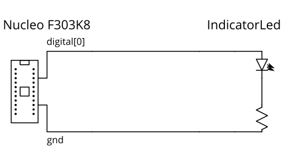
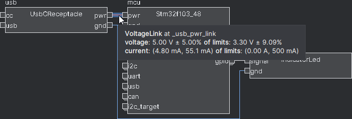
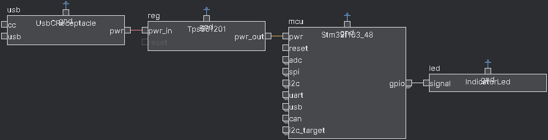
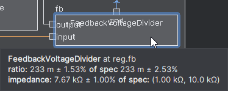

# Getting Started

## Core concepts
The core abstraction is the hierarchical block diagram, which we will explain using an example design of a microcontroller driving an LED.

In conventional schematic tools, such a design could be a flat schematic, consisting of the microcontroller module, LED, and resistor:


Many modern tools have the concept of hierarchy blocks, where a block could be a subcircuit:

In this example, the LED-resistor subcircuit is contained within a block, which can be manipulated as a unit, and exposes ports (circles on the diagram) while encapsulating internal pins.
(note: in mainstream schematic tools with this feature, the subcircuit is usually presented in its own sheet, instead of having its contents displayed in the block)

Generalizing this model, components are blocks too, and component pins are also block ports:


The main concepts our model extends on top of the simple hierarchy blocks above are **parameters**, **links**, and **generators**.

**Parameters** are variables that can be attached to blocks and ports.
For example, a digital IO, like `digital[0]` in the example above, would have parameters like input voltage tolerance, output voltage range, and logic thresholds.
This allows for a more powerful design correctness check (think ERC++), and provides a foundation for generators.

**Generators** allow a block's internal contents to be constructed by code, possibly based on parameters on it and its ports.
For example, the `IndicatorLed` block automatically sizes the resistor based on the input voltage on the `sig` pin, and the DC-DC converter block automatically sizes inductors and capacitors based on the target output voltage and current.

Finally, in the internal model (mainly relevant for compiler writers and library builders), the connections between ports expand into **links** which defines how parameters propagate between those ports and any constraints on them.
Continuing the digital IO example, the link would check the output thresholds against the input thresholds, and provide the worst-case voltage levels given all connected drivers.
These could be viewed as a block-like object (diamonds on the diagram) instead of direct wire connections:


> In the user-facing HDL design model, links are inferred based on the types of connected ports and not explicit.
> Being aware of links can be useful for debugging, but this is mainly relevant for compiler writers and library builders.

We'll put these concepts into practice in the rest of this tutorial by building a variation of the blinky example above, then defining a custom part.

### Reference Document
While this getting started guide is meant to be self-contained, you may also find the [reference document](reference.md) helpful, especially as you build designs outside this tutorial.
The reference document includes a short overview of all the core primitives and common library elements.


### Hardware Description Language (HDL)
To support user-defined computation of parameters and generator blocks, the design system is implemented as a _hardware description language_ (HDL).
That is, blocks are "placed" or instantiated, and their ports are connected, through lines in code instead of GUI actions in a graphical schematic.

There are a couple of basic operations, which you'll get to try in the tutorial:
- **Block Definition**: blocks are defined as Python classes which extend (subclass, including indirectly) `Block`.
- **Block Instantiation**: creates a sub-block in the current block
  - For example, `self.led = self.Block(IndicatorLed())` instantiates an `IndicatorLed` block and names it `led` in the current block
- **Port Instantiation**: creates an exterior port in the current block, used for building library blocks.
  - For example, `self.vdd = self.Port(VoltageSink(voltage_limits=(2.3, 5.5)*Volt, current_draw=(0, 15)*uAmp))` instantiates a port of type `VoltageSink` (voltage input) with defined voltage limits and current draw ranges, and names it `vdd`.
  - Ports are not allowed on top-level blocks.
- **Connect**: connects two (or more) ports.
  - For example, `self.connect(self.mcu.gnd, self.led.gnd)` connects the ground pins on `mcu` and `led`


### Graphical Editor and Integrated Development Environment (IDE)
While an HDL is needed to support parameter computation and programmatic construction, some operations (like building a top-level design with an LED connected to a microcontroller) may not require the full power provided by an HDL and may be more intuitive or familiar within a graphical environment.
However, because this design makes use of generator blocks (the LED), and because blocks may also take parameters (such as the target output voltage of a DC-DC converter), the HDL is still the primary design input.

To help with these more basic operations and to support those more familiar with a graphical schematic capture flow, we're developing an IDE to help bridge the graphical schematic-like and HDL code representations. Specifically, it:
- provides a block diagram visualization of the design
- allows inspection of solved / computed parameters in the design
- generates and inserts HDL code from schematic editor-like actions

The rest of this tutorial will focus on the HDL, but will also describe how the equivalent code could be generated by GUI actions.


## IDE Setup
_Recommended (but optional), to use the IDE._

1. Download [sbt](https://www.scala-sbt.org/download.html), the Scala build tool.
2. Download or clone the IDE plugin sources from https://github.com/BerkeleyHCI/edg-ide.
3. In the `edg-ide` directory, run `sbt runIDE`.
   sbt will automatically fetch dependencies, compile the plugin, and start the IDE with the plugin enabled.
   - The first run may take a while. 
4. In the IDE, open the `PolymorphicBlocks` folder as a project and configure it for Python.
   You do not need to clone `PolymorphicBlocks` separately, you can use the submodule in `edg-ide`.
5. Install Python dependencies:
   - If setting up a Pipenv environment, it will automatically fetch dependencies.
     You may need to install pipenv: `pip install pipenv`.
   - If not, you can use the System Interpreter but may need to install pip dependencies: `pip install protobuf kinparse`


## A top-level design: Blinky
_In this example, we will create a circuit consisting of a LED and switch connected to a microcontroller._

For now, you will be working directly in the `PoylmorphicBlocks` repository folder directly.
In the future, we will improve the flow to allow adding `PolymorphicBlocks` as a package dependency.

Start by opening `blinky_skeleton.py`, which is pre-populated with this skeleton code:

```python
from edg import *


class BlinkyExample(BoardTop):
  def contents(self) -> None:
    super().contents()
    # your implementation here


if __name__ == "__main__":
  compile_board_inplace(BlinkyExample)
```

- `from edg import *` brings in the base classes for circuit construction, like `BlockTop`.
- `class BlinkyExample` contains the (top-level) circuit you're going to build, and it extends the top-level hierarchical block base class `BlockTop`.
  It's empty for now, but we'll fill it in the next section.
- `compile_board_inplace(...)` invokes the circuit generator given the top-level design (`BlinkyExample`).
  This is the starting point that allows the file to run as a Python script, and you can treat it as magic.

Try building the example now:
- **If not using the IDE**: run `python blinkly_skeleton.py` from the command line.
  If all worked, this should create a folder `PolymorphicNlocks/blinky_skeleton` with a netlist `BlinkyExample.net` inside.
- **If using the IDE**: look for the run icon  in the gutter (with the line numbers) next to `class BlinkyExample`.
  1. Click it
  2. Then from the menu, click the Run option.  
     
     > Next time, you can rebuild the design by re-running the last selected run configuration with hotkey **Shift+F10**.
  3. The design should build, and you should get a run log that looks something like:
     ```
     Starting compilation of blinky_skeleton.BlinkyExample
     Using interpreter from configured SDK [...]
     [... lots of compilation output here ...]
     Run backend NetlistBackend
     Wrote netlist to [...]
     ```
  4. Unlike the command-line option, this generates a netlist in the same directory as `blinky_skeleton.py`.
     In the IDE, you can configure where this goes via the run options at the top right:  
     


### Creating the microcontroller and LED
For this simple example, we connect an LED to a STM32F103 microcontroller, and have everything powered by a USB type-C receptacle.

**In `# implementation here`, add this code** to instantiate the microcontroller and LED as follows:
```python
self.usb = self.Block(UsbCReceptacle())
self.mcu = self.Block(Stm32f103_48())
self.led = self.Block(IndicatorLed())
```
> `self.Block(...)` creates a sub-block in `self` (the current hierarchy block being defined).
> It must be assigned to an instance variable (in this case, `mcu`), which is used as the name sub-block.

> You can also insert blocks through graphical operations in the IDE.
> 1. Start by selecting the insert location in code, by setting the caret to the end of `super().contents()`.
> 2. Search for the relevant block in the Library Browser by using the Filter textbox:  
>    
> 3. Double-click the library entry.
>    - Alternatively, you can also right-click to show other available actions. 
> 4. In the text prompt, give the new block a name.
> 5. The block should appear in the block diagram visualizer, and the corresponding line of code should be inserted.
>    - The hatched fill in the block diagram visualizer indicates that the block may be out-of-sync with the code until the next re-compile. 
>
> The library icons have these meanings:
> -  (category): this "block" is actually a category organizer and should not be instantiated.
> -  (abstract type): this block is an abstract type.
>   Abstract blocks will be discussed more later. 
> - Most will not have an icon, which means that they're none of the above. These blocks can be instantiated.

If you're using the IDE, once you recompile the block diagram should look like:  


As the design is incomplete, it is expected that you will get errors.
The red ports indicate ports that need to be connected, but aren't.
We'll fix that next.

### Connecting blocks
Blocks alone aren't very interesting, and they must be connected to be useful.
First, we need to connect the power and ground between the devices, by **adding connect statements after your block instantiations**:

```python
self.connect(self.usb.pwr, self.mcu.pwr)
self.connect(self.usb.gnd, self.mcu.gnd, self.led.gnd)
```

> `self.connect(...)` connects all the argument ports together. 
> Connections are strongly typed based on the port types: the system will try to infer a _link_ based on the argument port types and count.

> You can also connect ports through graphical operations in the IDE.
> 1. Again, start by selecting the insert location in code, by setting the caret to the end of `super().contents()`.
> 2. Double click any of the ports you want to connect.
>    This starts a connection operation, which dims out the ports that cannot be connected.
> 3. Select (single clock) on all the other ports you want to connect.
>    - The order in which you select additional ports determines the order of the ports in the generated code.
> 4. Double-click anywhere (within a block) to make the connections.
>    - You can also cancel the connect operation by double-clicking anywhere (within a block) without additional ports selected, or through the right-click menu.
> 5. Optionally, in the text prompt. give the connection a name.
> 6. The connection should appear in the block diagram visualizer, and the corresponding line of code should be inserted.

If you're using the IDE, once you recompile the block diagram should look like:  


Then, we need to connect the LED to a GPIO on the microcontroller, by **adding this connect statements**.

```python
self.connect(self.mcu.gpio.request('led'), self.led.signal)
```

> Microcontroller GPIOs (and other IOs like SPI and UART) are port arrays, which are dynamically sized.
> Here, we `request(...)` a new GPIO from the GPIO port array, then connect it to the LED.
> `request(...)` takes an optional name parameter, the meaning of which depends on the block.
> For microcontrollers, this name can be used later to manually assign pins to simplify layout.
> 
> Port arrays behave differently when viewed externally (as we're going here) and internally (for library builders).
> Internal usage of port arrays will be covered later in the library building section.

> Port array requests are a recent feature and are currently not supported with graphical operations in the IDE.
> This can only be done by writing textual HDL, for now.

Recompiling in the IDE yields this block diagram:  


> <details>
>   <summary>At this point, your HDL might look like...</summary>
>
>   ```python
>   class BlinkyExample(BoardTop):
>     def contents(self) -> None:
>       super().contents()
>       self.usb = self.Block(UsbCReceptacle())
>       self.mcu = self.Block(Stm32f103_48())
>       self.led = self.Block(IndicatorLed())
>       self.connect(self.usb.gnd, self.mcu.gnd, self.led.gnd, self.buck.gnd)
>       self.connect(self.usb.pwr, self.mcu.pwr)
>       self.connect(self.mcu.gpio.request('led'), self.led.signal)
>   ```
> </details>

While the design is now structurally complete, we still have errors in the form of failed assertions.
Assertions are checks on the electronics model, in this case it's detecting a voltage incompatibility between the USB's 5v out and the STM32's 3.3v tolerant power inputs.

If you're in the IDE, errors will show up in the compilation log and in the errors tab:  
  
You can also inspect the details of the power connection by mousing over it:   



## Fixing and Cleaning Blinky
_In this section, we will fix those errors by adding a power converter._

To run the STM32 within its rated voltage limits, we'll need something to lower the 5v from USB to the common 3.3v power expected by modern devices.
Here, we'll choose to use a buck converter, a high-efficiency DC-DC switching converter.
**Repeat the add block flow** with a `BuckConverter` block, **then connect its power (between the USB and the microcontroller) and ground**.
```python
self.buck = self.Block(BuckConverter(3.3*Volt(tol=0.05)))

self.connect(self.usb.pwr, self.buck.pwr_in)
self.connect(self.buck.pwr_out, self.mcu.pwr)
self.connect(self.usb.gnd, self.buck.gnd, self.mcu.gnd, self.led.gnd)
```

> The `BuckConverter` block is parameterized - configured by additional data specified as constructor arguments.
> Here, we've specified a target output voltage of 3.3v.
> 
> Many blocks in the library are parameterized, allowing them to be used in a wide range of situations.
> See each block's definition or documentation for what those parameters mean.

> If using the IDE, make sure to select a local location for insertion.
> This block logically goes between the USB input and the microcontroller, but it just needs to be declared before any connect statements involving it.
> The IDE will create a block with empty parameters for you to fill.
> 
> You can append the buck converter's ground pin to the existing ground connect statement:
> 1. Select the existing connect statement in the code.
> 2. Start a connect operation at any port that is part of the existing connection.
>    - It is not currently supported to add to an existing connection without starting the connect operation at that connection.
> 3. Add the new port to the selection and finish the connect operation as typical.
> 
> The IDE does not support disconnect operations, so you'll have to edit the HDL for code that.
> However, the IDE can help you find where the code is:
> 1. Right click on any port in the connection, then select "Goto connect"

If you try recompiling it, it will give you a bunch of errors, all stemming from the BuckConverter block being _abstract_, or not having an implementation (and hence no output voltage, which confuses everything downstream).
Abstract blocks are useful for two reasons:
1. It allows your design to be more general and allows you to defer implementation choices until later.
   This is more relevant for library builders, where you may want to give the system designer the choice of, for example, whether to use a surface-mount or through-hole resistor.
2. It can help preserve design intent more precisely and keep HDL readable.
   For example, saying that we want a buck converter by instantiating a buck converter is more intuitive than directly instantiating, for example, a TPS561201 block.

Unlike in software, we can instantiate abstract blocks here, but they won't actually place down a useful circuit.
We can _refine_ those abstract blocks to give them a _concrete_ subclass by **adding a refinements block in the `BoardTop` class**.
```python
class BlinkyExample(BoardTop):
  def contents(self) -> None:
    ...

  def refinements(self) -> Refinements:
    return super().refinements() + Refinements(
    instance_refinements=[
      (['buck'], Tps561201),
    ])
```

> `BoardTop` defines default refinements for some common types, such has choosing surface-mount components for `Resistor` and `Capacitor`.
> You can override these with a refinement in your HDL, for example choosing `AxialResistor`.

> If using the IDE, refinements can be done through the library browser.
> 1. Select (single click) on the block you want to refine.
> 2. In the Library Browser, search for the class you want to refine into.
>    If you don't know, you can filter by the abstract type and see what options are under it.
> 3. Right-click the subclass in the Library Browser, and click "Refine instance...".
>    - Refine instance only affects the single selected block.
>    - Refine class affects all classes of the selected block.
>      This may be useful, for example, if you wanted to do a design-wide replacement of all generic resistors with a specific type.
> 4. The corresponding refinement block should be inserted, or if it already exists, a new refinement entry will be added.

Recompiling in the IDE yields this block diagram and no errors:  


> <details>
>   <summary>At this point, your HDL might look like...</summary>
>
>   ```python
>   class BlinkyExample(BoardTop):
>     def contents(self) -> None:
>       super().contents()
>       self.usb = self.Block(UsbCReceptacle())
>       self.buck = self.Block(BuckConverter(3.3*Volt(tol=0.05)))
>       self.mcu = self.Block(Stm32f103_48())
>       self.led = self.Block(IndicatorLed())
>       self.connect(self.usb.gnd, self.mcu.gnd, self.led.gnd, self.buck.gnd)
>       self.connect(self.usb.pwr, self.buck.pwr_in)
>       self.connect(self.buck.pwr_out, self.mcu.pwr)
>       self.connect(self.mcu.gpio.request('led'), self.led.signal)
>
>     def refinements(self) -> Refinements:
>       return super().refinements() + Refinements(
>       instance_refinements=[
>         (['buck'], Tps561201),
>       ])
>   ```
> </details>

### Deeper Inspection

One major benefit of this HDL-based design flow is the design automation that is encapsulated in the libraries.
Here, we were able to place down a buck converter - a non-trivial subcircuit - with just one line of code.
The library writer has done the hard work of figuring out how to size the capacitors and inductors, and wrapped it into this neat `BuckConverter` block.

You may want to inspect the results.
In the IDE, you can hover over the output line and see that it is at 3.3v ±4.47%.
Why?
You can dig into the Tps561201 by double-clicking on it:  


The implementation uses a feedback voltage divider, and if you mouseover this it will show the generated ratio of 0.23.
The converter's output voltage reflects the actual expected output voltage, accounting for resistor tolerance and the chip's feedback reference tolerance.  


Similarly, you can mouseover other components like the resistors and capacitors to view their details.

To zoom out, you double-click on the topmost block.


## Expanding Blinky
_In this section, we will add a tactile switch and three more LEDs._

### Adding a Switch
The simplest way would be to, following the example of the LED, instantiate a switch and connect its IO and ground, by **adding these lines in your block**:
```python
self.sw = self.Block(DigitalSwitch())
self.connect(self.mcu.gnd, self.sw.gnd)
self.connect(self.sw.out, self.mcu.new_io(DigitalBidir))
```


## Cleaning Up Blinky 

### Implicit Connections
However, recognizing that some connections are very common, we provide the idea of an implicit connection scope to automatically make them.
You can **replace your existing LED and switch instantiations and their ground connections with**:
```python
with self.implicit_connect(
    ImplicitConnect(self.mcu.gnd, [Common]),
) as imp:
  self.led = imp.Block(IndicatorLed())
  self.sw = imp.Block(DigitalSwitch())
```
The above code defines an implicit connection scope `imp`, with one `ImplicitConnect` rule that connects all ports with the tag `Common` to `self.mcu.gnd`.
Tags are associated with ports in the block being connected (in this case, `DigitalSwitch` and `IndicatorLed`), and `imp.Block` both instantiates a Block and makes all the implicit connections.
To prevent errors, all ports with tags are required, so if a port has a tag, it must be either implicitly connected (through `imp.Block`) or explicitly connected (through `connect`), otherwise it will error.

Common tags are:
- `Power`: general positive voltage rail (without a specific voltage)
- `Common`: ground connection

> For reference, the complete block definition using `implicit_connect` looks like:
> ```python
> self.mcu = self.Block(Nucleo_F303k8())
> 
> with self.implicit_connect(
>     ImplicitConnect(self.mcu.gnd, [Common]),
> ) as imp:
>   self.led = imp.Block(IndicatorLed())
>   self.sw = imp.Block(DigitalSwitch())
> 
> self.connect(self.mcu.new_io(DigitalBidir), self.led.signal)
> self.connect(self.sw.out, self.mcu.new_io(DigitalBidir))
> ```

### Chain Connects
Another shorthand is for chained connections of blocks with inline declarations of blocks.
We could, **inside the implicit scope, replace the LED and switch instantiations and connections, with**:
```python
(self.led, ), _ = self.chain(self.mcu.new_io(DigitalBidir), imp.Block(IndicatorLed()))
(self.sw, ), _ = self.chain(imp.Block(DigitalSwitch()), self.mcu.new_io(DigitalBidir))
```
`chain` takes blocks and ports as arguments, from left to right as inputs to outputs, and does `connects` to chain them together.
The first argument is treated as the initial input, and the last element is treated as the final output.
Blocks in the middle (if any) have the previous link connected to their `Input`-tagged ports and present their `Output`-tagged ports for the next element, or attach their `InOut`-tagged port to the previous link which is also presented to the next element.

> As a more complicated example, running `self.chain(Port1, Block1, Block2, Block3, Block4)` (with the block definitions written as are shown below) would produce this block diagram: 
> 
> The chain starts at Port1.
> Block1 and Block2 have both an Input and Output port, so the chain goes "through" those blocks.
> Block3 has an InOut port, so it is attached to the previous connection, but the chain goes not go "through" it.
> Because Block4 is the last in the chain, it only needs an Input port. 

Inline-declared blocks can also use implicit scopes, as in the blinky chain code example above.

`chain` returns a chain object, which can be unpacked into a tuple of blocks that are part of the chain and the chain object itself.
The tuple of blocks can be used to name inline blocks declared in the chain (which is done in the blinky example to name the LED and switch), and the chain object can be used to name the links.

> For reference, the complete block definition using `implicit_connect` and `chain` looks like: 
> ```python
> self.mcu = self.Block(Nucleo_F303k8())
> 
> with self.implicit_connect(
>     ImplicitConnect(self.mcu.gnd, [Common]),
> ) as imp:
>   (self.led, ), _ = self.chain(self.mcu.new_io(DigitalBidir), imp.Block(IndicatorLed()))
>   (self.sw, ), _ = self.chain(imp.Block(DigitalSwitch()), self.mcu.new_io(DigitalBidir))
> ```

## Flattening the Microcontroller
_In this section, we move away from the socketed microcontroller dev board, replacing it with a discrete microcontroller subcircuit directly onto the PCB, and add supporting components like power inputs and converters._

Since we will be working with a bare microcontroller, it now needs power (instead of being able to supply power).
In this case, we'll use an USB Type-C receptacle in device (upstream-facing port) mode, which you can instantiate by **adding this line to the top of the block definition**:
```python
self.usb = self.Block(UsbDeviceCReceptacle())
```

We can then (try) connecting the microcontroller directly to the USB power output.
**Replace the Nucleo F303K8 block with these blocks for the LPC1549 and its associated SWD programming header, and hook up the power lines**:
```python
with self.implicit_connect(
    ImplicitConnect(self.usb.pwr, [Power]),
    ImplicitConnect(self.usb.gnd, [Common]),
) as imp:
  self.mcu = imp.Block(Lpc1549_48())
  (self.swd, ), _ = self.chain(imp.Block(SwdCortexTargetHeader()), self.mcu.swd)
```

If you try to run it, it will error out, since the 5v supplied by the USB power is higher than the 3.3v tolerated by the microcontroller:
```
mypy blinky_skeleton.py && python blinky_skeleton.py
``` 
Design errors still update the generated `.edg` files (but they will refuse to netlist), so you can still view the errors and debug with the compiler GUI:
```
python compiler_gui.py examples/blinky_example/design_raw.edg
```

## Adding a Power Converter
So, we'll add a buck converter (step-down switching DC-DC converter) which you can instantiate by **by adding these lines after the USB port**:
```python
with self.implicit_connect(
    ImplicitConnect(self.usb.pwr, [Power]),
    ImplicitConnect(self.usb.gnd, [Common]),
) as imp:
  self.usb_reg = imp.Block(BuckConverter(output_voltage=3.3*Volt(tol=0.05)))
```

> For a simple circuit such as this, the optimal power supply may be a linear regulator or LDO - but we choose a buck converter here to demonstrate subcircuit generation and abstract blocks.

BuckConverter is an abstract (in our hardware model, but not in the Python sense of being uninstantiable) base class for several different types of specific converter subcircuits.
Abstract base class blocks define some standardized functionality and an interface set of Ports that its sub-classes (for example, a buck converter subcircuit based around a specific chip) implement.
Using these lets your designs remain high-level, and allows lower-level decisions like the specific sub-class to use to be deferred until later (and made with the help of tools like the compiler GUI). 

With the infrastructure in place, **replace the implicit power connection for the microcontroller block with**.
```python
ImplicitConnect(self.usb_reg.pwr_out, [Power])
```

Make sure the LED and switch instantiations and connections from the previous section are still present.
The top-level design is now complete.
**Re-generate your design** to re-build the .edg files, but this will fail on netlisting since the BuckConverter is abstract and no refinement has been selected:  
```
mypy blinky_skeleton.py && python blinky_skeleton.py
``` 
You can make such a selection within the compiler GUI, which (again) can be invoked with:
```
python compiler_gui.py examples/blinky_example/design_raw.edg
``` 
For this design, **pick the TPS561201 regulator refinement for the BuckConverter**, and it will generate the full subcircuit, including appropriately-sized capacitors, inductors, and feedback resistors for voltage setpoint.
The netlist will also be updated.

> For reference, the complete block definition with the USB, buck regulator, and microcontroller looks like:
> ```python
> self.usb = self.Block(UsbDeviceCReceptacle())
>
> with self.implicit_connect(
>     ImplicitConnect(self.usb.pwr, [Power]),
>     ImplicitConnect(self.usb.gnd, [Common]),
> ) as imp:
>   self.usb_reg = imp.Block(BuckConverter(output_voltage=3.3*Volt(tol=0.05)))
>
> with self.implicit_connect(
>     ImplicitConnect(self.usb_reg.pwr_out, [Power]),
>     ImplicitConnect(self.usb.gnd, [Common]),
> ) as imp:
>   self.mcu = imp.Block(Lpc1549_48())
>   (self.swd, ), _ = self.chain(imp.Block(SwdCortexTargetHeader()), self.mcu.swd)
>      
>   (self.led, ), _ = self.chain(self.mcu.new_io(DigitalBidir), imp.Block(IndicatorLed()))
>   (self.sw, ), _ = self.chain(imp.Block(DigitalSwitch()), self.mcu.new_io(DigitalBidir))
> ```

### Arraying LEDs
_In this section, we introduce programmatic generation by using a for loop to instantiate multiple LEDs._

If we wanted 8 LEDs, the dead-simple (though inelegant and repetitive) option might be to copy the block instantiation 8 times. 
But, since the hardware construction functionality is actually running Python, we can use Python's control structures (such as a `for` loop) to construct hardware.
**Replace your single LED instantiation / chain with**:
```python
self.led = ElementDict[IndicatorLed]()
for i in range(8):
  (self.led[i], ), _ = self.chain(self.mcu.new_io(DigitalBidir), imp.Block(IndicatorLed()))
```
> ElementDict creates a naming space that is an extension of the parent, and is needed to give a unique, arrayed name for the LED being created.
> The square brackets provide the type parameter for the value type, which is necessary when using static analysis tools like mypy.

> In practice, when used with microcontrollers, you may need a separate `connect` statement for each LED, to assign pins for ease of routing.

You can see the results by re-generating your circuit and running the compiler GUI on the output:
```
mypy blinky_skeleton.py && python blinky_skeleton.py
python compiler_gui.py examples/blinky_example/design_raw.edg
``` 

## Adding Parts
_In this section, we will add a custom subcircuit block, an [MCP9700](http://ww1.microchip.com/downloads/en/DeviceDoc/20001942G.pdf) temperature sensor in SOT-23-3, by defining the component / footprint `Block`, then the encapsulating application circuit as another `Block`._

### Defining the component
We start off by defining the MCP9700 component using a `CirciutBlock` that provides footprint and pinning facilities.
**Add this as a new class in your `blinky_skeleton.py`**:
```python
class Mcp9700_Device(CircuitBlock):
  def __init__(self) -> None:
    super().__init__()
    # block boundary (ports, parameters) definition here 

  def contents(self) -> None:
    super().contents()
    # block implementation (subblocks, internal connections, footprint) here
```
> `CircuitBlock` is a subtype of `Block` that effectively is one footprint, and provides the `self.footprint(...)` method described in more detail below.
> If you think of a `Block` as analogous to a hierarchical sub-sheet, a `CircuitBlock` would be analogous to a schematic symbol.

> `__init__` is meant to define the interface of a block (all Ports and Parameters), while `contents` is meant to define the contents of a block (largely Blocks, connections, and constraints).
> This split is not enforced (and there are cases where it is desirable to mix them into just `__init__`), but the main benefits of this are performance (avoid elaborating the full design tree unnecessarily) and separation for readability.

According to the datasheet, the MCP9700 has three pins: Vdd (power), Vout (analog output), and GND (power), which we will model using the `EletricalSink`, `AnalogSource`, and `Ground` Port types, respectively.
Each takes arguments that can be sourced from the part's electrical characteristics table.
**In `__init__`, add this implementation**:
```python
self.vdd = self.Port(VoltageSink(
  voltage_limits=(2.3, 5.5)*Volt, current_draw=(0, 15)*uAmp
), [Power])
self.vout = self.Port(AnalogSource(
  voltage_out=(0.1, 2), current_limits=(0, 100)*uAmp,
  impedance=(20, 20)*Ohm
), [Output])
self.gnd = self.Port(Ground(), [Common])
```
> Limits are typically modeled with recommended operating conditions (as opposed to absolute maximum ratings) where available - for example, the 2.3v - 5.5v Vdd input limit.
> Other parameters are modeled for worst case / full range - for example, the 15uA maximum current draw, the impedance being exactly 20 Ohm (since no tolerance is given), or the full output range derived from the rated temperature range and temperature coefficient.
> The Ports are also specified with `Tag`s (like `Power` and `Common`) to enable implicit connection domains.

> Currently, we only model electrical characteristics - so while data like temperature range and accuracy would be useful, those are not currently modeled.

**In `contents`, add the footprint and pinmap (mapping footprint pins to `Block` ports)**:
```
self.footprint(
  'U', 'Package_TO_SOT_SMD:SOT-23',
  {
    '1': self.vdd,
    '2': self.vout,
    '3': self.gnd,
  },
  mfr='Microchip Technology', part='MCP9700T-E/TT',
  datasheet='http://ww1.microchip.com/downloads/en/DeviceDoc/20001942G.pdf'
)
```
> `self.footprint(refdes_prefix, footprint, pinning, [mfr=...], [part=...], [datasheet=...]` defines the footprint of a `CircuitBlock`.
> The pinning is specified as a mapping (`dict`) of footprint pin numbers to the `CircuitBlock`'s ports. 
> The current data model uses KiCad footprint names and pinnings, and DigiKey-style manufacturer names and part numbers.
> There can only be one `self.footprint` per `CircuitBlock`.
>
### Defining the application circuit
However, the chip we just defined isn't supposed to be used bare: its application circuit recommends a decoupling capacitor (between 0.1 and 1uF - we arbitrarily choose 0.1uF).
Here, we define a subcircuit block to encapsulate application circuit.
**Add this as another new class in your `blinky_skeleton.py`**:
```python
class Mcp9700(Block):
  def __init__(self) -> None:
    super().__init__()
    self.ic = self.Block(Mcp9700_Device())
    self.pwr = self.Export(self.ic.vdd)
    self.gnd = self.Export(self.ic.gnd)
    self.out = self.Export(self.ic.vout)

  def contents(self) -> None:
    super().contents()
    with self.implicit_connect(
        ImplicitConnect(self.pwr, [Power]),
        ImplicitConnect(self.gnd, [Common])
    ) as imp:
      self.vdd_cap = imp.Block(DecouplingCapacitor(capacitance=0.1*uFarad(tol=0.2)))
```

> This is a typical pattern for many devices: define the chip as a `CircuitBlock`, then define a subcircuit `Block` containing its application circuit.

> self.Export creates a port on the current block that is directly connected to a port on an internal block, automatically propagating type and tag information.

> For decoupling capacitors, because tolerances are rarely explicitly specified, we use a loose 20% tolerance.

### Instantiating the temperature sensor
We can now instantiate the temperature sensor with a chain in the 3.3v implicit connection domain by **adding this line in our `BlinkyExample` circuit**:
```python
(self.temp, ), _ = self.chain(imp.Block(Mcp9700()), self.mcu.new_io(AnalogSink))
```

The final generated block diagram looks like:


> For reference, the complete block definition looks like:
> ```python
> self.usb = self.Block(UsbDeviceCReceptacle())
>
> with self.implicit_connect(
>     ImplicitConnect(self.usb.pwr, [Power]),
>     ImplicitConnect(self.usb.gnd, [Common]),
> ) as imp:
>   self.usb_reg = imp.Block(BuckConverter(output_voltage=3.3*Volt(tol=0.05)))
>
> with self.implicit_connect(
>     ImplicitConnect(self.usb_reg.pwr_out, [Power]),
>     ImplicitConnect(self.usb.gnd, [Common]),
> ) as imp:
>   self.mcu = imp.Block(Lpc1549_48())
>   (self.swd, ), _ = self.chain(imp.Block(SwdCortexTargetHeader()), self.mcu.swd)
>      
>   self.led = ElementDict[IndicatorLed]()
>   for i in range(8):
>     (self.led[i], ), _ = self.chain(self.mcu.new_io(DigitalBidir), imp.Block(IndicatorLed()))
>
>   (self.sw, ), _ = self.chain(imp.Block(DigitalSwitch()), self.mcu.new_io(DigitalBidir))
>   (self.temp, ), _ = self.chain(imp.Block(Mcp9700()), self.mcu.new_io(AnalogSink))
> ```