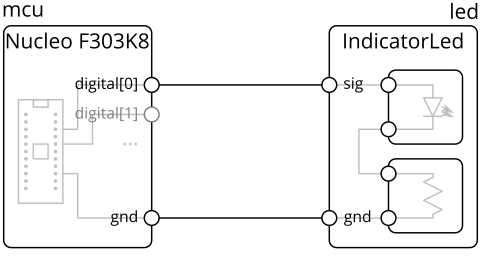

# Getting Started

## Core concepts
The core abstraction is the hierarchical block diagram, which we will explain using an example design of a microcontroller driving an LED.

In conventional schematic tools, such a design could be a flat schematic, consisting of the microcontroller module, LED, and resistor:


Many modern tools have the concept of hierarchy blocks, where a block could be a subcircuit:

In this example, the LED-resistor subcircuit is contained within a block, which can be manipulated as a unit, and exposes ports (circles on the diagram) while encapsulating internal pins.
(note: in tools with this feature, the subcircuit is usually presented in its own sheet, instead of having its contents displayed in the block)

Generalizing this model, components are blocks too, and component pins are also block ports:


The main concepts our model extends on top of the simple hierarchy blocks above are **parameters**, **links**, and **generators**.

**Parameters** are variables that can be attached to blocks and ports.
For example, a digital IO, like `digital[0]` in the example above, would have parameters like input voltage tolerance, output voltage range, and logic thresholds.
This allows for a more powerful design correctness check (think ERC++), and provides a foundation for generators.

**Links** are connections between ports, which defines how parameters propagate between those ports and any constraints on them.
Continuing the digital IO example, the link would check the output thresholds against the input thresholds, and provide the worst-case voltage levels given all connected drivers.
These could be viewed as a block-like object (diamonds on the diagram) instead of direct wire connections:


Finally, **generators** allow a block's internal contents to be constructed by code, possibly based on parameters on it and its ports.
For example, the `IndicatorLed` block might automatically size the resistor based on the input voltage on the `sig` pin, or a DC-DC converter might automatically size inductors and capacitors based on the expected output voltage and current.

We'll put these concepts into practice in the rest of this tutorial by building a variation of the blinky example above, then defining a custom part.

### Reference Document
While this getting started guide is meant to be self-contained, you may also find the [reference document](reference.md) helpful, especially as you build designs outside this tutorial.
The reference document includes a short overview of all the core primitives and common library elements.


## A top-level design: Blinky
_In this example, we will create a circuit consisting of a LED and switch connected to a microcontroller._

In the console, start by opening `blinky_skeleton.py`, which is pre-populated with this skeleton code:
```python
from edg import *


class BlinkyExample(Block):
  def contents(self) -> None:
    super().contents()
    # your implementation here

if __name__ == '__main__':
  ElectronicsDriver().generate_write_block(
    BlinkyExample(),
    "examples/blinky_example"
  )
```

- `from edg import *` brings in the base classes for circuit construction, like `Block`.
- `class BlinkyExample` contains the (top-level) circuit you're going to build, and it extends the hierarchical block base class `Block`.
  It's empty for now, but we'll fill it in the next section.
- `ElectronicsDriver().generate_write_block(...)` invokes the circuit generator given the top-level design (`BlinkyExample`) and a directory to write generated files to (`examples/blinky_example/`).
  This is the starting point that allows the file runs as a Python script, and you can treat it as magic.

### Creating the microcontroller and LED
For this simple example, we will use a socketed development board, a Nucleo F303K8.
It's very convenient and simple since it integrates a programming connection (via USB), provides power to the rest of your circuit (from USB), and includes a reasonably powerful microcontroller. 

**In `# implementation here`, add this code** to instantiate the microcontroller board / socket and LED as follows:
```python
self.mcu = self.Block(Nucleo_F303k8())
self.led = self.Block(IndicatorLed())
```
> `self.Block(...)` creates a sub-block in `self` (the current hierarchy block being defined).
> It must be assigned to an instance variable (in this case, `mcu`), which is used as the name sub-block.

### Connecting blocks
Blocks alone aren't very interesting, and they must be connected to be useful.
First, we need to connect the common ground (`self.mcu.gnd` and `self.led.gnd`) between the two devices, by **adding a connect statement after your block instantiations**:
```python
self.connect(self.mcu.gnd, self.led.gnd)
```

`self.connect(...)` connects all the argument ports together. 
Connections are strongly typed based on the port types: the system will try to infer a _link_ based on the argument port types, and number of ports.
In this case, both positive and negative terminals consist of one voltage source and one voltage sink. 

Then, we need to get a new digital pin from the microcontroller and connect it to the LED's signal line, by **adding these connect statements**:
```python
self.connect(self.mcu.new_io(DigitalBidir), self.led.signal)
```
> Microcontrollers have a `new_io(type, [pin=...])` method that returns a fresh IO of the specified type.
> Here, we ask the microcontroller for a digital bidirectional port.
> This presents the mirocontroller with the abstraction of a grab-bag of ports.
>
> The optional `pin=` argument can be used to force the IO to be tied to a particular microcontroller pin, which could make layout easier.
>
> > TODO: in theory, we would want to only ask for a DigitalSource, since the LED pin doesn't need input capabilities, but currently port types are treated as _invariant_ (subtyping relations are ignored) so the exact type presented by the microcontroller is required.  

### Generating and Compiler GUI
To generate your design, **run your file**:
```
mypy blinky_skeleton.py && python blinky_skeleton.py 
```
This creates / updates the folder `examples/blinky_example` and its contents. 

> mypy is an optional type checker for Python that uses type annotations (such as the `-> None` in the example `def contents` line).
> Like modern statically-typed languages (for example, Java, C++, and Scala), this catches certain bugs fast (without needing to encounter the bug during runtime - or even run code at all), and can speed up the development loop.
> Here, this will catch syntax errors and passing in the wrong type of object into a function (for example, a Block where a Port is expected).
> Note that it will not catch all bugs, some of which are only checked at runtime (in particular, it does not understand which Ports can be `connect`ed together, only that `connect` must take Ports).
>
> The `python blinky_skeleton.py` is what actually runs the generator.

You can also **run the compiler GUI / block diagram visualizer on the generated .edg file**:
```
python compiler_gui.py examples/blinky_example/design_raw.edg
```
If everything worked, something like this should come up, with the hierarchical block diagram of your design on the left side:


You can navigate the design hierarchy in the compiler GUI by clicking on blocks, ports, and links in the block diagram, and selecting elements in the Design Tree.
In the Design Tree, black text indicates a block for which where are no choices to be made, yellow text indicates a block for which choices must be made (under-defined), green text indicates a block for which a choice has been made (and can still be modified), and red text indicates some kind of error.
With a block selected, choices are listed in the Block Refinements (currently selected one in bold).
All the current choices made, including default ones, are listed in the Selected Refinements.
Choices are saved to disk and persist when you close and re-open the compiler GUI.

Parameters of the currently selected blocks, its ports, and connected links, are shown (and available for inspection) in the Detail panel.

### Layout
A KiCad netlist would have been generated in `examples/blinky_example/netlist.net`, and can be imported to a KiCad PCB design.
This is updated every time you run `blinky_skeleton.py` or make a choice in the compuler GUI. 
> This tutorial focuses on getting to a netlist from your circuit generator, so board layout is out of scope.
> If you're not familiar with KiCad and want to learn more, check out out the [beginners tutorial by SparkFun](https://learn.sparkfun.com/tutorials/beginners-guide-to-kicad/all) or [KiCad's index of tutorials](https://kicad-pcb.org/help/tutorials/).
>
> Sufficient supplemental data (such as stub / dummy schematic files) to interoperate with the hierarchical utilities in [Kicad actions plugins](https://github.com/MitjaNemec/Kicad_action_plugins) such as save/load hierarchy and replicate hierarchy. 


## Expanding and Cleaning up Blinky
_In this section, we will add a tactile switch to and clean up the Blinky example and code from the last section._

### Adding a Switch
The simplest way would be to, following the example of the LED, instantiate a switch and connect its IO and ground, by **adding these lines in your block**:
```python
self.sw = self.Block(DigitalSwitch())
self.connect(self.mcu.gnd, self.sw.gnd)
self.connect(self.sw.out, self.mcu.new_io(DigitalBidir))
```

### Implicit Connections
However, recognizing that some connections are very common, we provide the idea of an implicit connection scope to automatically make them.
You can **replace your existing LED and switch instantiations and their ground connections with**:
```python
with self.implicit_connect(
    ImplicitConnect(self.mcu.gnd, [Common]),
) as imp:
  self.led = imp.Block(IndicatorLed())
  self.sw = imp.Block(DigitalSwitch())
```
The above code defines an implicit connection scope `imp`, with one `ImplicitConnect` rule that connects all ports with the tag `Common` to `self.mcu.gnd`.
Tags are associated with ports in the block being connected (in this case, `DigitalSwitch` and `IndicatorLed`), and `imp.Block` both instantiates a Block and makes all the implicit connections.
To prevent errors, all ports with tags are required, so if a port has a tag, it must be either implicitly connected (through `imp.Block`) or explicitly connected (through `connect`), otherwise it will error.

Common tags are:
- `Power`: general positive voltage rail (without a specific voltage)
- `Common`: ground connection

> For reference, the complete block definition using `implicit_connect` looks like:
> ```python
> self.mcu = self.Block(Nucleo_F303k8())
> 
> with self.implicit_connect(
>     ImplicitConnect(self.mcu.gnd, [Common]),
> ) as imp:
>   self.led = imp.Block(IndicatorLed())
>   self.sw = imp.Block(DigitalSwitch())
> 
> self.connect(self.mcu.new_io(DigitalBidir), self.led.signal)
> self.connect(self.sw.out, self.mcu.new_io(DigitalBidir))
> ```

### Chain Connects
Another shorthand is for chained connections of blocks with inline declarations of blocks.
We could, **inside the implicit scope, replace the LED and switch instantiations and connections, with**:
```python
(self.led, ), _ = self.chain(self.mcu.new_io(DigitalBidir), imp.Block(IndicatorLed()))
(self.sw, ), _ = self.chain(imp.Block(DigitalSwitch()), self.mcu.new_io(DigitalBidir))
```
`chain` takes blocks and ports as arguments, from left to right as inputs to outputs, and does `connects` to chain them together.
The first argument is treated as the initial input, and the last element is treated as the final output.
Blocks in the middle (if any) have the previous link connected to their `Input`-tagged ports and present their `Output`-tagged ports for the next element, or attach their `InOut`-tagged port to the previous link which is also presented to the next element.

> As a more complicated example, running `self.chain(Port1, Block1, Block2, Block3, Block4)` (with the block definitions written as are shown below) would produce this block diagram: 
> 
> The chain starts at Port1.
> Block1 and Block2 have both an Input and Output port, so the chain goes "through" those blocks.
> Block3 has an InOut port, so it is attached to the previous connection, but the chain goes not go "through" it.
> Because Block4 is the last in the chain, it only needs an Input port. 

Inline-declared blocks can also use implicit scopes, as in the blinky chain code example above.

`chain` returns a chain object, which can be unpacked into a tuple of blocks that are part of the chain and the chain object itself.
The tuple of blocks can be used to name inline blocks declared in the chain (which is done in the blinky example to name the LED and switch), and the chain object can be used to name the links.

> For reference, the complete block definition using `implicit_connect` and `chain` looks like: 
> ```python
> self.mcu = self.Block(Nucleo_F303k8())
> 
> with self.implicit_connect(
>     ImplicitConnect(self.mcu.gnd, [Common]),
> ) as imp:
>   (self.led, ), _ = self.chain(self.mcu.new_io(DigitalBidir), imp.Block(IndicatorLed()))
>   (self.sw, ), _ = self.chain(imp.Block(DigitalSwitch()), self.mcu.new_io(DigitalBidir))
> ```

## Flattening the Microcontroller
_In this section, we move away from the socketed microcontroller dev board, replacing it with a discrete microcontroller subcircuit directly onto the PCB, and add supporting components like power inputs and converters._

Since we will be working with a bare microcontroller, it now needs power (instead of being able to supply power).
In this case, we'll use an USB Type-C receptacle in device (upstream-facing port) mode, which you can instantiate by **adding this line to the top of the block definition**:
```python
self.usb = self.Block(UsbDeviceCReceptacle())
```

We can then (try) connecting the microcontroller directly to the USB power output.
**Replace the Nucleo F303K8 block with these blocks for the LPC1549 and its associated SWD programming header, and hook up the power lines**:
```python
with self.implicit_connect(
    ImplicitConnect(self.usb.pwr, [Power]),
    ImplicitConnect(self.usb.gnd, [Common]),
) as imp:
  self.mcu = imp.Block(Lpc1549_48())
  (self.swd, ), _ = self.chain(imp.Block(SwdCortexTargetHeader()), self.mcu.swd)
```

If you try to run it, it will error out, since the 5v supplied by the USB power is higher than the 3.3v tolerated by the microcontroller:
```
mypy blinky_skeleton.py && python blinky_skeleton.py
``` 
Design errors still update the generated `.edg` files (but they will refuse to netlist), so you can still view the errors and debug with the compiler GUI:
```
python compiler_gui.py examples/blinky_example/design_raw.edg
```

## Adding a Power Converter
So, we'll add a buck converter (step-down switching DC-DC converter) which you can instantiate by **by adding these lines after the USB port**:
```python
with self.implicit_connect(
    ImplicitConnect(self.usb.pwr, [Power]),
    ImplicitConnect(self.usb.gnd, [Common]),
) as imp:
  self.usb_reg = imp.Block(BuckConverter(output_voltage=3.3*Volt(tol=0.05)))
```

> For a simple circuit such as this, the optimal power supply may be a linear regulator or LDO - but we choose a buck converter here to demonstrate subcircuit generation and abstract blocks.

BuckConverter is an abstract (in our hardware model, but not in the Python sense of being uninstantiable) base class for several different types of specific converter subcircuits.
Abstract base class blocks define some standardized functionality and an interface set of Ports that its sub-classes (for example, a buck converter subcircuit based around a specific chip) implement.
Using these lets your designs remain high-level, and allows lower-level decisions like the specific sub-class to use to be deferred until later (and made with the help of tools like the compiler GUI). 

With the infrastructure in place, **replace the implicit power connection for the microcontroller block with**.
```python
ImplicitConnect(self.usb_reg.pwr_out, [Power])
```

Make sure the LED and switch instantiations and connections from the previous section are still present.
The top-level design is now complete.
**Re-generate your design** to re-build the .edg files, but this will fail on netlisting since the BuckConverter is abstract and no refinement has been selected:  
```
mypy blinky_skeleton.py && python blinky_skeleton.py
``` 
You can make such a selection within the compiler GUI, which (again) can be invoked with:
```
python compiler_gui.py examples/blinky_example/design_raw.edg
``` 
For this design, **pick the TPS561201 regulator refinement for the BuckConverter**, and it will generate the full subcircuit, including appropriately-sized capacitors, inductors, and feedback resistors for voltage setpoint.
The netlist will also be updated.

> For reference, the complete block definition with the USB, buck regulator, and microcontroller looks like:
> ```python
> self.usb = self.Block(UsbDeviceCReceptacle())
>
> with self.implicit_connect(
>     ImplicitConnect(self.usb.pwr, [Power]),
>     ImplicitConnect(self.usb.gnd, [Common]),
> ) as imp:
>   self.usb_reg = imp.Block(BuckConverter(output_voltage=3.3*Volt(tol=0.05)))
>
> with self.implicit_connect(
>     ImplicitConnect(self.usb_reg.pwr_out, [Power]),
>     ImplicitConnect(self.usb.gnd, [Common]),
> ) as imp:
>   self.mcu = imp.Block(Lpc1549_48())
>   (self.swd, ), _ = self.chain(imp.Block(SwdCortexTargetHeader()), self.mcu.swd)
>      
>   (self.led, ), _ = self.chain(self.mcu.new_io(DigitalBidir), imp.Block(IndicatorLed()))
>   (self.sw, ), _ = self.chain(imp.Block(DigitalSwitch()), self.mcu.new_io(DigitalBidir))
> ```

### Arraying LEDs
_In this section, we introduce programmatic generation by using a for loop to instantiate multiple LEDs._

If we wanted 8 LEDs, the dead-simple (though inelegant and repetitive) option might be to copy the block instantiation 8 times. 
But, since the hardware construction functionality is actually running Python, we can use Python's control structures (such as a `for` loop) to construct hardware.
**Replace your single LED instantiation / chain with**:
```python
self.led = ElementDict[IndicatorLed]()
for i in range(8):
  (self.led[i], ), _ = self.chain(self.mcu.new_io(DigitalBidir), imp.Block(IndicatorLed()))
```
> ElementDict creates a naming space that is an extension of the parent, and is needed to give a unique, arrayed name for the LED being created.
> The square brackets provide the type parameter for the value type, which is necessary when using static analysis tools like mypy.

> In practice, when used with microcontrollers, you may need a separate `connect` statement for each LED, to assign pins for ease of routing.

You can see the results by re-generating your circuit and running the compiler GUI on the output:
```
mypy blinky_skeleton.py && python blinky_skeleton.py
python compiler_gui.py examples/blinky_example/design_raw.edg
``` 

## Adding Parts
_In this section, we will add a custom subcircuit block, an [MCP9700](http://ww1.microchip.com/downloads/en/DeviceDoc/20001942G.pdf) temperature sensor in SOT-23-3, by defining the component / footprint `Block`, then the encapsulating application circuit as another `Block`._

### Defining the component
We start off by defining the MCP9700 component using a `CirciutBlock` that provides footprint and pinning facilities.
**Add this as a new class in your `blinky_skeleton.py`**:
```python
class Mcp9700_Device(CircuitBlock):
  def __init__(self) -> None:
    super().__init__()
    # block boundary (ports, parameters) definition here 

  def contents(self) -> None:
    super().contents()
    # block implementation (subblocks, internal connections, footprint) here
```
> `CircuitBlock` is a subtype of `Block` that effectively is one footprint, and provides the `self.footprint(...)` method described in more detail below.
> If you think of a `Block` as analogous to a hierarchical sub-sheet, a `CircuitBlock` would be analogous to a schematic symbol.

> `__init__` is meant to define the interface of a block (all Ports and Parameters), while `contents` is meant to define the contents of a block (largely Blocks, connections, and constraints).
> This split is not enforced (and there are cases where it is desirable to mix them into just `__init__`), but the main benefits of this are performance (avoid elaborating the full design tree unnecessarily) and separation for readability.

According to the datasheet, the MCP9700 has three pins: Vdd (power), Vout (analog output), and GND (power), which we will model using the `EletricalSink`, `AnalogSource`, and `Ground` Port types, respectively.
Each takes arguments that can be sourced from the part's electrical characteristics table.
**In `__init__`, add this implementation**:
```python
self.vdd = self.Port(VoltageSink(
  voltage_limits=(2.3, 5.5)*Volt, current_draw=(0, 15)*uAmp
), [Power])
self.vout = self.Port(AnalogSource(
  voltage_out=(0.1, 2), current_limits=(0, 100)*uAmp,
  impedance=(20, 20)*Ohm
), [Output])
self.gnd = self.Port(Ground(), [Common])
```
> Limits are typically modeled with recommended operating conditions (as opposed to absolute maximum ratings) where available - for example, the 2.3v - 5.5v Vdd input limit.
> Other parameters are modeled for worst case / full range - for example, the 15uA maximum current draw, the impedance being exactly 20 Ohm (since no tolerance is given), or the full output range derived from the rated temperature range and temperature coefficient.
> The Ports are also specified with `Tag`s (like `Power` and `Common`) to enable implicit connection domains.

> Currently, we only model electrical characteristics - so while data like temperature range and accuracy would be useful, those are not currently modeled.

**In `contents`, add the footprint and pinmap (mapping footprint pins to `Block` ports)**:
```
self.footprint(
  'U', 'Package_TO_SOT_SMD:SOT-23',
  {
    '1': self.vdd,
    '2': self.vout,
    '3': self.gnd,
  },
  mfr='Microchip Technology', part='MCP9700T-E/TT',
  datasheet='http://ww1.microchip.com/downloads/en/DeviceDoc/20001942G.pdf'
)
```
> `self.footprint(refdes_prefix, footprint, pinning, [mfr=...], [part=...], [datasheet=...]` defines the footprint of a `CircuitBlock`.
> The pinning is specified as a mapping (`dict`) of footprint pin numbers to the `CircuitBlock`'s ports. 
> The current data model uses KiCad footprint names and pinnings, and DigiKey-style manufacturer names and part numbers.
> There can only be one `self.footprint` per `CircuitBlock`.
>
### Defining the application circuit
However, the chip we just defined isn't supposed to be used bare: its application circuit recommends a decoupling capacitor (between 0.1 and 1uF - we arbitrarily choose 0.1uF).
Here, we define a subcircuit block to encapsulate application circuit.
**Add this as another new class in your `blinky_skeleton.py`**:
```python
class Mcp9700(Block):
  def __init__(self) -> None:
    super().__init__()
    self.ic = self.Block(Mcp9700_Device())
    self.pwr = self.Export(self.ic.vdd)
    self.gnd = self.Export(self.ic.gnd)
    self.out = self.Export(self.ic.vout)

  def contents(self) -> None:
    super().contents()
    with self.implicit_connect(
        ImplicitConnect(self.pwr, [Power]),
        ImplicitConnect(self.gnd, [Common])
    ) as imp:
      self.vdd_cap = imp.Block(DecouplingCapacitor(capacitance=0.1*uFarad(tol=0.2)))
```

> This is a typical pattern for many devices: define the chip as a `CircuitBlock`, then define a subcircuit `Block` containing its application circuit.

> self.Export creates a port on the current block that is directly connected to a port on an internal block, automatically propagating type and tag information.

> For decoupling capacitors, because tolerances are rarely explicitly specified, we use a loose 20% tolerance.

### Instantiating the temperature sensor
We can now instantiate the temperature sensor with a chain in the 3.3v implicit connection domain by **adding this line in our `BlinkyExample` circuit**:
```python
(self.temp, ), _ = self.chain(imp.Block(Mcp9700()), self.mcu.new_io(AnalogSink))
```

The final generated block diagram looks like:


> For reference, the complete block definition looks like:
> ```python
> self.usb = self.Block(UsbDeviceCReceptacle())
>
> with self.implicit_connect(
>     ImplicitConnect(self.usb.pwr, [Power]),
>     ImplicitConnect(self.usb.gnd, [Common]),
> ) as imp:
>   self.usb_reg = imp.Block(BuckConverter(output_voltage=3.3*Volt(tol=0.05)))
>
> with self.implicit_connect(
>     ImplicitConnect(self.usb_reg.pwr_out, [Power]),
>     ImplicitConnect(self.usb.gnd, [Common]),
> ) as imp:
>   self.mcu = imp.Block(Lpc1549_48())
>   (self.swd, ), _ = self.chain(imp.Block(SwdCortexTargetHeader()), self.mcu.swd)
>      
>   self.led = ElementDict[IndicatorLed]()
>   for i in range(8):
>     (self.led[i], ), _ = self.chain(self.mcu.new_io(DigitalBidir), imp.Block(IndicatorLed()))
>
>   (self.sw, ), _ = self.chain(imp.Block(DigitalSwitch()), self.mcu.new_io(DigitalBidir))
>   (self.temp, ), _ = self.chain(imp.Block(Mcp9700()), self.mcu.new_io(AnalogSink))
> ```