# Hierarchical Layout Tutorial

Hierarchical layout tips and tricks, using the macropad circuit from the [introductory tutorial](getting-started.md) as an example.

This assumes familiarity with KiCad PCB layout.
If you're new to KiCad, there are plenty of excellent tutorials online, go through one of those, then come back.

## Requirements

The example uses the Keyswitch Kicad Library, available on the KiCad Plugin and Content Manager.

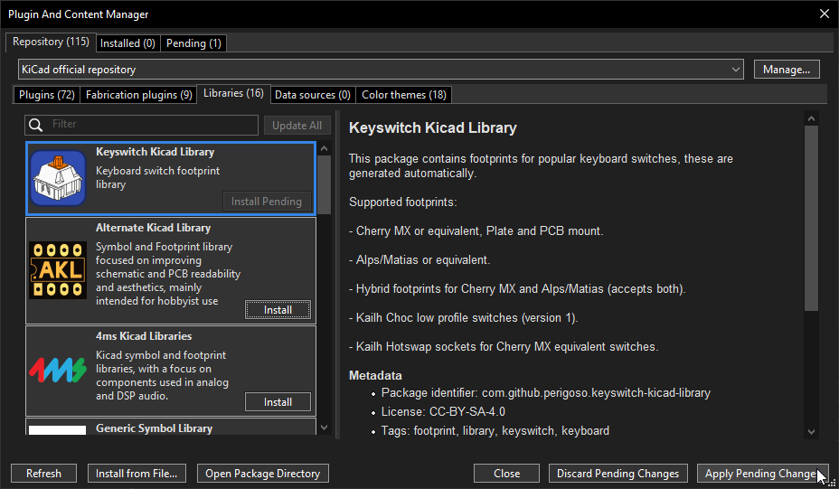

For hierarchical loading and replication, you have a few options:

- Use the Sublayout plugin (KiCad 8+), also available on the KiCad Plugin and Content Manager.

  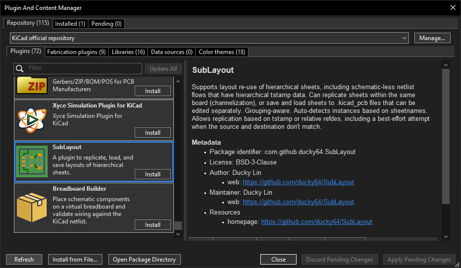
  - This was designed to work with netlist-based flows and automatically detects grouping based on hierarchy data in the netlist.  
  - This works with KiCad 10+, but zone replication is broken.
- Use KiCad's native design blocks feature (KiCad 10+).
  - This tutorial covers hierarchical replication, but hierarchical loading is not covered.
  - The design blocks flow is heavyweight (requires local library creation) and (at least for netlist driven flows, like this one) requires you to group footprints within a block manually.
- Use KiCad's Multi-Channel and Placement Rule Area feature.
  - This tutorial does not cover this.
  - This seems brittle to other traces overlapping the placement rule area and does not seem grouping-aware. 

> ⚠️ Replicate Layout, Save/Restore Layout, and HierarchicalPCB will **NOT work**. 
> These require and validate against schematic files, which are not generated in this HDL flow.

## Netlist Import

1. Start the PCB Editor (standalone)

   
2. Open Import Netlist from the toolbar: 
   
   
   > If you launched the PCB Editor from a KiCad project, this will not be on the toolbar (you will have "Update PCB from Schematic" instead).
   > You can still access it from the menu: File > Import > Netlist...
3. Select the generated netlist file, likely `BlinkyExample/BlinkyExample.net` in wherever you ran your HDL script, then click Load and Test Netlist.
   It should load with no errors, but there may be some warnings about missing pins.

   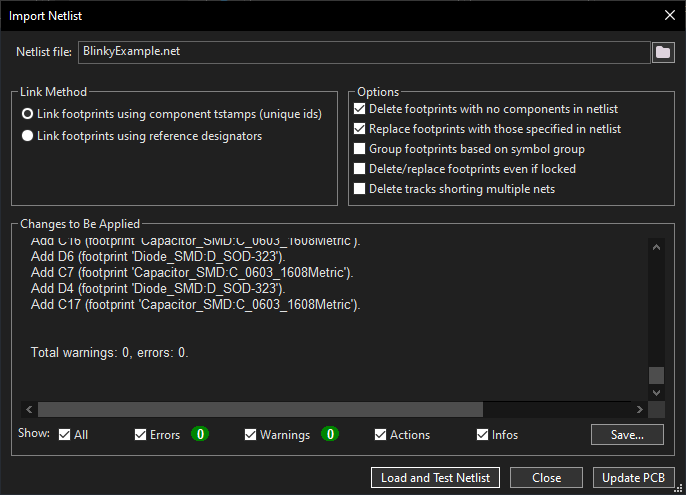

   > In KiCad 10, uncheck "Group footprints based on symbol group".
   > This ignores hierarchical data in the netlist and removes footprint grouping.

4. Click "Update PCB" to place the components on the board.
   Drop them anywhere for now.

   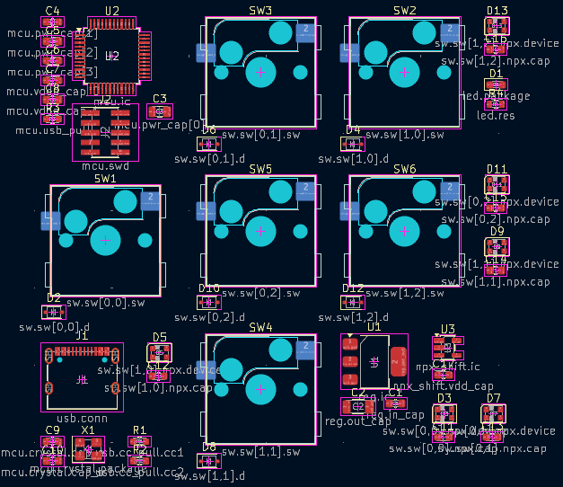
   - This may give you error(s) about missing pins, which you can ignore.

## Switch Matrix Placement and Replication

The switch, diode, LED, and LED capacitor are all part of a SwitchCell hierarchical sheet in the netlist, which allows the layout to be replicated for each switch.

Start by arranging all the switch footprints in a grid.
This can be done by selecting all the switch footprints, then right-clicking and selecting Create from Selection > Create Array...
Set the grid array size (here, 2x3 as consistent with the HDL parameters) and spacing (19.05mm typical for mechanical keyboard switch spacing).
Set Item Source to Arrange selection (move the footprints, instead of creating new ones), and the Grid Position to Source items remain in place.

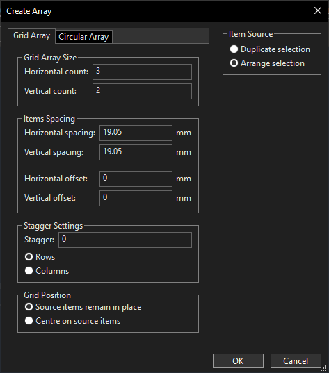

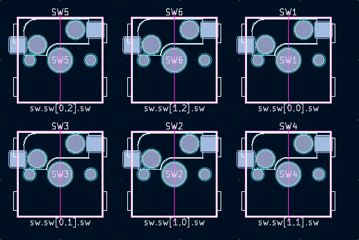

You may need to swap components to get the right ordering.

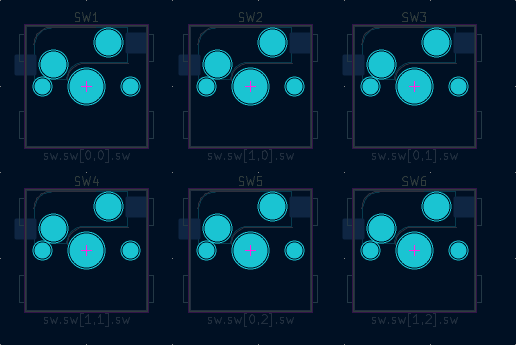

> You may also use external plugins to arrange the footprints.

Then, lay out a single switch cell, including the switch, diode, LED, LED capacitor, and traces.
Here is an example layout:

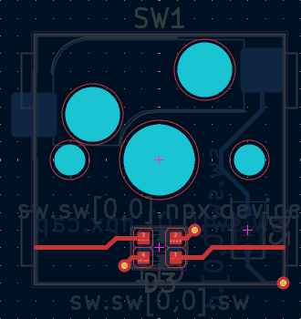

In this layout, I've allocated the top layer to run horizontal traces (rows and LEDs) and the bottom layer to run vertical traces (columns).

> Tip: use the footprint pathname on the F.Fab layer to find the footprints that are part of the same block.
> For example, find all the footprints starting with `sw.sw[0,0]`.

> Right-click > Select > Items in Same Hierarchical Sheet only selects items _strictly_ in the same sheet, not recursively.
> For example, selecting the hierarchical sheet for the switch includes the diode, but not the LED or LED capacitor, which are in a sub-sheet.

Group the switch cell footprints: select them, right click, Grouping > Group Items.

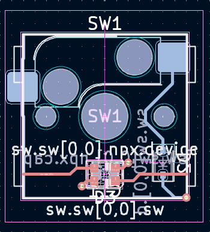

### Option 1: Sublayout Plugin

1. Enter into the switch cell footprint group you just created and select the switch.

   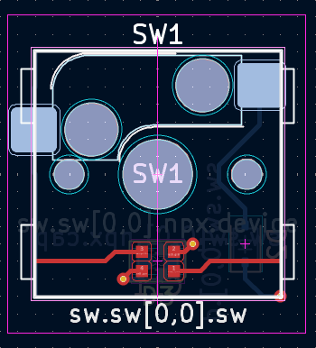

   The group defines the objects to replicate, while the selected footprint defines the _anchor footprint_, the matching component in the other sheets that other footprints are placed around.

2. Run the Sublayout plugin and select all the instances (bottom list box).

   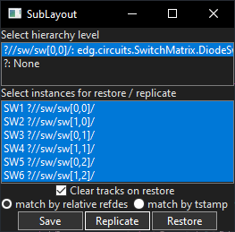

   The Sublayout plugin automatically detects all instances of the same hierarchical sheet (HDL block, by name) and lists them.

3. Press Replicate, and the plugin will replicate the layout, including footprint positions, traces, and groupings.

   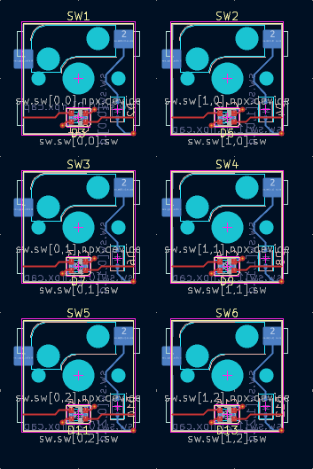

### Option 2: KiCad Design Blocks

_KiCad 10+ required._

1. Open the Design Blocks panel: main menu > View > Panels > Design Blocks.

   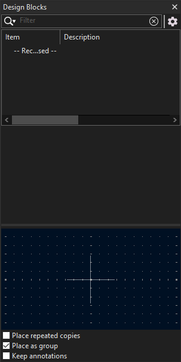
2. If you don't already have a testing library: create a new library.
   Right click > New Library, and select a location for it.

   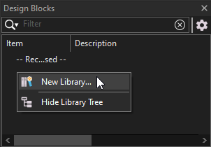
3. Select the switch cell footprint group, and save it.
   Right click on the design blocks library, > Save Selection as Design Block...

   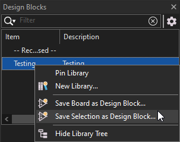

   It should show up as a new entry in the library:

   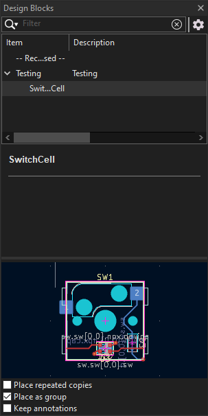
4. If you inspect the group properties of the reference layout (select group, `E` hotkey), you'll see the Library link.
   This links the group to the design block.

   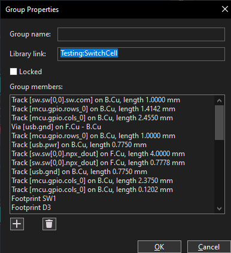
5. Group the other switch cells footprints (switches, diodes, LEDs, capacitors), one group per switch cell instance.
   For each group, set the library link to the same as the reference group.

   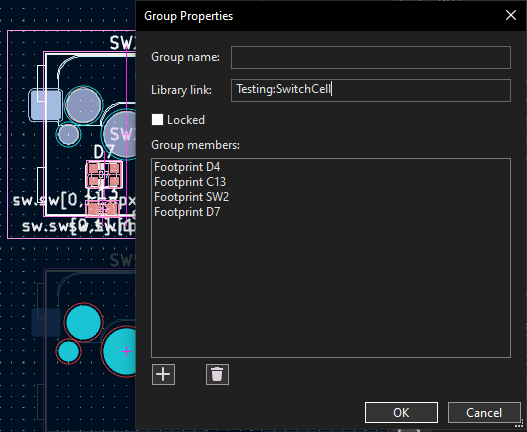
6. To replicate: right-click the group and select Apply Design Block Layout.

   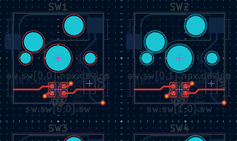

   > This may shift the position of footprints and you may need to reposition the group.
7. Move the switch cell groups into the right positions.

### Snaking

The LEDs are connected in a snaking pattern, which means every other row reverses the LED connection order.
You may want to have a different switch cell for the odd rows, which flips the LED rotation so data flows from right-to-left.

## Loading a Stock Microcontroller Layout

_The tutorial only covers using the Sublayout plugin._
_Some pre-routed blocks are provided in [examples/prerouted_blocks](examples/prerouted_blocks) which are Sublayout-compatible .kicad_pcb files._
_You can open those files as boards to inspect the layout snippet._

1. Select the STM32F103 footprint and run the Sublayout plugin.
   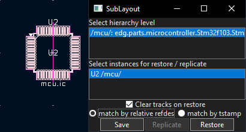

2. Press Restore and select the pre-routed block, here [examples/prerouted_blocks/Stm32f103.kicad_pcb](examples/prerouted_blocks/Stm32f103.kicad_pcb).
   It will complete with warnings about missing footprints (R3, the USB pullup resistor, and J2, the programming header) which are not included in the prerouted block. 
   However, it will place the rest of your components including the crystal oscillator.

   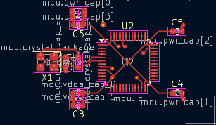

> Footprints are positioned exactly as they appear in the prerouted block, even if they are different footprints (e.g., using 1206 instead of 0603, or choosing a different crystal package).
> The Sublayout plugin allows restoring a prerouted block with different footprints, but you will probably need to do some fix-up work.
> In this case, consider it as a first-pass layout.

## Finishing the Board

With the switch matrix and microcontroller done, that's a huge chunk of the work of laying out this board.

You will still need to place and route the USB connector (including the CC pulldown resistors for passive power delivery negotiation), programming header, voltage regulator, and debugging LED.
