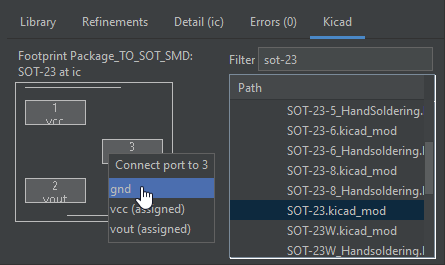

# Getting Started, Part 2: Building Library Blocks
_In this section, we build and add a digital magnetic field sensor ([LF21215TMR](https://www.littelfuse.com/~/media/electronics/datasheets/magnetic_sensors_and_reed_switches/littelfuse_tmr_switch_lf21215tmr_datasheet.pdf.pdf)) to our design._
_We do this in two stages, first defining a `FootprintBlock` for the chip itself, then building the wrapper application circuit `Block` around it._

> While `Block`s are arbitrary hierarchy blocks that only have ports, inner blocks, and connections, `FootprintBlock` also allows up to one PCB footprint, and a mapping from the block ports to footprint pins.
> In schematic terms, think of `FootprintBlock` as analogous to a schematic symbol, while `Block` is closer to a hierarchy sheet.


## Creating a part
Block definitions correspond to classes, and a new block can be defined by creating a new class.
**Create the class for `Lf21215tmr_Device`** by inserting: 
```python
class Lf21215tmr_Device(FootprintBlock):
  def __init__(self) -> None:
    super().__init__()
    # block boundary (ports, parameters) definition here 

  def contents(self) -> None:
    super().contents()
    # block implementation (subblocks, internal connections, footprint) here
```

> If using the IDE: the class skeleton can be created from the Library Browser.
> 1. Start by selecting an insertion location, at the top level of the file, outside any class or function.
> 2. In the Library Browser, find the block you want to subclass (`FootprintBlock` here)
> 3. Right click on the block entry, and select "Define New Subclass".
> 4. Give it a name, here `Lf21215tmr_Device`
> 5. It should insert the class skeleton.
> 
> While you can edit block definitions in the IDE, it must be part of a valid top-level design.
> It currently is not possible to set a non-BoardTop block as the top level.
> However, you can instantiate this block in your design, then double-click into it, and edit from there.
> 
> If you want to instantiate the new block from the GUI, you will need to recompile first.

> `__init__` is meant to define the interface of a block (all Ports and Parameters), while `contents` is meant to define the contents of a block (largely Blocks, connections, and constraints).
> This split is not enforced (and there are cases where it is desirable to mix them into just `__init__`), but the main benefits of this are performance (avoid building the full design tree unnecessarily) and separation for readability.

### Creating Ports
The chip itself has three pins:
- Vcc: voltage input, type **VoltageSink**
- GND: voltage input, type **VoltageSink**
- Vout: digital output, type **DigitalSource**

Let's start by **creating a port for each** in `__init__`:
```python
self.vcc = self.Port(VoltageSink())
self.gnd = self.Port(VoltageSink())
self.vout = self.Port(DigitalSource())
```

> If using the IDE: ports can be instantiated through the library browser the same way as blocks are.
> Make sure the caret is inside `__init__`.

Similar to the buck converter blocks, these ports are also parameterized.
We will need to modify these with values from the datasheet:
- operating supply voltage of 1.8-5.5v
- supply current of 1.5uA (nominal)
- output thresholds of 0.2v (low) and (Vcc-0.3) (high)

For Vcc, **set the `voltage_limits` and `current_draw`**:
```python
self.vcc = self.Port(
  VoltageSink(voltage_limits=(1.8, 5.5)*Volt, current_draw=(0, 1.5)*uAmp))
```

For `gnd`, we have a special `Ground()` convenience constructor for voltage inputs used as ground:
```python
self.gnd = self.Port(Ground())
```

For `DigitalSource`, while we could write the parameters explicitly:
```python
# Don't do this, see better style below!

self.vout = self.Port(DigitalSource(
  voltage_out=(self.gnd.link().voltage.lower(),
               self.vcc.link().voltage.upper()),
  current_limits=1.5 * uAmp(tol=0),
  output_thresholds=(self.gnd.link().voltage.upper() + 0.2 * Volt,
                     self.vcc.link().voltage.lower() - 0.3 * Volt)
))
```

there's also a wrapper `DigitalSource.from_supply` that wraps the common way of specifying a digital output as offsets from voltage rails:
```python
self.vout = self.Port(DigitalSource.from_supply(
  self.gnd, self.vcc,
  output_threshold_offset=(0.2, -0.3)
))
```

> Neither `Ground()` nor `DigitalSource.from_supply()` can be directly instantiated from the IDE.

> With a relatively simple example like this, you may be wondering why this needs an HDL instead of a diagram with property sheet interface that supports mathematical expressions.
> That interface would have a few shortcomings:
> - First, it would be less straightforward to support wrappers like `DigitalSource.from_supply`.
>   While possible, these wrappers may need to be baked into the tool (and limited to what the tool designers support), instead of being user-defineable.
> - Second, interfaces that don't allow multi-line code (think spreadsheets) generally have issues with duplication for re-use.
>   While this example only had one port, consider if we had several outputs with the same electrical characteristics.
>   In code, we could define one port model and instantiate it multiple times, while the GUI may require repeating the definition several times.

> <details>
>   <summary>At this point, your HDL might look like...</summary>
>
>   ```python
>   class Lf21215tmr_Device(FootprintBlock):
>     def __init__(self) -> None:
>       super().__init__()
>       self.vcc = self.Port(
>         VoltageSink(voltage_limits=(1.8, 5.5)*Volt, current_draw=(0, 1.5)*uAmp))
>       self.gnd = self.Port(Ground())
>   
>       self.vout = self.Port(DigitalSource.from_supply(
>         self.gnd, self.vcc,
>         output_threshold_offset=(0.2, -0.3)
>       ))
> 
>     def contents(self) -> None:
>       super().contents()
>   ```
> </details>

### Defining the footprint
`FootprintBlock` defines its footprint and pin mapping (from port to footprint pin) via a `self.footprint(...)` call.
**Add into `def contents()`**:
```python
self.footprint(
  'U', 'Package_TO_SOT_SMD:SOT-23',
  {
    '1': self.vcc,
    '2': self.vout,
    '3': self.gnd,
  },
  mfr='Littelfuse', part='LF21215TMR',
  datasheet='https://www.littelfuse.com/~/media/electronics/datasheets/magnetic_sensors_and_reed_switches/littelfuse_tmr_switch_lf21215tmr_datasheet.pdf.pdf'
)
```

> `self.footprint(...)` takes these parameters:
> 1. Refdes prefix: when generating a traditional refdes (like U1 or R3), this is the prefix to use.
> 2. KiCad footprint name: in the same format KiCad uses.
> 3. Pinning: a dict associating a pin number to a port.
> 4. Additional data like `mfr`, `part`, and `datasheet`, which is generated in the netlist and may eventually be used for BoM generation.

> If using the IDE, the footprint and pinning can be set from the KiCad panel.
> 
> You will need to make sure the KiCad footprint directory is properly set.
> 1. Open up IntelliJ settings: main menu > File > Settings.
> 2. In the settings panel, go to Tools > EDG IDE.
> 3. Set the KiCad Footprint Directory.
>    - In Windows, this is `C:\Program Files\KiCad\6.0\share\kicad\footprints`
>
> To set the footprint from the GUI:  
>   
> 1. Position the caret where you want to insert the code, such as inside `def contents()`
> 2. Switch to the KiCad tab (from the Library Browser).
> 3. Search for the footprint you want to use, in this case `Package_TO_SOT_SMD.pretty:SOT-23.kicad_mod`
> 4. Double-click the footprint entry to insert the code.
>    - If the caret is in an existing `self.footprint` call, it will be edited to use the new footprint
> 5. At this point, you have an empty `footprint(...)` call.
>    Fill in the manufacturer, part number, and datasheet URL fields as follows:
>    - Manufacturer: `Littelfuse`
>    - Part: `LF21215TMR`
>    - Datasheet: `https://www.littelfuse.com/~/media/electronics/datasheets/magnetic_sensors_and_reed_switches/littelfuse_tmr_switch_lf21215tmr_datasheet.pdf.pdf`
> 6. Double-click on the footprint pins to set the ports.
>    Here, assign as follows:
>    - Pin 1: `vcc`
>    - Pin 2: `vout`
>    - Pin 3: `gnd`

> <details>
>   <summary>At this point, your HDL might look like...</summary>
>
>   ```python
>   class Lf21215tmr_Device(FootprintBlock):
>     def __init__(self) -> None:
>       super().__init__()
>       self.vcc = self.Port(
>         VoltageSink(voltage_limits=(1.8, 5.5)*Volt, current_draw=(0, 1.5)*uAmp))
>       self.gnd = self.Port(Ground())
>   
>       self.vout = self.Port(DigitalSource.from_supply(
>         self.gnd, self.vcc,
>         output_threshold_offset=(0.2, -0.3)
>       ))
> 
>     def contents(self) -> None:
>       super().contents()
>       self.footprint(
>         'U', 'Package_TO_SOT_SMD:SOT-23',
>         {
>           '1': self.vcc,
>           '2': self.vout,
>           '3': self.gnd,
>         },
>         mfr='Littelfuse', part='LF21215TMR',
>         datasheet='https://www.littelfuse.com/~/media/electronics/datasheets/magnetic_sensors_and_reed_switches/littelfuse_tmr_switch_lf21215tmr_datasheet.pdf.pdf'
>       )
>   ```
> </details>


## Creating the application circuit
_In most cases, individual components are not used alone and  often require supporting components._ 
_Here, we will define the application circuit for the LF21215TMR, which then can be instantiated in the top-level design._

As described in the typical application circuit of the LF21215TMR datasheet, it requires a 0.1uF decoupling capacitor.
We will build the application circuit as a block around the device defined above, then use this in the top-level design.

**Start by creating a new block, `Lf21215tmr`**.
Since this won't be a footprint, it should extend `Block` directly, and you can insert such code by right clicking on All Blocks in the library browser.

> In contrast to definition we just wrote, this drops the `_Device` postfix we used to indicate a footprint block.

<!-- TODO GUI Export support -->

<!-- TODO Create Wrapper Block? -->

As indicated by the application circuit, this block would have the same ports as the device (two **VoltageSink** and one **DigitalSource**). It would have two parts, the `Lf21215tmr_Device` we just defined, and a `DecouplingCapacitor`.
**Instantiate them both, then connect them together**.
```python
self.ic = self.Block(Lf21215tmr_Device())
self.cap = self.Block(DecouplingCapacitor(capacitance=0.1*uFarad(tol=0.2)))
```

> Our design model requires a tolerance for all parts.
> We've chosen a default loose 20% tolerance for decoupling capacitors. 

For the ports, because these are intermediate ports, they must not have parameters (be `empty()`).
You can also add the implicit connection `Power` and `Common` tags
```python
self.pwr = self.Port(VoltageSink.empty(), [Power])
self.gnd = self.Port(VoltageSink.empty(), [Common])
self.out = self.Port(DigitalSource.empty())
```

> By default, instantiating a port without parameters defaults it to ideal parameters - for example, infinite voltage tolerance and zero current draw.
> This is different than empty parameters.
> 
> Having parameters in intermediate ports will cause an over-assignment error, as those parameters are simultaneously assigned from the port definition and the interior port.

> <details>
>   <summary>At this point, your HDL might look like...</summary>
>
>   ```python
>   class Lf21215tmr(Block):
>     def __init__(self) -> None:
>       super().__init__()
>       self.ic = self.Block(Lf21215tmr_Device())
>       
>       self.pwr = self.Port(VoltageSink.empty(), [Power])
>       self.gnd = self.Port(VoltageSink.empty(), [Common])
>       self.out = self.Port(DigitalSource.empty())
> 
>       self.cap = self.Block(DecouplingCapacitor(capacitance=0.1*uFarad(tol=0.2)))
> 
>       self.connect(self.ic.vcc, self.cap.pwr, self.pwr)
>       self.connect(self.ic.gnd, self.cap.gnd, self.gnd)
>       self.connect(self.ic.vout, self.out)
>   
>     def contents(self) -> None:
>       super().contents()
>   ```
> </details>

### Export
Instead of creating ports, we can also use the `self.Export(...)` function to export an inner port directly.
The main benefit is you don't need to specify repeated type information for the port, which will be inferred from the inner port.

With this style, the ports can be rewritten as follows:
```python
self.ic = self.Block(Lf21215tmr_Device())
self.pwr = self.Export(self.ic.vcc, [Power])
self.gnd = self.Export(self.ic.gnd, [Common])
self.out = self.Export(self.ic.vout)
```

> `Export` cannot be created from the IDE.

> <details>
>   <summary>At this point, your HDL might look like...</summary>
>
>   ```python
>   class Lf21215tmr(Block):
>     def __init__(self) -> None:
>       super().__init__()
>       self.ic = self.Block(Lf21215tmr_Device())
>       self.pwr = self.Export(self.ic.vcc, [Power])
>       self.gnd = self.Export(self.ic.gnd, [Common])
>       self.out = self.Export(self.ic.vout)
>   
>       self.cap = self.Block(DecouplingCapacitor(capacitance=0.1*uFarad(tol=0.2)))
>       self.connect(self.cap.pwr, self.pwr)
>       self.connect(self.cap.gnd, self.gnd)
>   
>     def contents(self) -> None:
>       super().contents()
>   ```
> </details>


## Finishing Touches
Instantiate and connect the magnetic sensor at the top level (if you haven't done so already).
You can put it in the implicit block to avoid the explicit power and ground `connect` statements.
The sensor output can be connected to the microcontroller's GPIO.

> <details>
>   <summary>At this point, your HDL might look like...</summary>
>
>   ```python
>   class BlinkyExample(SimpleBoardTop):
>     def contents(self) -> None:
>       super().contents()
>       self.usb = self.Block(UsbCReceptacle())
>       self.buck = self.Block(BuckConverter(3.3*Volt(tol=0.05)))
>       self.connect(self.usb.gnd, self.buck.gnd)
>       self.connect(self.usb.pwr, self.buck.pwr_in)
>
>       with self.implicit_connect(
>           ImplicitConnect(self.buck.pwr_out, [Power]),
>           ImplicitConnect(self.buck.gnd, [Common]),
>       ) as imp:
>         self.mcu = imp.Block(IoController())
>
>         (self.sw, ), _ = self.chain(imp.Block(DigitalSwitch()), self.mcu.gpio.request('sw'))
>
>         self.led = ElementDict[IndicatorLed]()
>         for i in range(4):
>           (self.led[i], ), _ = self.chain(self.mcu.gpio.request(f'led{i}'), imp.Block(IndicatorLed()))
>
>         self.mag = imp.Block(Lf21215tmr())
>         self.connect(self.mcu.gpio.request('mag'), self.mag.out)
>
>     def refinements(self) -> Refinements:
>       return super().refinements() + Refinements(
>       instance_refinements=[
>         (['buck'], Tps561201),
>       ],
>       instance_values=[
>         (['mcu', 'pin_assigns'], [
>           'led0=26',
>           'led1=27',
>           'led2=28',
>           'led3=29',
>          ])
>       ])
>   ```
> </details>


## Advanced Library Construction
Under Construction!

Continue to [part 3 of the tutorial](getting_started_library_advanced.md) on using generators and port arrays.
