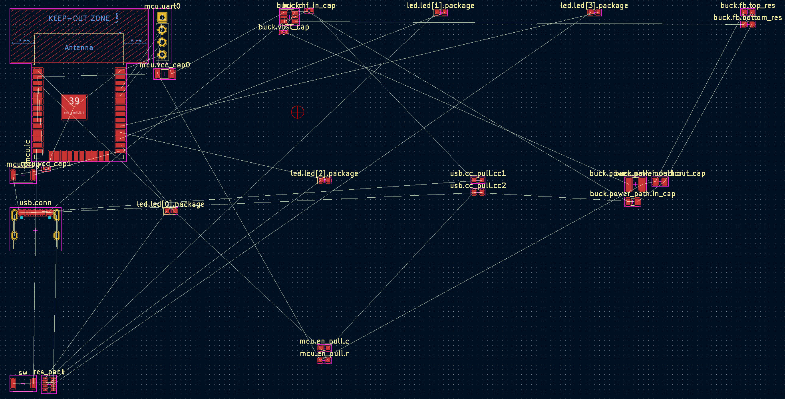

# Getting Started: Optimization
_This short tutorial puts the finishing touches on your design, by multipacking the resistors into a quad-pack device._


## Multipack
_Multipacking allows multiple components, potentially spread across the design hierarchy, to be combined into one component._
_This is an optimization that may save board area and cost._

### Creating Packed Blocks
Multipacking in our HDL model is similar to refinements in that it is a top-level design operation and targets parts that can be anywhere in the design hierarchy.
Multipacking starts by defining a PackedBlock:

```python
class BlinkyExample(SimpleBoardTop):
  ...
  def multipack(self) -> None:
    self.res_pack = self.PackedBlock(ResistorArray())
```

> The `multipack()` method is similar to `contents()` in that you can create and pack `PackedBlock`s in there, similar to how you create and connect normal `Block`s.
> `self.PackedBlock(...)` also behaves similarly to `self.Block(...)`

### Packing Blocks
With a packed block, you can now fill its parts with blocks from across the design hierarchy:

```python
class BlinkyExample(SimpleBoardTop):
  ...
  def multipack(self) -> None:
    self.res_pack = self.PackedBlock(ResistorArray())
    self.pack(self.res_pack.elements.request('0'), ['led', 'led[0]', 'res'])
    self.pack(self.res_pack.elements.request('1'), ['led', 'led[1]', 'res'])
    self.pack(self.res_pack.elements.request('2'), ['led', 'led[2]', 'res'])
    self.pack(self.res_pack.elements.request('3'), ['led', 'led[3]', 'res'])
```

> `self.pack(...)` takes two arguments, the first is the part in the `PackedBlock`, and the second is the `Block` in the design hierarchy to be backed.
> Since `Block`s arbitrarily deep in the design hierarchy may not be known when the top-level HDL is initially compiled, this is specified as a path as a list of strings.

> Packed blocks can have parts that are either single instances or arrays.
> The above is an example of a part array, which similar to port arrays are dynamically sized and can be `request`ed from.
> Like port arrays, even though they are dynamically sized, there may be restrictions from what parts are available, for example you'd be hard-pressed to find an 8-resistor array anywhere.

If you import this into KiCad, you should be able to see the quad-pack resistor instead of single resistors per LED.
Here, it is shown on the bottom left, next to the switch:  



## Definition

Creation of multipack devices is current out of the scope of this tutorial series.
However, you can see some examples:
- [Resistor array](electronics_abstract_parts/AbstractResistorArray.py): how the resistor array used above is implemented, though this is a base class intended to be subclassed by a parts table parser.
- [RGB LED](electronics_abstract_parts/AbstractLed.py): an RGB LED packed from individual discrete LED, that also show how shared pins can be handled.
  This is also an example of a `PackedBlock` that uses single instance parts, the component R, G, and B LEDs.
