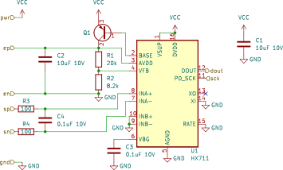

# Getting Started Tutorial: Schematic-Defined Library Blocks
_In this section, we build a graphical-schematic-defined HX711-based load cell amplifier subcircuit block and add it to our board._

> This section describes how to define a block in KiCad's graphical schematic editor and import it into an HDL flow.
> Blocks can also be defined in HDL using the same constructs used to define a board, which is covered in the [next section](getting_started_library.md).
>
> While defining blocks in HDL provides the most programming power, schematics can be a better option for blocks with complex connectivity or where the graphical arrangement is meaningful, in particular analog subcircuits.
> Graphical schematics may also be a more familiar interface and may be a good choice where programmatic generation is not necessary.
> 
> Schematic-defined blocks can make use of HDL library blocks (as schematic components), including all the automation (like automatic parts selection from a parts table) those libraries provide. 


## Schematic Definition
**Start by drawing the application schematic for the HX711**, as described in Figure 4 of its [datasheet](https://cdn.sparkfun.com/datasheets/Sensors/ForceFlex/hx711_english.pdf).

For common parts like capacitors, resistors, and transistors, we use the generic built-in KiCad symbols, which ultimately map down to HDL library blocks with parts selection automation.
A full list is available in the [reference section](#reference).
Parts where there isn't a corresponding library block can instead be defined with a footprint and pinning (like the HX711 chip here).

Hierarchical labels are used to define the block's boundary ports (electrical interface).

Our finished schematic looks like this and is available in [examples/resources/Hx711.sch](examples/resources/Hx711.sch):  


A few notes here:
- Labels like GND and VCC work as expected within this block.
- True global labels (which would directly connect to the rest of the design, not through the block's boundary ports) are not supported.
- Components mapping down to parameterized library blocks (like resistors and capacitors) must be defined with a value.
 See the [reference section](#reference) for details on formatting.


## HDL Stub
While the schematic defines the implementation, an HDL Block wrapper class is still required to interoperate with the rest of the system.
Start by **creating a empty `KiCadSchematicBlock` Block class:**

```diff
+ class Hx711(KiCadSchematicBlock):
+   def __init__(self) -> None:
+     super().__init__()
+     # block boundary (ports, parameters) definition here
+ 
+   def contents(self) -> None:
+     super().contents()
+     # block implementation (subblocks, internal connections, footprint) here
```

> `KiCadSchematicBlock` is a `Block` that is defined by a KiCad schematic.

Then, **define the ports in `__init__(...)`**, which must have the same name as the hierarchical labels:

```diff
  class Hx711(KiCadSchematicBlock):
    def __init__(self) -> None:
      super().__init__()
+ 
+     self.pwr = self.Port(VoltageSink.empty(), [Power])
+     self.gnd = self.Port(Ground.empty(), [Common])
+ 
+     self.dout = self.Port(DigitalSource.empty())
+     self.sck = self.Port(DigitalSink.empty())
+ 
+     self.ep = self.Port(Passive.empty())
+     self.en = self.Port(Passive.empty())
+     self.sp = self.Port(Passive.empty())
+     self.sn = self.Port(Passive.empty())

    def contents(self) -> None:
      super().contents()
      # block implementation (subblocks, internal connections, footprint) here
```

> Like the top-level board, the contents of a Block can be defined in `def contents(...)`.
> However, interfaces (like boundary ports and constructor parameters) must be defined in `def __init__(...)`.

> In the HDL model, ports must have a type.
> `Ground`, `VoltageSink`, `DigitalSource`, and `DigitalSink` are typed ports that have electronics modeling (e.g. voltage limits for `VoltageSink` and IO thresholds for `DigitalSink`).
> `Passive` represents a port with no electronics modeling and can be connected to any other `Passive` port.
> Unlike schematic ERC, `Passive` cannot be directly connected to a typed port and requires an adaptor (described later).
> 
> As these are intermediate ports (they connect to internal ports, here in the schematic), they must be `.empty()` to not define parameters like voltage limits which will be inferred from internal connections.

Then, **import the schematic**:

```diff
  class Hx711(KiCadSchematicBlock):
    def __init__(self) -> None:
      super().__init__()
      ...

    def contents(self) -> None:
      super().contents()
+ 
+     self.import_kicad("path/to/your/hx711.sch", auto_adapt=True)
```

> Many of the symbols in KiCad map to library Blocks with ports that are Passive-typed.
> The `auto_adapt` argument in `import_kicad` automatically adds adapters from Passive to (for example) VoltageSink and DigitalSource at these interfaces.
> These automatically-generated adapters produce ideal ports (for example, a VoltageSink with infinite voltage limits) and are great to get a quick-and-dirty schematic out fast, but do not enable the electronics model to check for correctness.

Finally, while the capacitors and resistor parameters can be parsed by value, the transistor is more complex and must be instantiated separately in the HDL.
**Instantiate a BJT in contents(...), making sure the name matches with the schematic refdes so the importer recognizes both as the same component.**
**Make sure the schematic symbol has no value.**

```diff
  class Hx711(KiCadSchematicBlock):
    def __init__(self) -> None:
      super().__init__()
      ...

    def contents(self) -> None:
      super().contents()
  
+     self.Q1 = self.Block(Bjt.Npn((0, 5)*Volt, 0*Amp(tol=0)))
      self.import_kicad("path/to/your/hx711.sch", auto_adapt=True)
```

> Overall, there are four ways to define a component in this schematic import process:
> 1. **Value parsing** (like with resistors and capacitors), where the importer has an associated library Block for that particular symbol: the particular library Block is created and parses the value string to determine parameters.
>    Typically, these are Passive-typed.
> 2. **HDL instantiation** (like with the BJT), where the symbol has neither footprint or value, but a Block whose name matches the symbol refdes and with a defined symbol to port mapping: the existing Block is connected as described in the schematic.
> 3. **Inline HDL** (not shown, but could be done with the BJT), where a Block's value contains HDL code prefixed with a `#`, and the resulting Block defines a symbol to port mapping.
>    For the BJT, instead of instantiating the Block in `contents(...)`, you could instead have set the value in the schematic to `Bjt.Npn((0, 5)*Volt, 0*Amp(tol=0))`.
> 4. **Blackboxing** (like with the HX711 chip), where the symbol has a footprint defined: a Block is created with all Passive ports.
>
> See the [reference section](#reference) below for KiCad symbols for value parsing, HDL instantiation, or inline HDL.  

## Top-Level Board
With a fully defined library Block, you can now **add it to your board:**

```diff
  class BlinkyExample(SimpleBoardTop):
    def contents(self) -> None:
      super().contents()
      ...

      with self.implicit_connect(
              ImplicitConnect(self.reg.pwr_out, [Power]),
              ImplicitConnect(self.reg.gnd, [Common]),
      ) as imp:
        self.mcu = imp.Block(IoController())

        ...

+       self.conn = self.Block(PassiveConnector(4))
+       self.sense = imp.Block(Hx711())
+       self.connect(self.mcu.gpio.request('hx711_dout'), self.sense.dout)
+       self.connect(self.mcu.gpio.request('hx711_sck'), self.sense.sck)
+       self.connect(self.conn.pins.request('1'), self.sense.ep)
+       self.connect(self.conn.pins.request('2'), self.sense.en)
+       self.connect(self.conn.pins.request('3'), self.sense.sp)
+       self.connect(self.conn.pins.request('4'), self.sense.sn)
```

> The new Block should also show up in the library browser and can be added with graphical actions in the IDE.
> A recompile may be needed for the library browser to index the new Block.


## Additional Modeling

While a schematic-defined Block allows subcircuit definition quickly and easily, we didn't model the device's electrical characteristics like pin voltage limitations, and as a result the automated checks would not be able to help here.
However, instead of using `auto_adapt`, we can instead define `conversions` on a symbol pin or boundary port basis.
**Add these conversions:**
```diff
  class Hx711(KiCadSchematicBlock):
    def __init__(self) -> None:
      super().__init__()
      ...

    def contents(self) -> None:
      super().contents()
  
      self.Q1 = self.Block(Bjt.Npn((0, 5)*Volt, 0*Amp(tol=0)))
-     self.import_kicad("path/to/your/hx711.sch", auto_adapt=True)
+     self.import_kicad("path/to/your/hx711.sch"),
+                       conversions={
+                         'pwr': VoltageSink(
+                           voltage_limits=(2.6, 5.5)*Volt,
+                           current_draw=(0.3 + 0.2, 1400 + 100)*uAmp),
+                         'gnd': Ground(),
+                         'dout': DigitalSource.from_supply(self.gnd, self.pwr),
+                         'sck': DigitalSink.from_supply(self.gnd, self.pwr),
+                       })
```

Here, we manually specified port models for the boundary ports, in particular including the limits of the input voltage.
Some of the port models have been left blank (notably, the digital input thresholds of the input SCK pin are missing, since they are not specified in the datasheet), and by convention these default to ideal models.


## Reference

These common symbols can be used in schematic import and map to the following passive-typed HDL blocks:

| Symbol                             | HDL Block          | Value Parsing | Notes                            |
|------------------------------------|--------------------|---------------|----------------------------------|
| Device:C, Device:C_Polarized       | Capacitor          | e.g. `10uF 10V` | Voltage rating must be specified |
| Device:R                           | Resistor           | e.g. `100`      |                                  |
| Device:L                           | Inductor           |               |                                  |
| Device:Q_NPN_\*, Device:Q_PNP_\*   | Bjt.Npn, Bjt.Pnp   |               |                                  |
| Device:D                           | Diode              |               |                                  |
| Device:L_Ferrite                   | FerriteBead        |               |                                  |
| Device:Q_NMOS_\*, Device:Q_PMOS_\* | Fet.NFet, Fet.PFet |               |                                  |
| Switch:SW_SPST                     | Switch             |               |                                  |

Notes:
- Blocks are passive-typed unless otherwise noted.
- If Value Parsing is empty, the Block can only be defined by HDL instantiation or inline HDL.
- All Blocks that can be used in schematic import can be found by searching for all subclasses of `KiCadImportableBlock`.
- In many cases, the `_Small` (e.g. `Device:C_Small`) symbol can also be used.

These higher-level symbols have typed pins (like VoltageSink, Ground, and AnalogSink) and can be used to make higher-level analog signal chains:

| Symbol                               | HDL Block             | Notes                                                                                                                     |
|--------------------------------------|-----------------------|---------------------------------------------------------------------------------------------------------------------------|
| Simulation_SPICE:OPAMP               | Opamp                 | Supports value parsing (with empty value); is the full application circuit for an opamp (including decoupling capacitors) |
| edg_importable:Amplifier             | Amplifier             |                                                                                                                           |
| edg_importable:DifferentialAmplifier | DifferentialAmplifier |                                                                                                                           |
| edg_importable:IntegratorInverting   | IntegratorInverting   |                                                                                                                           |
| edg_importable:OpampCurrentSensor    | OpampCurrentSensor    |                                                                                                                           | 


## Defining Library Parts
Continue to [the next part of the tutorial](getting_started_library.md) on defining a library Block in pure HDL.

### Additional Resources
If you want to some more complex examples of schematic-defined Blocks, check out:
- The FET power gate [schematic](examples/resources/FetPowerGate.kicad_sch) and [FetPowerGate stub class](examples/test_multimeter.py), a power button that turns on a FET which can then be latched on by a microcontroller.
- The priority power OR [schematic](electronics_lib/resources/PriorityPowerOr.kicad_sch) and [PriorityPowerOr stub class](electronics_lib/PowerConditioning.py), a diode-FET circuit that merges two voltage sources with priority.
- The source measure unit analog chain [schematic](examples/resources/SourceMeasureControl.kicad_sch) and [SourceMeasureControl stub class](examples/test_usb_source_measure.py), which uses the analog building blocks above.
- The differential amplifier [schematic](electronics_abstract_parts/resources/DifferentialAmplifier.kicad_sch) and [DifferentialAmplifier stub class](electronics_abstract_parts/OpampCircuits.py), a standard opamp circuit that mixes schematic definition for the connectivity and generator code to compute resistor values.
